# Access (`10.10.10.98`)

## Summary

I find an FTP share that allows Anonymous access. I find a Microsoft Access database that has a set of credentials inside of it. One of the credentials allows me open an encrypted zip file, also found on the share. The encrypted zip file contains a Microsoft Outlook Mailbox file, in which I find a user credential pair. I use this to log in over telnet, and then use saved credentials on the system to escalate to Administrator. 

## `/etc/hosts`

I begin by adding an entry in `/etc/hosts` to resolve `access.htb` to `10.10.10.98`. I use this later in my report.

## Enumeration

I start a portscan of all ports (`-p-`), running OS, service version, and vulnerability scripts (`-A`), skipping host discovery (`-Pn`), with verbose logging (`-v`) and output to a file (`-oN`).

```bash
$ nmap -A -v -p- -Pn -oN allports access.htb
# Nmap 7.80 scan initiated Fri Dec 11 19:19:16 2020 as: nmap -A -v -p- -Pn -oN allports access.htb
Nmap scan report for access.htb (10.10.10.98)
Host is up (0.047s latency).
Not shown: 65532 filtered ports
PORT   STATE SERVICE VERSION
21/tcp open  ftp     Microsoft ftpd
| ftp-anon: Anonymous FTP login allowed (FTP code 230)
|_Can't get directory listing: PASV failed: 425 Cannot open data connection.
| ftp-syst: 
|_  SYST: Windows_NT
23/tcp open  telnet  Microsoft Windows XP telnetd (no more connections allowed)
80/tcp open  http    Microsoft IIS httpd 7.5
| http-methods: 
|   Supported Methods: OPTIONS TRACE GET HEAD POST
|_  Potentially risky methods: TRACE
|_http-server-header: Microsoft-IIS/7.5
|_http-title: MegaCorp
Warning: OSScan results may be unreliable because we could not find at least 1 open and 1 closed port
Device type: general purpose|phone|specialized
Running (JUST GUESSING): Microsoft Windows 8|Phone|2008|7|8.1|Vista|2012 (92%)
OS CPE: cpe:/o:microsoft:windows_8 cpe:/o:microsoft:windows cpe:/o:microsoft:windows_server_2008:r2 cpe:/o:microsoft:windows_7 cpe:/o:microsoft:windows_8.1 cpe:/o:microsoft:windows_vista::- cpe:/o:microsoft:windows_vista::sp1 cpe:/o:microsoft:windows_server_2012
Aggressive OS guesses: Microsoft Windows 8.1 Update 1 (92%), Microsoft Windows Phone 7.5 or 8.0 (92%), Microsoft Windows 7 or Windows Server 2008 R2 (91%), Microsoft Windows Server 2008 R2 (91%), Microsoft Windows Server 2008 R2 or Windows 8.1 (91%), Microsoft Windows Server 2008 R2 SP1 or Windows 8 (91%), Microsoft Windows 7 (91%), Microsoft Windows 7 Professional or Windows 8 (91%), Microsoft Windows 7 SP1 or Windows Server 2008 SP2 or 2008 R2 SP1 (91%), Microsoft Windows Vista SP0 or SP1, Windows Server 2008 SP1, or Windows 7 (91%)
No exact OS matches for host (test conditions non-ideal).
Uptime guess: 0.003 days (since Fri Dec 11 19:18:12 2020)
Network Distance: 2 hops
TCP Sequence Prediction: Difficulty=260 (Good luck!)
IP ID Sequence Generation: Incremental
Service Info: OSs: Windows, Windows XP; CPE: cpe:/o:microsoft:windows, cpe:/o:microsoft:windows_xp

TRACEROUTE (using port 23/tcp)
HOP RTT      ADDRESS
1   42.87 ms 10.10.14.1
2   42.83 ms access.htb (10.10.10.98)

Read data files from: /usr/bin/../share/nmap
OS and Service detection performed. Please report any incorrect results at https://nmap.org/submit/ .
# Nmap done at Fri Dec 11 19:22:00 2020 -- 1 IP address (1 host up) scanned in 163.99 seconds
```

### Enumerating FTP

```bash
$ ftp access.htb
Connected to access.htb.
220 Microsoft FTP Service
Name (access.htb:kali): anonymous
331 Anonymous access allowed, send identity (e-mail name) as password.
Password:
230 User logged in.
Remote system type is Windows_NT.
ftp> bin
200 Type set to I.
ftp> ls
200 PORT command successful.
125 Data connection already open; Transfer starting.
08-23-18  08:16PM       <DIR>          Backups
08-24-18  09:00PM       <DIR>          Engineer
226 Transfer complete.
ftp> cd Backups
250 CWD command successful.
ftp> ls
200 PORT command successful.
125 Data connection already open; Transfer starting.
08-23-18  08:16PM              5652480 backup.mdb
226 Transfer complete.
ftp> mget backup.mdb
mget backup.mdb? y
200 PORT command successful.
125 Data connection already open; Transfer starting.
226 Transfer complete.
5652480 bytes received in 2.61 secs (2.0647 MB/s)
ftp> cd ..
250 CWD command successful.
ftp> ls
200 PORT command successful.
125 Data connection already open; Transfer starting.
08-23-18  08:16PM       <DIR>          Backups
08-24-18  09:00PM       <DIR>          Engineer
226 Transfer complete.
ftp> cd Engineer
250 CWD command successful.
ftp> ls
200 PORT command successful.
125 Data connection already open; Transfer starting.
08-24-18  12:16AM                10870 Access Control.zip
226 Transfer complete.
ftp> mget "Access Control.zip"
mget Access Control.zip? y
200 PORT command successful.
125 Data connection already open; Transfer starting.
226 Transfer complete.
10870 bytes received in 0.13 secs (83.2835 kB/s)
```

I use a script I found [here](https://www.guyrutenberg.com/2012/07/16/sql-dump-for-ms-access-databases-mdb-files-on-linux/) to dump MS Access database files.

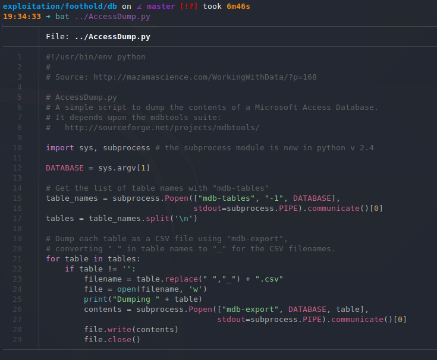

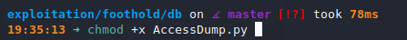

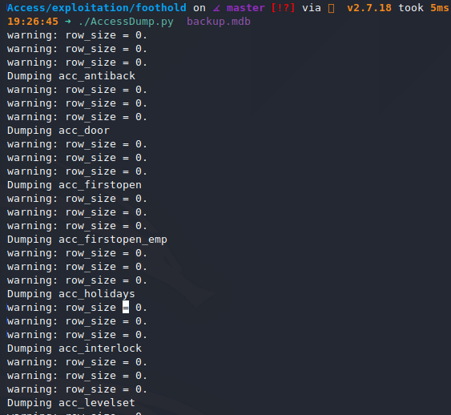

In the `auth_user.csv` file produced, the following credentials can be found.

```
id,username,password,Status,last_login,RoleID,Remark
25,"admin","admin",1,"08/23/18 21:11:47",26,
27,"engineer","access4u@security",1,"08/23/18 21:13:36",26,
28,"backup_admin","admin",1,"08/23/18 21:14:02",26,
```

```
admin:admin
engineer:access4u@security
backup_admin:admin
```

I'm able to unzip the `Access Control.zip` file with `7z` and the password `access4u@security`.

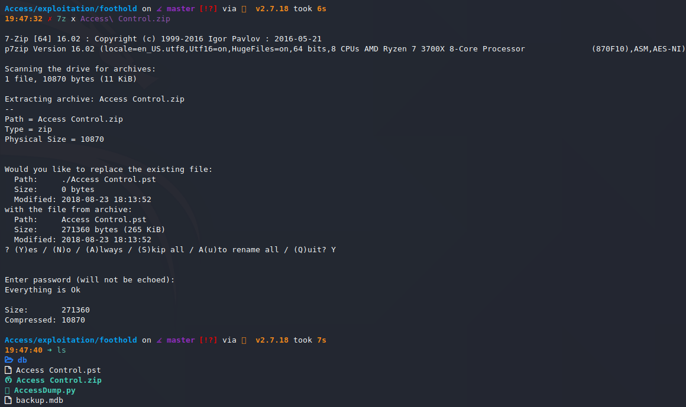

It creates an Outlook Mailbox file, which I convert to a `mbox` file with `readpst`.

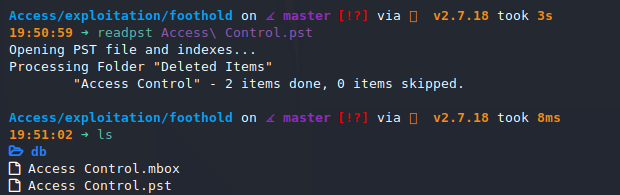

It gives me another credential pair: `security:4Cc3ssC0ntr0ller`.

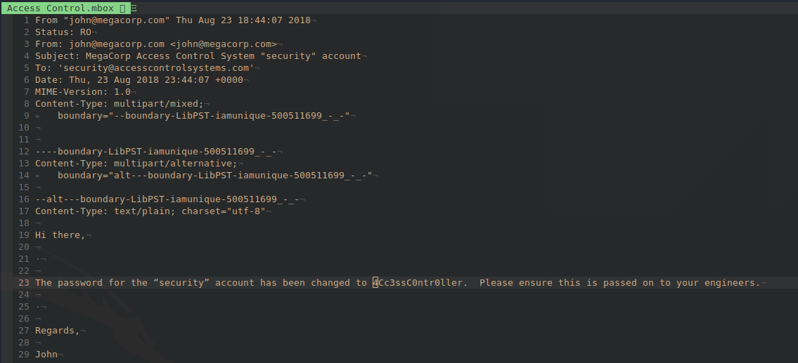

## Shell as `security`

I use this credential pair to log in over `telnet`.

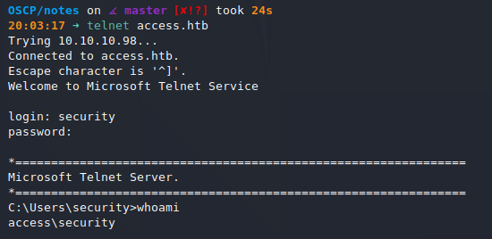

## Privilege Escalation to `root`

I find some stored Administrator credentials on the box. I use them to spawn a reverse shell.

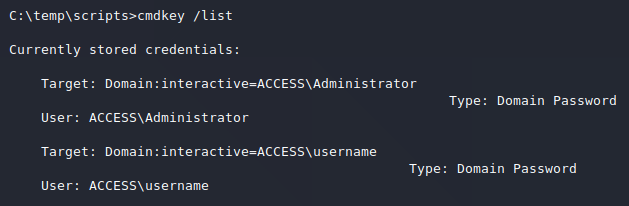

I generate the reverse shell on my Kali box.

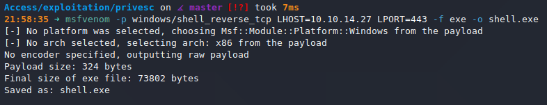

I spin up a python webserver and move `shell.exe` over to the target.

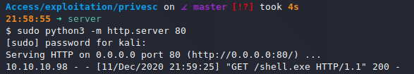

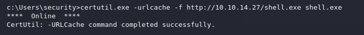

I start a `nc` listener and run the shell.

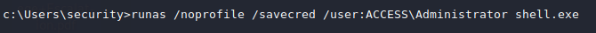

## Root

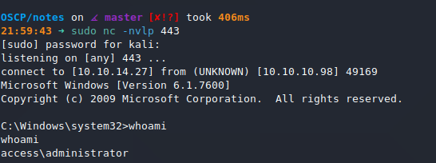

