# Bastion (`10.10.10.134`)

## Summary

User credentials are recovered from an exposed Windows backup on a readable SMB share, by dumping the `SAM` and `SYSTEM` hives. Administrator credentials are recovered from an `mRemoteNG` cache file.

## `/etc/hosts`

I begin by adding an entry in `/etc/hosts` to resolve `bastion.htb` to `10.10.10.134`. I use this later in my report.

## Enumeration

I start a portscan of all ports (`-p-`), running OS, service version, and vulnerability scripts (`-A`), skipping host discovery (`-Pn`), with verbose logging (`-v`) and output to a file (`-oN`).

```bash
$ nmap -A -v -p- -Pn -oN allports .htb
# Nmap 7.80 scan initiated Sat Nov 28 21:02:42 2020 as: nmap -A -v -p- -Pn -oN allports bastion.htb
Nmap scan report for bastion.htb (10.10.10.134)
Host is up (0.040s latency).
Not shown: 65522 closed ports
PORT      STATE SERVICE      VERSION
22/tcp    open  ssh          OpenSSH for_Windows_7.9 (protocol 2.0)
| ssh-hostkey: 
|   2048 3a:56:ae:75:3c:78:0e:c8:56:4d:cb:1c:22:bf:45:8a (RSA)
|   256 cc:2e:56:ab:19:97:d5:bb:03:fb:82:cd:63:da:68:01 (ECDSA)
|_  256 93:5f:5d:aa:ca:9f:53:e7:f2:82:e6:64:a8:a3:a0:18 (ED25519)
135/tcp   open  msrpc        Microsoft Windows RPC
139/tcp   open  netbios-ssn  Microsoft Windows netbios-ssn
445/tcp   open  microsoft-ds Windows Server 2016 Standard 14393 microsoft-ds
5985/tcp  open  http         Microsoft HTTPAPI httpd 2.0 (SSDP/UPnP)
|_http-server-header: Microsoft-HTTPAPI/2.0
|_http-title: Not Found
47001/tcp open  http         Microsoft HTTPAPI httpd 2.0 (SSDP/UPnP)
|_http-server-header: Microsoft-HTTPAPI/2.0
|_http-title: Not Found
49664/tcp open  msrpc        Microsoft Windows RPC
49665/tcp open  msrpc        Microsoft Windows RPC
49666/tcp open  msrpc        Microsoft Windows RPC
49667/tcp open  msrpc        Microsoft Windows RPC
49668/tcp open  msrpc        Microsoft Windows RPC
49669/tcp open  msrpc        Microsoft Windows RPC
49670/tcp open  msrpc        Microsoft Windows RPC
Service Info: OSs: Windows, Windows Server 2008 R2 - 2012; CPE: cpe:/o:microsoft:windows

Host script results:
|_clock-skew: mean: -12m28s, deviation: 34m37s, median: 7m30s
| smb-os-discovery: 
|   OS: Windows Server 2016 Standard 14393 (Windows Server 2016 Standard 6.3)
|   Computer name: Bastion
|   NetBIOS computer name: BASTION\x00
|   Workgroup: WORKGROUP\x00
|_  System time: 2020-11-29T04:11:48+01:00
| smb-security-mode: 
|   account_used: guest
|   authentication_level: user
|   challenge_response: supported
|_  message_signing: disabled (dangerous, but default)
| smb2-security-mode: 
|   2.02: 
|_    Message signing enabled but not required
| smb2-time: 
|   date: 2020-11-29T03:11:50
|_  start_date: 2020-11-29T03:06:27

Read data files from: /usr/bin/../share/nmap
Service detection performed. Please report any incorrect results at https://nmap.org/submit/ .
# Nmap done at Sat Nov 28 21:04:25 2020 -- 1 IP address (1 host up) scanned in 102.94 seconds
```

### Enumerating SMB

I mount the SMB share on my Kali machine.

```bash
$ mkdir /mnt/bastion-smb
$ sudo mount -t cifs '//10.10.10.134/Backups' /mnt/bastion-smb  -o nounix,user=nobody,pass=
```

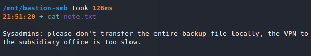

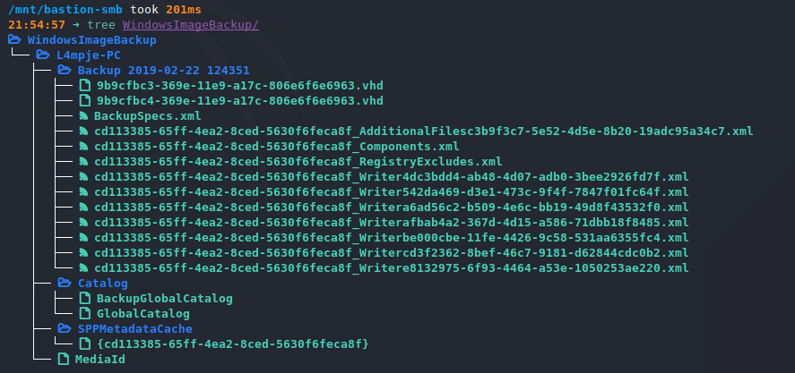

```bash
$ sudo mkdir /mnt/bastion-backup
$ sudo guestmount --add 9b9cfbc4-369e-11e9-a17c-806e6f6e6963.vhd  --inspector --ro /mnt/bastion-backup
```

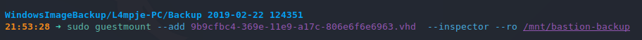

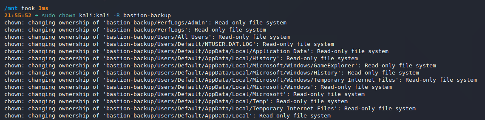

I extract the user password hashes from `C:\Windows\System32\config\SAM` and `C:\Windows\System32\config\SYSTEM` with `pwdump`.

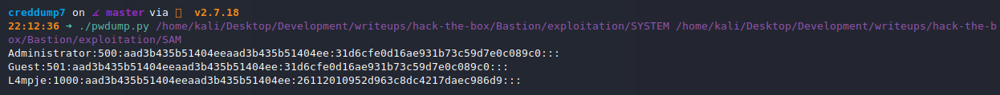

I crack the user hash on Crackstation.

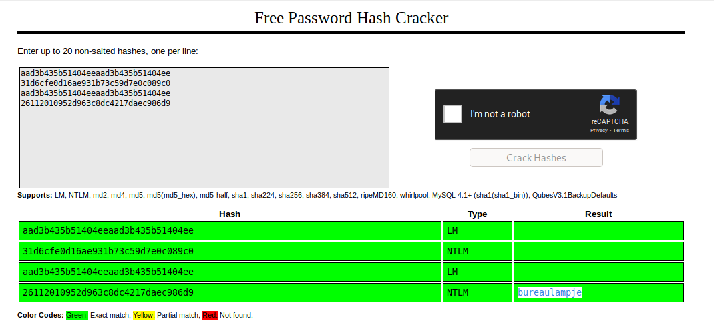

I'm able to SSH in as `L4mpje` with the password `bureaulampje`.

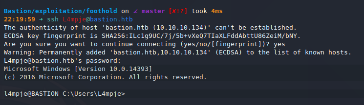

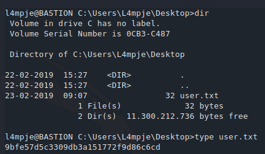

## Privilege Escalation

I find the cache file for `mRemoteNG` in the `C:\Users\L4mpje\AppData\Roaming\mRemoteNG` directory. 

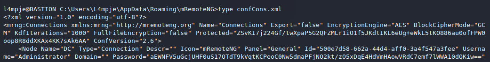

I use https://github.com/haseebT/mRemoteNG-Decrypt to decrypt the password.

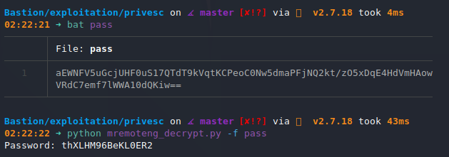

I can `ssh` with this password (`thXLHM96BeKL0ER2`) as `Administrator`.

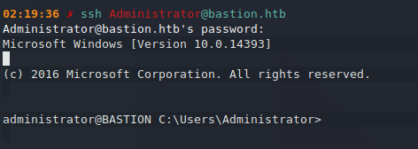

## Root

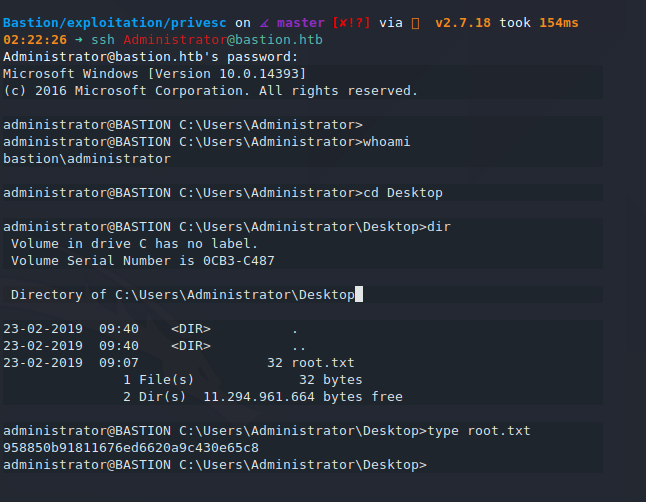
