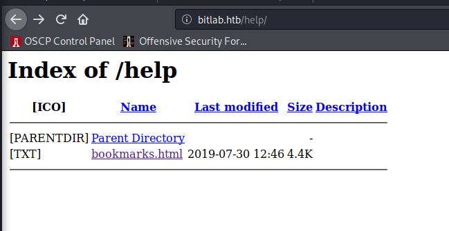
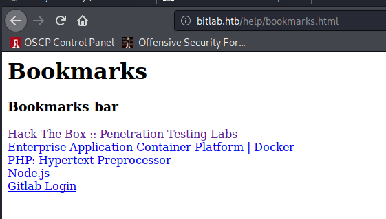
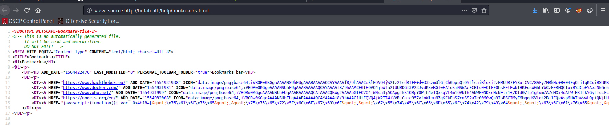
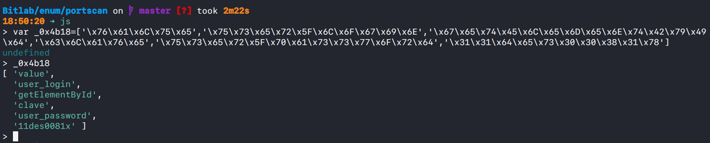
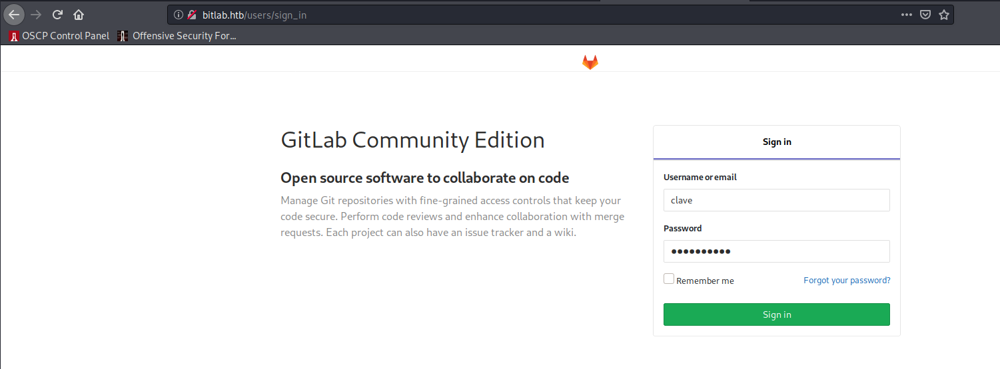
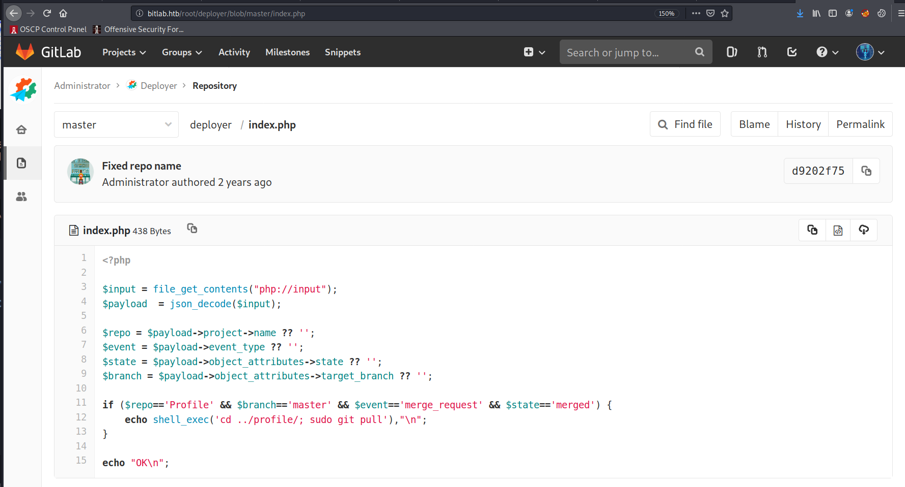
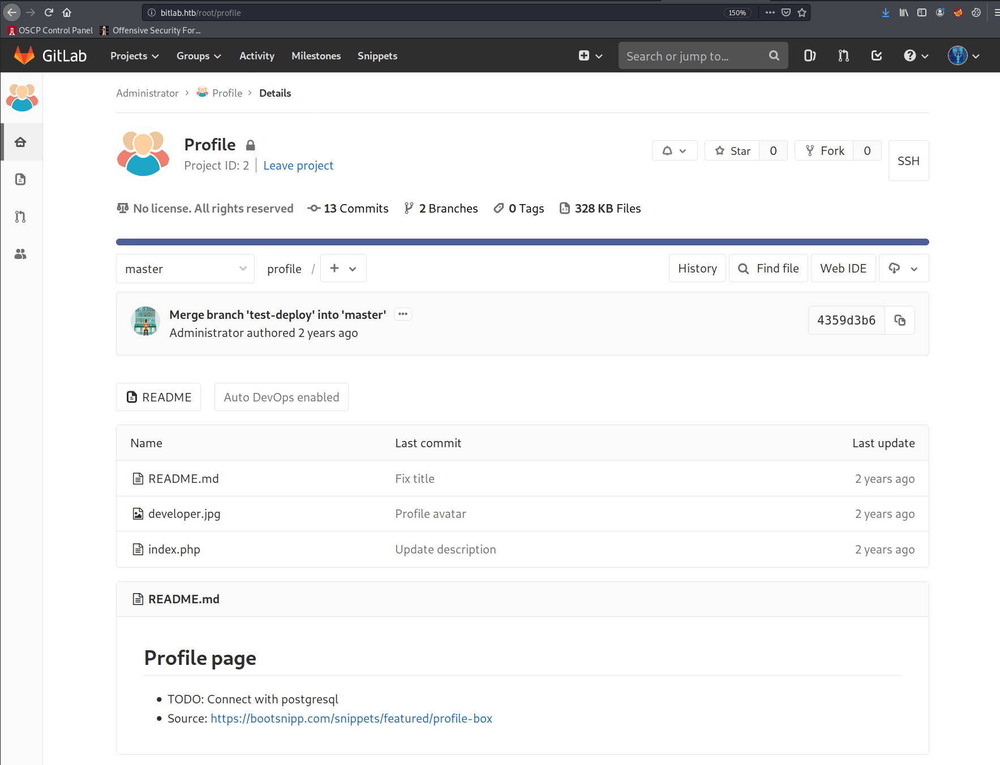
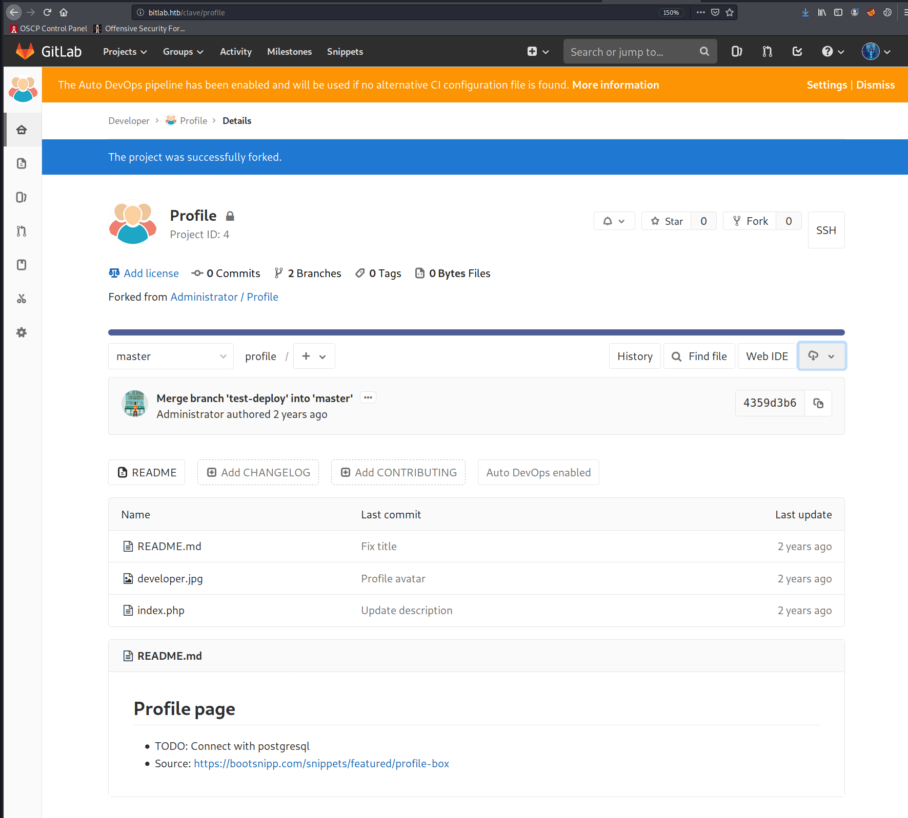

# Bitlab (`10.10.10.IP`)

## Summary

## `/etc/hosts`

I begin by adding an entry in `/etc/hosts` to resolve `bitlab.htb` to `10.10.10.114`. I use this later in my report.

## Enumeration

I start a portscan of all ports (`-p-`), running OS, service version, and vulnerability scripts (`-A`), skipping host discovery (`-Pn`), with verbose logging (`-v`) and output to a file (`-oN`).

```bash
$ nmap -A -v -p- -Pn -oN allports bitlab.htb
# Nmap 7.80 scan initiated Tue Jan 12 18:45:04 2021 as: nmap -A -v -p- -Pn -oN allports bitlab.htb
Nmap scan report for bitlab.htb (10.10.10.114)
Host is up (0.034s latency).
Not shown: 65533 filtered ports
PORT   STATE SERVICE VERSION
22/tcp open  ssh     OpenSSH 7.6p1 Ubuntu 4ubuntu0.3 (Ubuntu Linux; protocol 2.0)
| ssh-hostkey: 
|   2048 a2:3b:b0:dd:28:91:bf:e8:f9:30:82:31:23:2f:92:18 (RSA)
|   256 e6:3b:fb:b3:7f:9a:35:a8:bd:d0:27:7b:25:d4:ed:dc (ECDSA)
|_  256 c9:54:3d:91:01:78:03:ab:16:14:6b:cc:f0:b7:3a:55 (ED25519)
80/tcp open  http    nginx
|_http-favicon: Unknown favicon MD5: F7E3D97F404E71D302B3239EEF48D5F2
| http-methods: 
|_  Supported Methods: GET HEAD POST OPTIONS
| http-robots.txt: 55 disallowed entries (15 shown)
| / /autocomplete/users /search /api /admin /profile 
| /dashboard /projects/new /groups/new /groups/*/edit /users /help 
|_/s/ /snippets/new /snippets/*/edit
| http-title: Sign in \xC2\xB7 GitLab
|_Requested resource was http://bitlab.htb/users/sign_in
|_http-trane-info: Problem with XML parsing of /evox/about
Warning: OSScan results may be unreliable because we could not find at least 1 open and 1 closed port
Aggressive OS guesses: Linux 3.10 - 4.11 (92%), Linux 3.2 - 4.9 (92%), Linux 3.18 (90%), Crestron XPanel control system (90%), Linux 3.16 (89%), ASUS RT-N56U WAP (Linux 3.4) (87%), Linux 3.1 (87%), Linux 3.2 (87%), HP P2000 G3 NAS device (87%), AXIS 210A or 211 Network Camera (Linux 2.6.17) (87%)
No exact OS matches for host (test conditions non-ideal).
Uptime guess: 32.377 days (since Fri Dec 11 09:43:35 2020)
Network Distance: 2 hops
TCP Sequence Prediction: Difficulty=261 (Good luck!)
IP ID Sequence Generation: All zeros
Service Info: OS: Linux; CPE: cpe:/o:linux:linux_kernel

TRACEROUTE (using port 22/tcp)
HOP RTT      ADDRESS
1   34.11 ms 10.10.14.1
2   35.75 ms bitlab.htb (10.10.10.114)

Read data files from: /usr/bin/../share/nmap
OS and Service detection performed. Please report any incorrect results at https://nmap.org/submit/ .
# Nmap done at Tue Jan 12 18:47:11 2021 -- 1 IP address (1 host up) scanned in 127.35 seconds
```

### Enumerating Port 80

I see `bitlab.htb/help` disallowed in the `robots.txt` file. I check it out.







```html
<DT><A HREF="javascript:(function(){ var _0x4b18=[&quot;\x76\x61\x6C\x75\x65&quot;,&quot;\x75\x73\x65\x72\x5F\x6C\x6F\x67\x69\x6E&quot;,&quot;\x67\x65\x74\x45\x6C\x65\x6D\x65\x6E\x74\x42\x79\x49\x64&quot;,&quot;\x63\x6C\x61\x76\x65&quot;,&quot;\x75\x73\x65\x72\x5F\x70\x61\x73\x73\x77\x6F\x72\x64&quot;,&quot;\x31\x31\x64\x65\x73\x30\x30\x38\x31\x78&quot;];document[_0x4b18[2]](_0x4b18[1])[_0x4b18[0]]= _0x4b18[3];document[_0x4b18[2]](_0x4b18[4])[_0x4b18[0]]= _0x4b18[5]; })()" ADD_DATE="1554932142">Gitlab Login</A>
```

Stripping out the first variable and replacing `&quot;` with `'` gives:

```js
var _0x4b18=['\x76\x61\x6C\x75\x65','\x75\x73\x65\x72\x5F\x6C\x6F\x67\x69\x6E','\x67\x65\x74\x45\x6C\x65\x6D\x65\x6E\x74\x42\x79\x49\x64','\x63\x6C\x61\x76\x65','\x75\x73\x65\x72\x5F\x70\x61\x73\x73\x77\x6F\x72\x64','\x31\x31\x64\x65\x73\x30\x30\x38\x31\x78']
```



Looks like a credential pair: `clave:11des0081x`.







I fork the repo to `clave`'s account.



## Reverse Shell

## Upgrading Shell

## Privilege Escalation

## Root
