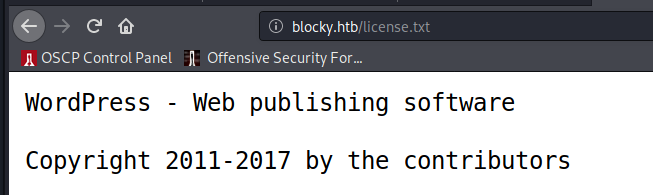
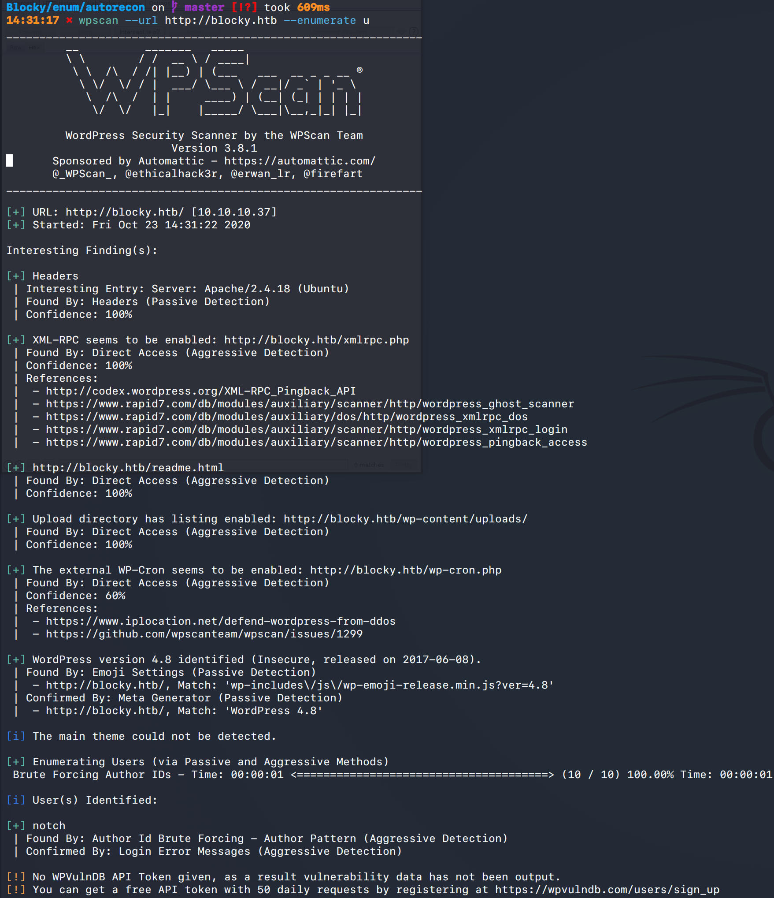
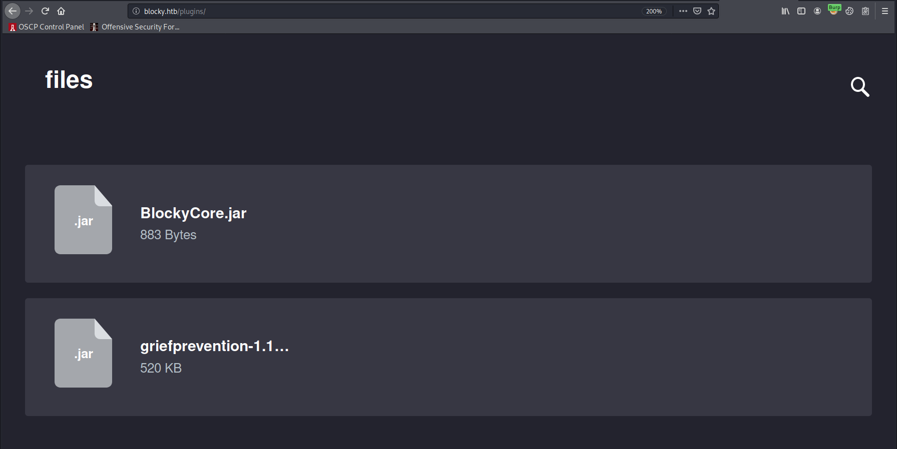
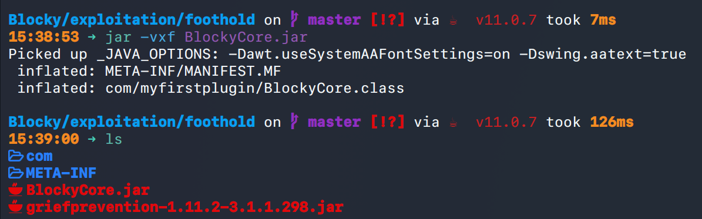
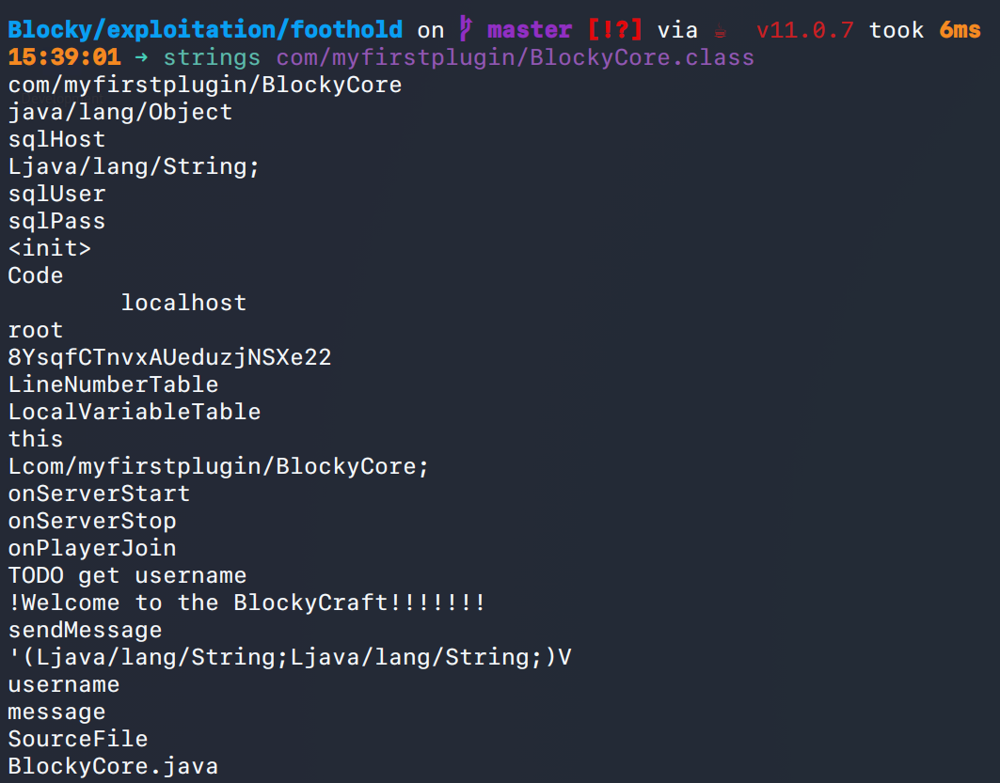
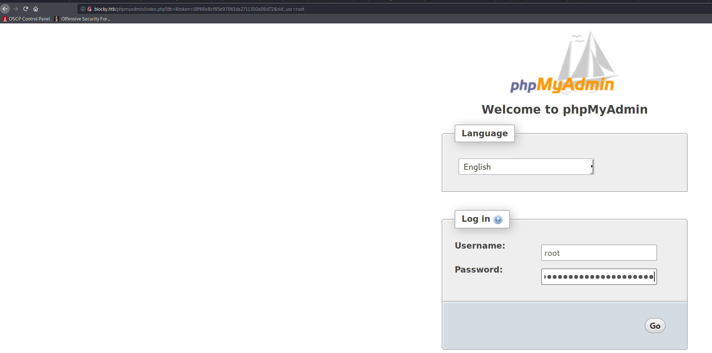
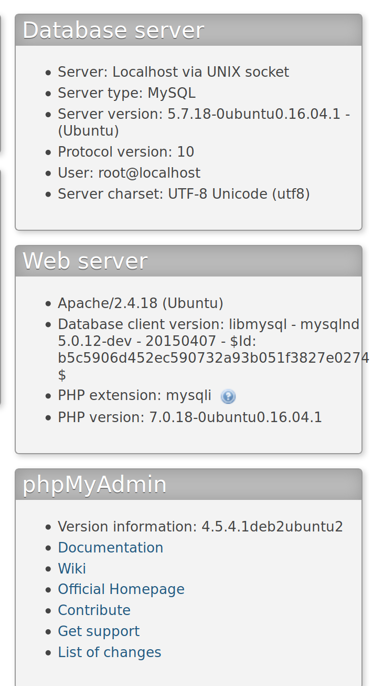
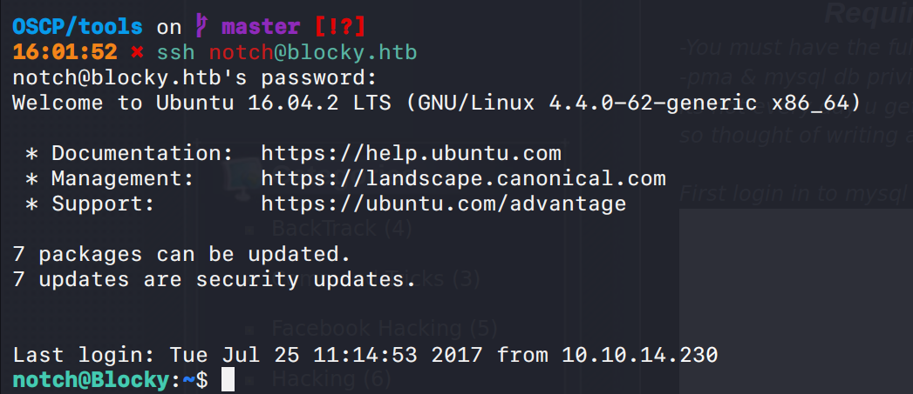
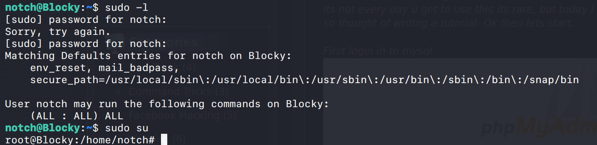

# Blocky (`10.10.10.37`)

## Summary

## Enumeration

I start a portscan of all ports (`-p-`), running OS, service version, and vulnerability scripts (`-A`), skipping host discovery (`-Pn`), with verbose logging (`-v`) and output to a file (`-oN`).

```bash
$ sudo nmap -A -v -p- -sVC -Pn -oN allports blocky.htb
Nmap scan report for blocky.htb (10.10.10.37)
Host is up, received user-set (0.11s latency).
Scanned at 2020-10-23 14:04:27 EDT for 1800s
Not shown: 65530 filtered ports
Reason: 65530 no-responses
PORT      STATE  SERVICE   REASON         VERSION
21/tcp    open   ftp       syn-ack ttl 63 ProFTPD 1.3.5a
22/tcp    open   ssh       syn-ack ttl 63 OpenSSH 7.2p2 Ubuntu 4ubuntu2.2 (Ubuntu Linux; protocol 2.0)
| ssh-hostkey: 
|   2048 d6:2b:99:b4:d5:e7:53:ce:2b:fc:b5:d7:9d:79:fb:a2 (RSA)
| ssh-rsa AAAAB3NzaC1yc2EAAAADAQABAAABAQDXqVh031OUgTdcXsDwffHKL6T9f1GfJ1/x/b/dywX42sDZ5m1Hz46bKmbnWa0YD3LSRkStJDtyNXptzmEp31Fs2DUndVKui3LCcyKXY6FSVWp9ZDBzlW3aY8qa+y339OS3gp3aq277zYDnnA62U7rIltYp91u5VPBKi3DITVaSgzA8mcpHRr30e3cEGaLCxty58U2/lyCnx3I0Lh5rEbipQ1G7Cr6NMgmGtW6LrlJRQiWA1OK2/tDZbLhwtkjB82pjI/0T2gpA/vlZJH0elbMXW40Et6bOs2oK/V2bVozpoRyoQuts8zcRmCViVs8B3p7T1Qh/Z+7Ki91vgicfy4fl
|   256 5d:7f:38:95:70:c9:be:ac:67:a0:1e:86:e7:97:84:03 (ECDSA)
| ecdsa-sha2-nistp256 AAAAE2VjZHNhLXNoYTItbmlzdHAyNTYAAAAIbmlzdHAyNTYAAABBBNgEpgEZGGbtm5suOAio9ut2hOQYLN39Uhni8i4E/Wdir1gHxDCLMoNPQXDOnEUO1QQVbioUUMgFRAXYLhilNF8=
|   256 09:d5:c2:04:95:1a:90:ef:87:56:25:97:df:83:70:67 (ED25519)
|_ssh-ed25519 AAAAC3NzaC1lZDI1NTE5AAAAILqVrP5vDD4MdQ2v3ozqDPxG1XXZOp5VPpVsFUROL6Vj
80/tcp    open   http      syn-ack ttl 63 Apache httpd 2.4.18 ((Ubuntu))
|_http-generator: WordPress 4.8
| http-methods: 
|_  Supported Methods: GET HEAD POST OPTIONS
|_http-server-header: Apache/2.4.18 (Ubuntu)
|_http-title: BlockyCraft &#8211; Under Construction!
8192/tcp  closed sophos    reset ttl 63
25565/tcp open   minecraft syn-ack ttl 63 Minecraft 1.11.2 (Protocol: 127, Message: A Minecraft Server, Users: 0/20)
Device type: general purpose|WAP|specialized|storage-misc|broadband router|printer
Running (JUST GUESSING): Linux 3.X|4.X|2.6.X (94%), Asus embedded (90%), Crestron 2-Series (88%), HP embedded (88%)
OS CPE: cpe:/o:linux:linux_kernel:3 cpe:/o:linux:linux_kernel:4 cpe:/o:linux:linux_kernel cpe:/h:asus:rt-ac66u cpe:/o:crestron:2_series cpe:/h:hp:p2000_g3 cpe:/o:linux:linux_kernel:2.6 cpe:/o:linux:linux_kernel:3.4
OS fingerprint not ideal because: Didn't receive UDP response. Please try again with -sSU
Aggressive OS guesses: Linux 3.10 - 4.11 (94%), Linux 3.13 (94%), Linux 3.13 or 4.2 (94%), Linux 4.2 (94%), Linux 4.4 (94%), Linux 3.16 (92%), Linux 3.16 - 4.6 (92%), Linux 3.12 (90%), Linux 3.2 - 4.9 (90%), Linux 3.8 - 3.11 (90%)
No exact OS matches for host (test conditions non-ideal).
TCP/IP fingerprint:
SCAN(V=7.80%E=4%D=10/23%OT=21%CT=8192%CU=%PV=Y%DS=2%DC=T%G=N%TM=5F932233%P=x86_64-pc-linux-gnu)
SEQ(SP=106%GCD=1%ISR=10B%TI=Z%CI=I%TS=5)
OPS(O1=M54DST11NW7%O2=M54DST11NW7%O3=M54DNNT11NW7%O4=M54DST11NW7%O5=M54DST11NW7%O6=M54DST11)
WIN(W1=7120%W2=7120%W3=7120%W4=7120%W5=7120%W6=7120)
ECN(R=Y%DF=Y%TG=40%W=7210%O=M54DNNSNW7%CC=Y%Q=)
T1(R=Y%DF=Y%TG=40%S=O%A=S+%F=AS%RD=0%Q=)
T2(R=N)
T3(R=N)
T4(R=Y%DF=Y%TG=40%W=0%S=A%A=Z%F=R%O=%RD=0%Q=)
T5(R=Y%DF=Y%TG=40%W=0%S=Z%A=S+%F=AR%O=%RD=0%Q=)
T6(R=Y%DF=Y%TG=40%W=0%S=A%A=Z%F=R%O=%RD=0%Q=)
T7(R=N)
U1(R=N)
IE(R=Y%DFI=N%TG=40%CD=S)

Uptime guess: 0.015 days (since Fri Oct 23 14:13:13 2020)
Network Distance: 2 hops
TCP Sequence Prediction: Difficulty=262 (Good luck!)
IP ID Sequence Generation: All zeros
Service Info: OSs: Unix, Linux; CPE: cpe:/o:linux:linux_kernel

TRACEROUTE (using port 8192/tcp)
HOP RTT      ADDRESS
1   90.68 ms 10.10.14.1
2   90.73 ms blocky.htb (10.10.10.37)

Read data files from: /usr/bin/../share/nmap
OS and Service detection performed. Please report any incorrect results at https://nmap.org/submit/
```

The current attack surface is:

- Wordpress 4.8 / phpmyadmin
- ProFTPd 1.3.5a
- Apache 2.4.18

### Port 80



Wordpress install found. `notch` user.



`$ gobuster dir -u https://blocky.htb -w /usr/share/wordlists/dirbuster/directory-list-2.3-medium.txt -e -k -s "200,201,202,204,301,302,303,307,403,500" -x "txt,html,php,asp,aspx,jsp" -t 30 -o tcp_80_http_gobuster_big.txt --timeout 15s` shows me `http://blocky.htb/plugins`.







`root:8YsqfCTnvxAUeduzjNSXe22` could be the creds.



They work!



After messing around here for a while, I tried just `ssh`ing in... and the password above works for `notch`.



## Privilege Escalation

`notch`'s `root` password is the same as above. We're root.

