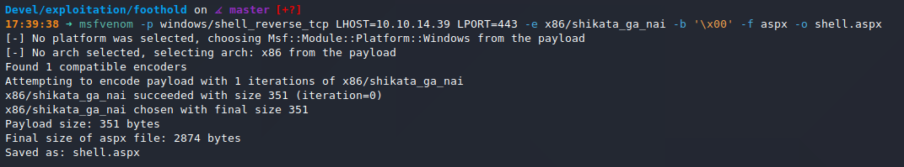
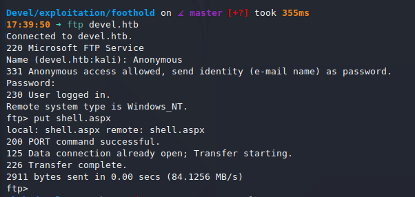
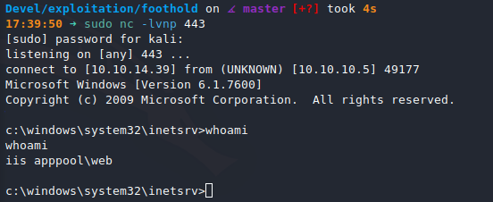
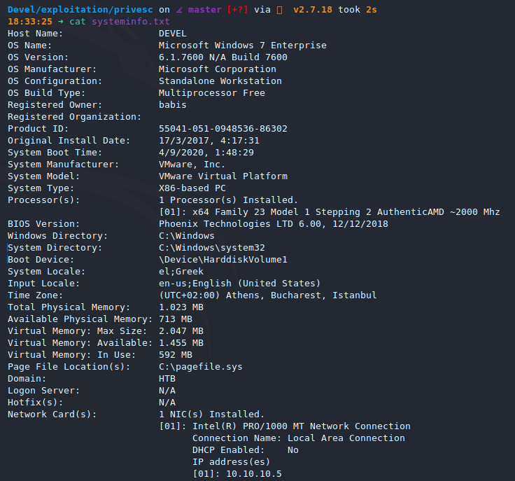
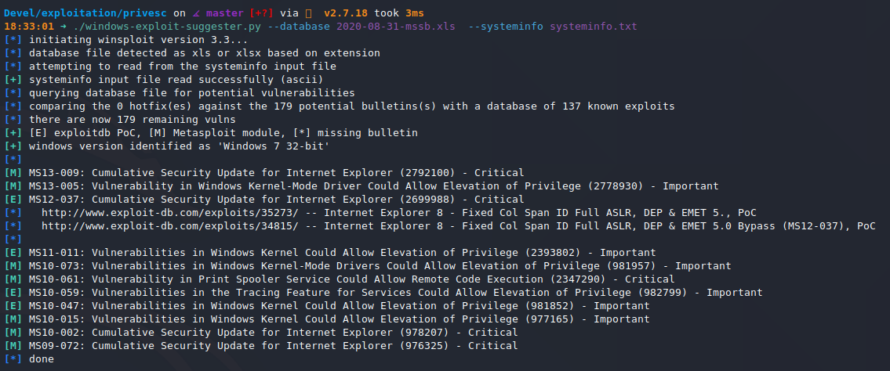
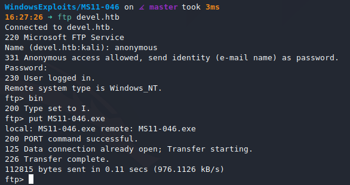
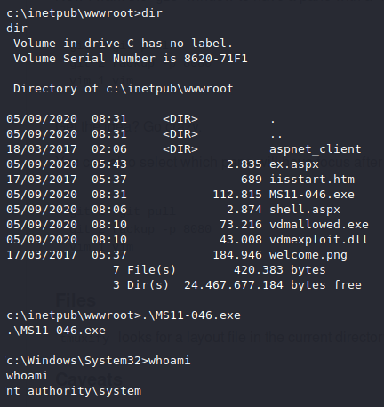

# Devel (`10.10.10.5`)

## Summary

## `/etc/hosts`

I begin by adding an entry in `/etc/hosts` to resolve `devel.htb` to `10.10.10.5`. I use this later in my report.

## Enumeration

I start a portscan of all ports (`-p-`), running OS, service version, and vulnerability scripts (`-A`), skipping host discovery (`-Pn`), with verbose logging (`-v`) and output to a file (`-oN`).

```bash
$ nmap -A -v -p- -Pn -oN allports devel.htb
# Nmap 7.80 scan initiated Mon Aug 31 17:36:03 2020 as: nmap -A -sVC -v -p- -Pn -oA allports devel.htb
adjust_timeouts2: packet supposedly had rtt of -405533 microseconds.  Ignoring time.
adjust_timeouts2: packet supposedly had rtt of -405533 microseconds.  Ignoring time.
Nmap scan report for devel.htb (10.10.10.5)
Host is up (0.046s latency).
Not shown: 65533 filtered ports
PORT   STATE SERVICE VERSION
21/tcp open  ftp     Microsoft ftpd
| ftp-anon: Anonymous FTP login allowed (FTP code 230)
| 03-18-17  02:06AM       <DIR>          aspnet_client
| 09-04-20  02:01AM                 2836 devel.aspx
| 09-04-20  05:40AM                 2835 ex.aspx
| 03-17-17  05:37PM                  689 iisstart.htm
|_03-17-17  05:37PM               184946 welcome.png
| ftp-syst: 
|_  SYST: Windows_NT
80/tcp open  http    Microsoft IIS httpd 7.5
| http-methods: 
|   Supported Methods: OPTIONS TRACE GET HEAD POST
|_  Potentially risky methods: TRACE
|_http-server-header: Microsoft-IIS/7.5
|_http-title: IIS7
Warning: OSScan results may be unreliable because we could not find at least 1 open and 1 closed port
OS fingerprint not ideal because: Missing a closed TCP port so results incomplete
No OS matches for host
Uptime guess: 0.329 days (since Mon Aug 31 09:44:54 2020)
Network Distance: 2 hops
TCP Sequence Prediction: Difficulty=261 (Good luck!)
IP ID Sequence Generation: Busy server or unknown class
Service Info: OS: Windows; CPE: cpe:/o:microsoft:windows

TRACEROUTE (using port 21/tcp)
HOP RTT      ADDRESS
1   44.07 ms 10.10.14.1
2   44.06 ms devel.htb (10.10.10.5)

Read data files from: /usr/bin/../share/nmap
OS and Service detection performed. Please report any incorrect results at https://nmap.org/submit/ .
# Nmap done at Mon Aug 31 17:39:09 2020 -- 1 IP address (1 host up) scanned in 186.80 seconds
```

## Reverse Shell

Looks like the FTP contents are being served over port 80, so I'll upload an `aspx` shell, start a `nc` listener and get a shell.





I start a `nc` listener on port 443 and navigate to `http://devel.htb/shell.aspx` and get a shell back.



## Privilege Escalation





After much trial and error, none of these exploits got me a shell. I believe they would have worked if I had a graphical session instead of just a remote shell. The session just hung. I landed on `MS11-046`, when I found a remote shell friendly version [here](https://github.com/abatchy17/WindowsExploits/tree/master/MS11-046).




