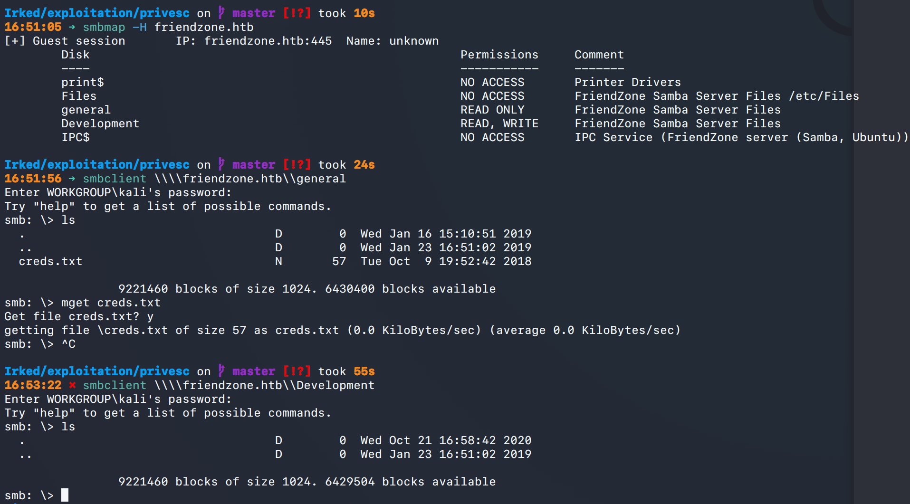
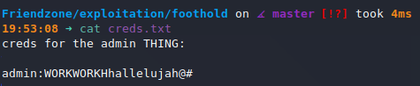
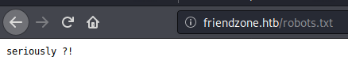

# Friendzone (`10.10.10.123`)

## Summary

## Enumeration

I start a portscan of all ports (`-p-`), running OS, service version, and vulnerability scripts (`-A`), skipping host discovery (`-Pn`), with verbose logging (`-v`) and output to a file (`-oN`).

```bash
$ sudo nmap -A -v -p- -sVC -Pn -oN allports friendzone.htb
# Nmap 7.80 scan initiated Wed Oct 21 16:23:01 2020 as: nmap -A -v -p- -sVC -Pn -oN allports friendzone.htb
Nmap scan report for friendzone.htb (10.10.10.123)
Host is up (0.083s latency).
Not shown: 65528 closed ports
PORT    STATE SERVICE     VERSION
21/tcp  open  ftp         vsftpd 3.0.3
22/tcp  open  ssh         OpenSSH 7.6p1 Ubuntu 4 (Ubuntu Linux; protocol 2.0)
| ssh-hostkey:
|   2048 a9:68:24:bc:97:1f:1e:54:a5:80:45:e7:4c:d9:aa:a0 (RSA)
|   256 e5:44:01:46:ee:7a:bb:7c:e9:1a:cb:14:99:9e:2b:8e (ECDSA)
|_  256 00:4e:1a:4f:33:e8:a0:de:86:a6:e4:2a:5f:84:61:2b (ED25519)
53/tcp  open  domain      ISC BIND 9.11.3-1ubuntu1.2 (Ubuntu Linux)
| dns-nsid:
|_  bind.version: 9.11.3-1ubuntu1.2-Ubuntu
80/tcp  open  http        Apache httpd 2.4.29 ((Ubuntu))
| http-methods:
|_  Supported Methods: HEAD GET POST OPTIONS
|_http-server-header: Apache/2.4.29 (Ubuntu)
|_http-title: Friend Zone Escape software
139/tcp open  netbios-ssn Samba smbd 3.X - 4.X (workgroup: WORKGROUP)
443/tcp open  ssl/ssl     Apache httpd (SSL-only mode)
| http-methods:
|_  Supported Methods: HEAD GET POST OPTIONS
|_http-server-header: Apache/2.4.29 (Ubuntu)
|_http-title: 404 Not Found
|_ssl-date: TLS randomness does not represent time
| tls-alpn:
|_  http/1.1
445/tcp open  netbios-ssn Samba smbd 4.7.6-Ubuntu (workgroup: WORKGROUP)

Uptime guess: 41.756 days (since Thu Sep 10 21:36:40 2020)
Network Distance: 2 hops
TCP Sequence Prediction: Difficulty=263 (Good luck!)
IP ID Sequence Generation: All zeros
Service Info: Host: FRIENDZONE; OSs: Unix, Linux; CPE: cpe:/o:linux:linux_kernel

Host script results:
|_clock-skew: mean: -53m09s, deviation: 1h43m55s, median: 6m49s
| nbstat: NetBIOS name: FRIENDZONE, NetBIOS user: <unknown>, NetBIOS MAC: <unknown> (unknown)
| Names:
|   FRIENDZONE<00>       Flags: <unique><active>
|   FRIENDZONE<03>       Flags: <unique><active>
|   FRIENDZONE<20>       Flags: <unique><active>
|   \x01\x02__MSBROWSE__\x02<01>  Flags: <group><active>
|   WORKGROUP<00>        Flags: <group><active>
|   WORKGROUP<1d>        Flags: <unique><active>
|_  WORKGROUP<1e>        Flags: <group><active>
| smb-os-discovery:
|   OS: Windows 6.1 (Samba 4.7.6-Ubuntu)
|   Computer name: friendzone
|   NetBIOS computer name: FRIENDZONE\x00
|   Domain name: \x00
|   FQDN: friendzone
|_  System time: 2020-10-22T22:51:17+03:00
| smb-security-mode:
|   account_used: guest
|   authentication_level: user
|   challenge_response: supported
|_  message_signing: disabled (dangerous, but default)
| smb2-security-mode:
|   2.02:
|_    Message signing enabled but not required
| smb2-time:
|   date: 2020-10-22T19:51:17
|_  start_date: N/A

TRACEROUTE (using port 7367/tcp)
HOP RTT      ADDRESS
1   77.43 ms 10.10.14.1
2   85.47 ms friendzone.htb (10.10.10.123)

Read data files from: /usr/bin/../share/nmap
OS and Service detection performed. Please report any incorrect results at https://nmap.org/submit/ .
# Nmap done at Thu Oct 22 15:45:35 2020 -- 1 IP address (1 host up) scanned in 84154.41 seconds
```

### `vsftpd 3.0.3` (Port 21)

### `OpenSSH 7.6p1` (Port 22)

### DNS `ISC BIND 9.11.3-1ubuntu1.2` (Port 53)

### `Samba smbd 3.X - 4.X` (Ports 139/445)





`admin:WORKWORKHhallelujah@#`

### Web Servers (Ports 80/443)




## Reverse Shell

## Upgrading Shell

## Privilege Escalation

## Proof

> `> type "C:\Users\Administrator\Desktop\proof.txt" && whoami && ipconfig`
> `> type "C:\Documents and Settings\Administrator\Desktop\proof.txt" && whoami && ipconfig`
> `$ cat /root/proof.txt && whoami && /sbin/ifconfig`

## Post Exploitation

## Clean Up

## Remediation

In order to remediate these issues, I suggest:

-
