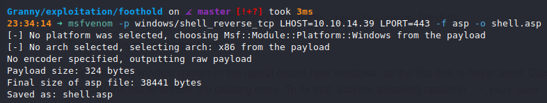
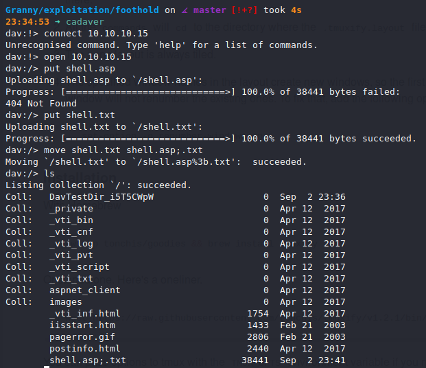
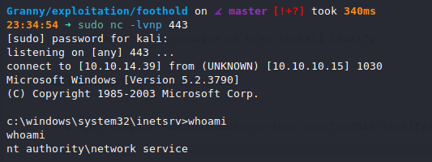
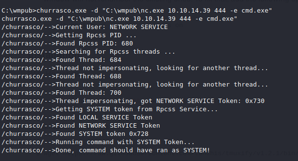
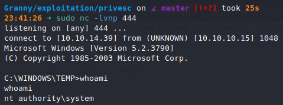

# Granny (`10.10.10.15`)

## `/etc/hosts`

I begin by adding an entry in `/etc/hosts` to resolve `granny.htb` to `10.10.10.15`. I use this later in my report.

## Enumeration

I start a portscan of all ports (`-p-`), running OS, service version, and vulnerability scripts (`-A`), skipping host discovery (`-Pn`), with verbose logging (`-v`) and output to a file (`-oN`).

```bash
$ nmap -A -v -p- -Pn -oN allports 10.10.10.15
# Nmap 7.80 scan initiated Wed Sep  2 23:29:22 2020 as: nmap -A -sVC -v -p- -Pn -oA allports 10.10.10.15
adjust_timeouts2: packet supposedly had rtt of -409484 microseconds.  Ignoring time.
adjust_timeouts2: packet supposedly had rtt of -409484 microseconds.  Ignoring time.
adjust_timeouts2: packet supposedly had rtt of -210511 microseconds.  Ignoring time.
adjust_timeouts2: packet supposedly had rtt of -210511 microseconds.  Ignoring time.
Nmap scan report for granny.htb (10.10.10.15)
Host is up (0.044s latency).
Not shown: 65534 filtered ports
PORT   STATE SERVICE VERSION
80/tcp open  http    Microsoft IIS httpd 6.0
| http-methods: 
|   Supported Methods: OPTIONS TRACE GET HEAD DELETE COPY MOVE PROPFIND PROPPATCH SEARCH MKCOL LOCK UNLOCK PUT POST
|_  Potentially risky methods: TRACE DELETE COPY MOVE PROPFIND PROPPATCH SEARCH MKCOL LOCK UNLOCK PUT
|_http-server-header: Microsoft-IIS/6.0
|_http-title: Under Construction
| http-webdav-scan: 
|   Allowed Methods: OPTIONS, TRACE, GET, HEAD, DELETE, COPY, MOVE, PROPFIND, PROPPATCH, SEARCH, MKCOL, LOCK, UNLOCK
|   Public Options: OPTIONS, TRACE, GET, HEAD, DELETE, PUT, POST, COPY, MOVE, MKCOL, PROPFIND, PROPPATCH, LOCK, UNLOCK, SEARCH
|   WebDAV type: Unknown
|   Server Date: Thu, 03 Sep 2020 04:38:20 GMT
|_  Server Type: Microsoft-IIS/6.0
Warning: OSScan results may be unreliable because we could not find at least 1 open and 1 closed port
Device type: general purpose
Running (JUST GUESSING): Microsoft Windows 2003|2008|XP|2000 (89%)
OS CPE: cpe:/o:microsoft:windows_server_2003::sp1 cpe:/o:microsoft:windows_server_2003::sp2 cpe:/o:microsoft:windows_server_2008::sp2 cpe:/o:microsoft:windows_xp::sp3 cpe:/o:microsoft:windows_2000::sp4
Aggressive OS guesses: Microsoft Windows Server 2003 SP1 or SP2 (89%), Microsoft Windows Server 2003 SP2 (89%), Microsoft Windows Server 2008 Enterprise SP2 (89%), Microsoft Windows 2003 SP2 (87%), Microsoft Windows XP SP3 (87%), Microsoft Windows 2000 SP4 (85%), Microsoft Windows XP (85%)
No exact OS matches for host (test conditions non-ideal).
Network Distance: 2 hops
TCP Sequence Prediction: Difficulty=248 (Good luck!)
IP ID Sequence Generation: Busy server or unknown class
Service Info: OS: Windows; CPE: cpe:/o:microsoft:windows

TRACEROUTE (using port 80/tcp)
HOP RTT      ADDRESS
1   43.29 ms 10.10.14.1
2   43.29 ms granny.htb (10.10.10.15)

Read data files from: /usr/bin/../share/nmap
OS and Service detection performed. Please report any incorrect results at https://nmap.org/submit/ .
# Nmap done at Wed Sep  2 23:32:27 2020 -- 1 IP address (1 host up) scanned in 185.62 seconds
```

`$ davtest -url http://10.10.10.15` shows me I can upload `.txt` files.






I start a `nc` listener and visit the webpage `http://granny.htb/shell.asp;.txt`, and get a shell.



I use FTP to move over `Churrasco` and `nc`, and use that to obtain a `SYSTEM` shell.



