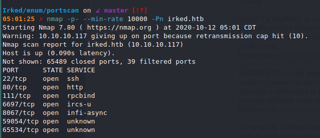
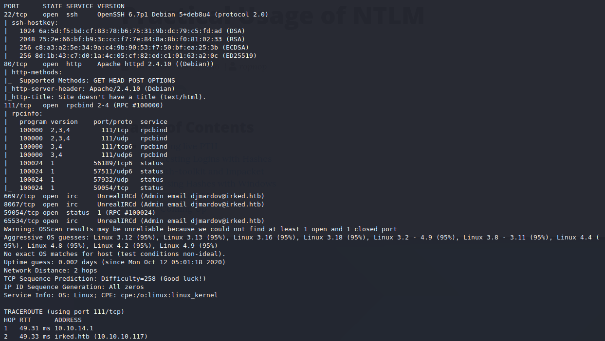

# Irked (`10.10.10.117`)

## Summary

## Enumeration




```bash
$ sudo nmap -A -v -p 22,80,111,6697,8067,59054,65534 -Pn -oA allports irked.htb
```



`djmardov@irked.htb`

The current attack surface is:

-

## Reverse Shell

## Upgrading Shell

## Privilege Escalation

## Proof

> `> type "C:\Users\Administrator\Desktop\proof.txt" && whoami && ipconfig`
> `> type "C:\Documents and Settings\Administrator\Desktop\proof.txt" && whoami && ipconfig`
> `$ cat /root/proof.txt && whoami && /sbin/ifconfig`

## Post Exploitation

## Clean Up

## Remediation

In order to remediate these issues, I suggest:

-
