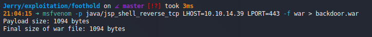
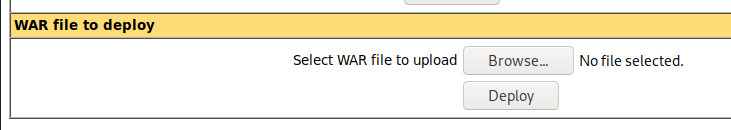
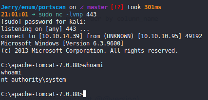
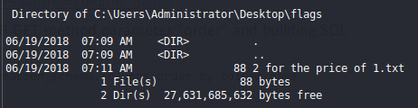

# Jerry (`10.10.10.95`)

## Summary

Apache Tomcat with default credentials. Upload backdoor reverse shell, get a root shell.

## `/etc/hosts`

I begin by adding an entry in `/etc/hosts` to resolve `jerry.htb` to `10.10.10.95`. I use this later in my report.

## Enumeration

I start a portscan of all ports (`-p-`), running OS, service version, and vulnerability scripts (`-A`), skipping host discovery (`-Pn`), with verbose logging (`-v`) and output to a file (`-oN`).

```bash
$ nmap -A -v -p- -Pn -oN allports jerry.htb
...
Scanning jerry.htb (10.10.10.95) [65535 ports]
Discovered open port 8080/tcp on 10.10.10.95
...
```

I see an `Apache Tomcat` homepage on port 8080. I log in to the manager with the default credentials: `tomcat:s3cret`.

I create a backdoor WAR file.



Upload it, and deploy it after starting a `nc` listener.



I have a root shell.



Both flags are present.


