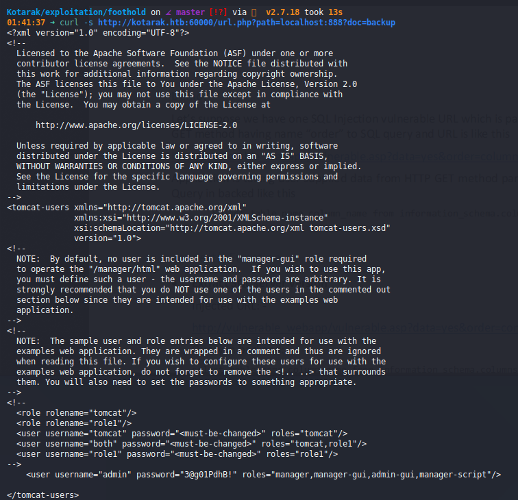
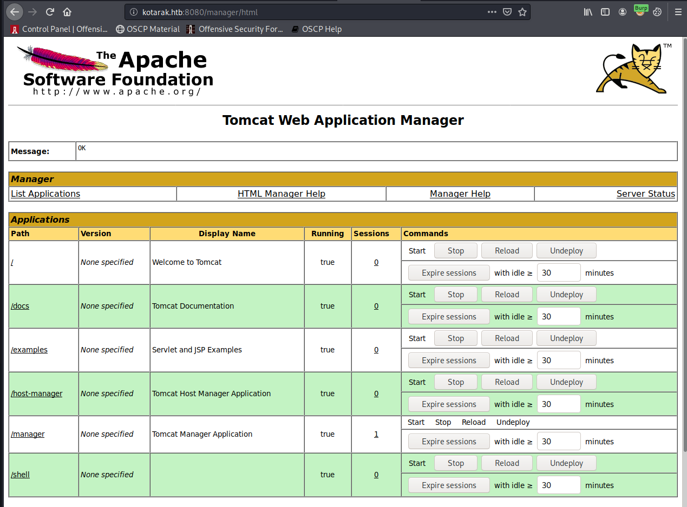
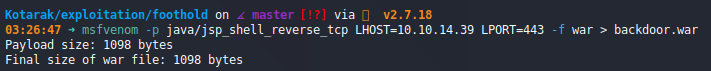
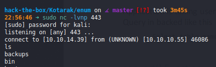
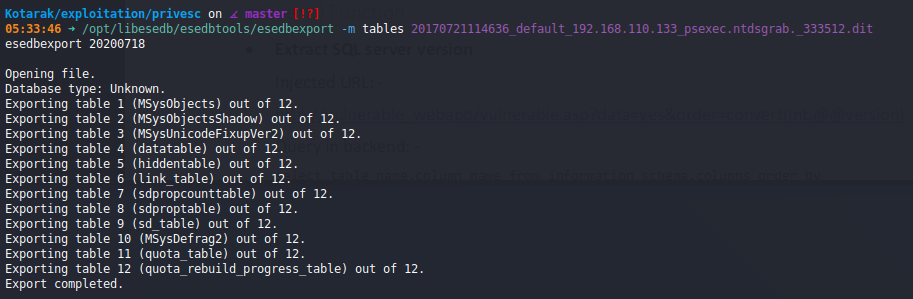
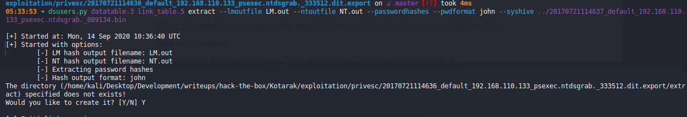
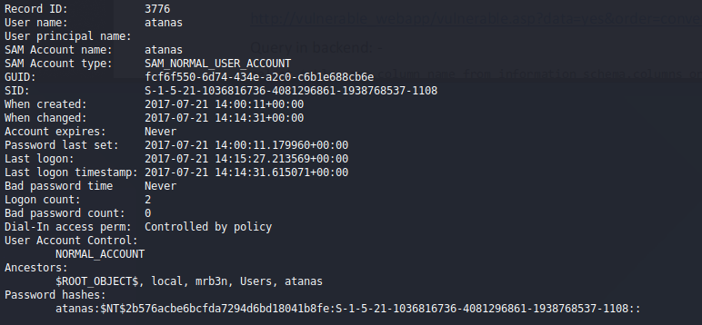
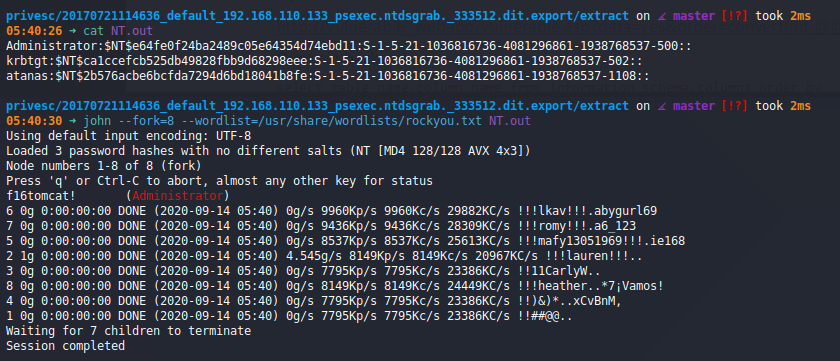
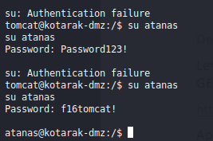
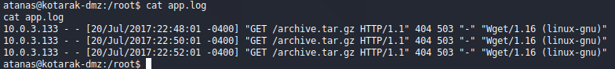

# Kotarak (`10.10.10.55`)

## Summary

## `/etc/hosts`

I begin by adding an entry in `/etc/hosts` to resolve `kotarak.htb` to `10.10.10.55`. I use this later in my report.

## Enumeration

I start a portscan of all ports (`-p-`), running OS, service version, and vulnerability scripts (`-A`), skipping host discovery (`-Pn`), with verbose logging (`-v`) and output to a file (`-oN`).

```bash
$ nmap -A -v -p- -Pn -oN allports kotarak.htb

```

The current attack surface is:

- Port 8080: Apache Tomcat 8.5.5

### Enumerate Port 60000

`$ for i in $(seq 0 1000); do echo "$i: "; curl -s http://kotarak.htb:60000/url.php?path=localhost:$i ; done`



I find credentials for `Tomcat`: `admin:3@g01PdhB!`.

Log in on port 8080.



Upload and deploy a WAR reverse shell and you've got your shell.





## Privilege Escalation to `atanas`










`Administrator:f16tomcat!` is a cracked set of credentials, but I'm really interested in the `atanas` creds. `john` stumbled with cracking them, but `Crackstation` takes care of it easily.


Turns out, I really did care about the `Administrator` one.



## Privilege Escalation to `root`



TODO: Root it with `$ searchsploit -m linux/remote/40064.txt` but I can't get it to work. So we're moving on.

## Proof

> `> type "C:\Users\Administrator\Desktop\proof.txt" && whoami && ipconfig`
> `> type "C:\Documents and Settings\Administrator\Desktop\proof.txt" && whoami && ipconfig`
> `$ cat /root/proof.txt && whoami && /sbin/ifconfig`

## Post Exploitation

## Clean Up

## Remediation

In order to remediate these issues, I suggest:

-
