# Lightweight (`10.10.10.119`)

## Summary

`SSH` in using account created by website on port 80. Sniff LDAP traffic off of localhost to scrape the password for `ldapuser2`. Find password for `ldapuser1` in a backup archive on the system. Escalate to root taking advantage of extra capabilities given to `/home/ldapuser1/openssl`.

## `/etc/hosts`

I begin by adding an entry in `/etc/hosts` to resolve `lightweight.htb` to `10.10.10.119`. I use this later in my report.

## Enumeration

I start a portscan of all ports (`-p-`), running OS, service version, and vulnerability scripts (`-A`), skipping host discovery (`-Pn`), with verbose logging (`-v`) and output to a file (`-oN`).

```bash
$ nmap -A -v -p- -Pn -oN allports lightweight.htb
# Nmap 7.91 scan initiated Tue Dec 29 05:42:27 2020 as: nmap -A -v -p- -Pn -oN allports lightweight.htb
Nmap scan report for lightweight.htb (10.10.10.119)
Host is up (0.040s latency).
Not shown: 65532 filtered ports
PORT    STATE SERVICE    VERSION
22/tcp  open  ssh        OpenSSH 7.4 (protocol 2.0)
| ssh-hostkey: 
|   2048 19:97:59:9a:15:fd:d2:ac:bd:84:73:c4:29:e9:2b:73 (RSA)
|   256 88:58:a1:cf:38:cd:2e:15:1d:2c:7f:72:06:a3:57:67 (ECDSA)
|_  256 31:6c:c1:eb:3b:28:0f:ad:d5:79:72:8f:f5:b5:49:db (ED25519)
80/tcp  open  tcpwrapped
389/tcp open  ldap       OpenLDAP 2.2.X - 2.3.X
| ssl-cert: Subject: commonName=lightweight.htb
| Subject Alternative Name: DNS:lightweight.htb, DNS:localhost, DNS:localhost.localdomain
| Issuer: commonName=lightweight.htb
| Public Key type: rsa
| Public Key bits: 1024
| Signature Algorithm: sha256WithRSAEncryption
| Not valid before: 2018-06-09T13:32:51
| Not valid after:  2019-06-09T13:32:51
| MD5:   0e61 1374 e591 83bd fd4a ee1a f448 547c
|_SHA-1: 8e10 be17 d435 e99d 3f93 9f40 c5d9 433c 47dd 532f
|_ssl-date: TLS randomness does not represent time
Warning: OSScan results may be unreliable because we could not find at least 1 open and 1 closed port
Aggressive OS guesses: Linux 3.10 - 4.11 (92%), Linux 3.18 (92%), Linux 3.2 - 4.9 (92%), Linux 5.1 (92%), Crestron XPanel control system (90%), Linux 3.16 (89%), ASUS RT-N56U WAP (Linux 3.4) (87%), Linux 3.1 (87%), Linux 3.2 (87%), HP P2000 G3 NAS device (87%)
No exact OS matches for host (test conditions non-ideal).
Uptime guess: 0.002 days (since Tue Dec 29 05:42:26 2020)
Network Distance: 2 hops
TCP Sequence Prediction: Difficulty=260 (Good luck!)
IP ID Sequence Generation: All zeros

TRACEROUTE (using port 80/tcp)
HOP RTT      ADDRESS
1   40.47 ms 10.10.14.1
2   40.45 ms lightweight.htb (10.10.10.119)

Read data files from: /usr/bin/../share/nmap
OS and Service detection performed. Please report any incorrect results at https://nmap.org/submit/ .
# Nmap done at Tue Dec 29 05:44:46 2020 -- 1 IP address (1 host up) scanned in 139.33 seconds
```

Right on the homepage, I see a hyperlink to `Status`, `Info` and `User` pages. I click on `User` and am redirected to `http://10.10.10.119/user.php`.

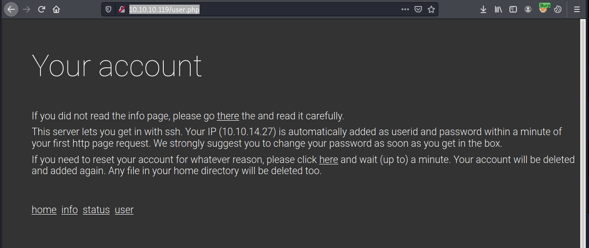

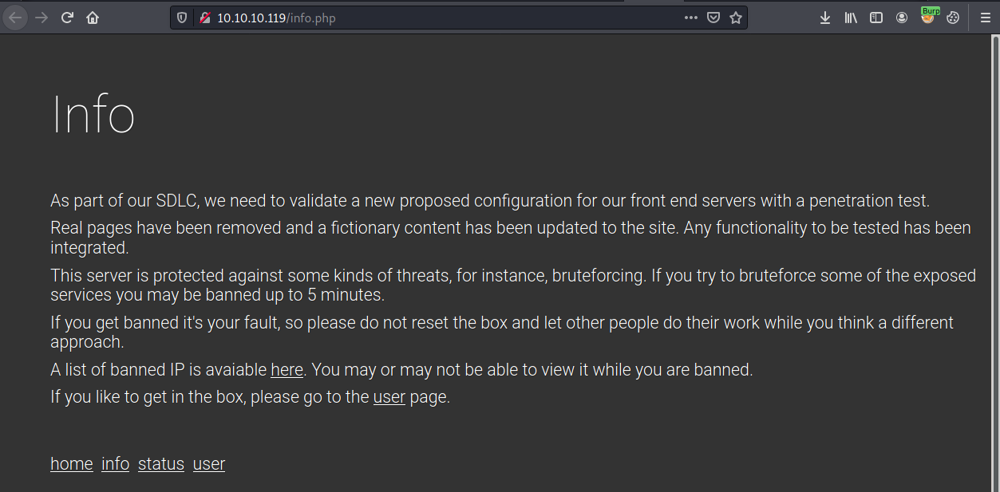

`Status` never loads.

I use `10.10.14.27` as the username and password to `SSH` in.

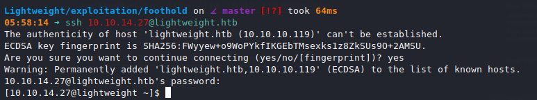

## Reverse Shell

## Privilege Escalation to `ldapuser2`

Running CentOS Linux release 7.5.1804

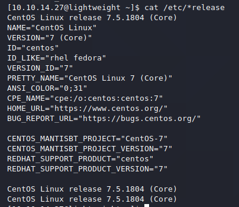

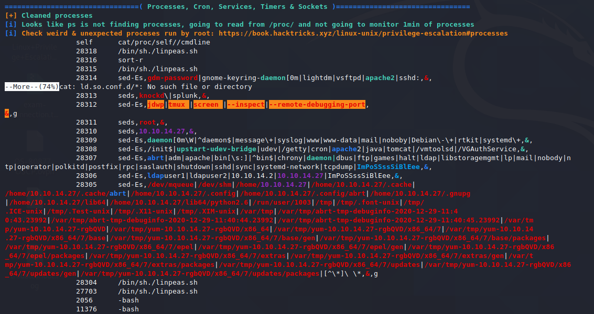

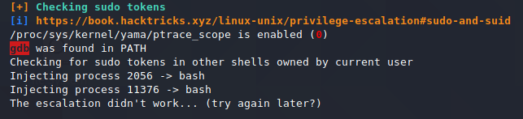

I capture LDAP localhost traffic and reset my account on the interface on port 80. I watch the authentication string flow over the network.

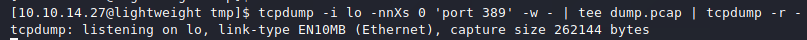

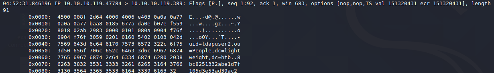

`8bc8251332abe1d7f105d3e53ad39ac2`

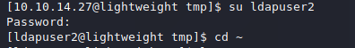

## Privilege Escalation to `ldapuser1`

I find a file `backup.7z` in the home directory of `ldapuser2`.

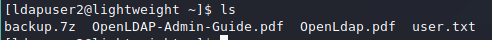

I turn it into `base64` so I can copy and paste it over to my host system, and transfer the file like so.

```bash
## On target
$ cat backup.7z | base64
# Copy output

## On host
$ echo "PASTED OUTPUT" | base64 -d > backup.7z
```

It's password protected, so we'll need to crack it.

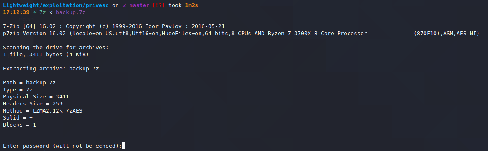

I first dump the hash with `7z2john.pl`.

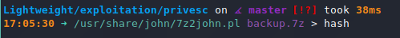

I then remove the filename from the beginning of the hash, changing it from:

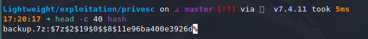

to:

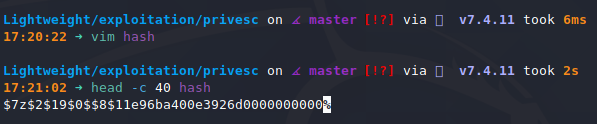

`john` quickly finds the password to be `delete`, which sounds incredibly promising.

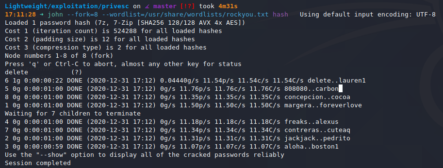

It decrypts properly.

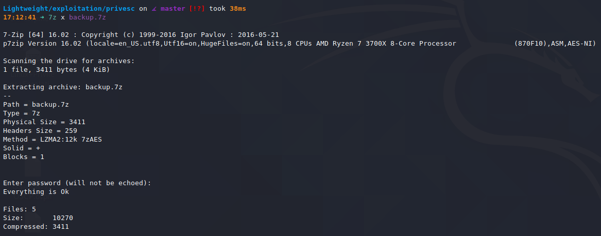

And I find a pair of credentials in the extracted files.

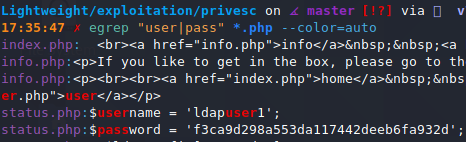

`ldapuser1:f3ca9d298a553da117442deeb6fa932d`

## `ldapuser1` to `root`

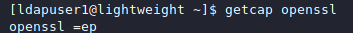

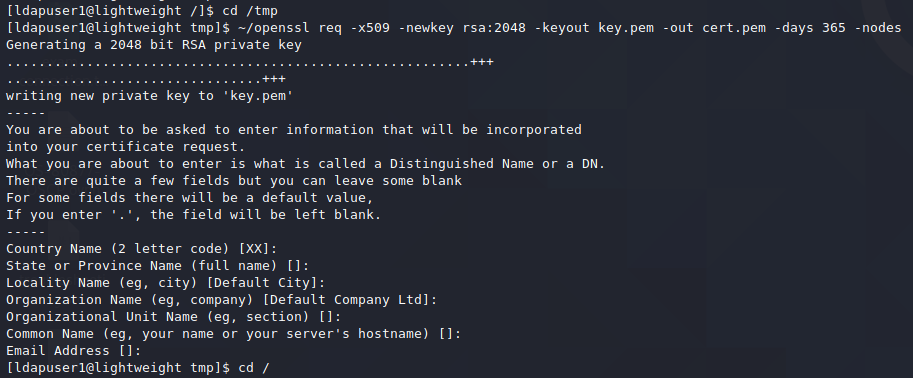

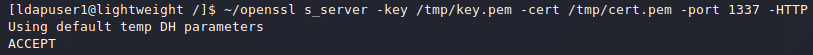

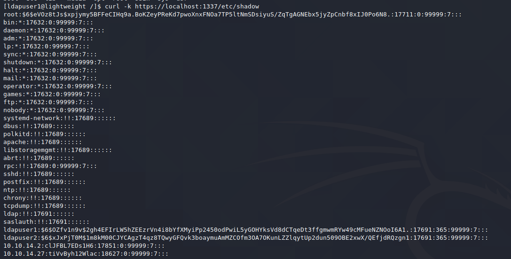

```
root:$6$eVOz8tJs$xpjymy5BFFeCIHq9a.BoKZeyPReKd7pwoXnxFNOa7TP5ltNmSDsiyuS/ZqTgAGNEbx5jyZpCnbf8xIJ0Po6N8.:17711:0:99999:7:::
bin:*:17632:0:99999:7:::
daemon:*:17632:0:99999:7:::
adm:*:17632:0:99999:7:::
lp:*:17632:0:99999:7:::
sync:*:17632:0:99999:7:::
shutdown:*:17632:0:99999:7:::
halt:*:17632:0:99999:7:::
mail:*:17632:0:99999:7:::
operator:*:17632:0:99999:7:::
games:*:17632:0:99999:7:::
ftp:*:17632:0:99999:7:::
nobody:*:17632:0:99999:7:::
systemd-network:!!:17689::::::
dbus:!!:17689::::::
polkitd:!!:17689::::::
apache:!!:17689::::::
libstoragemgmt:!!:17689::::::
abrt:!!:17689::::::
rpc:!!:17689:0:99999:7:::
sshd:!!:17689::::::
postfix:!!:17689::::::
ntp:!!:17689::::::
chrony:!!:17689::::::
tcpdump:!!:17689::::::
ldap:!!:17691::::::
saslauth:!!:17691::::::
ldapuser1:$6$OZfv1n9v$2gh4EFIrLW5hZEEzrVn4i8bYfXMyiPp2450odPwiL5yGOHYksVd8dCTqeDt3ffgmwmRYw49cMFueNZNOoI6A1.:17691:365:99999:7:::
ldapuser2:$6$xJxPjT0M$1m8kM00CJYCAgzT4qz8TQwyGFQvk3boaymuAmMZCOfm3OA7OKunLZZlqytUp2dun509OBE2xwX/QEfjdRQzgn1:17691:365:99999:7:::
10.10.14.2:clJFBL7EDs1H6:17851:0:99999:7:::
10.10.14.27:tiVvByh12Wlac:18627:0:99999:7:::
```

I edit the `root` entry in `/etc/shadow` by replacing the password hash with the output from:

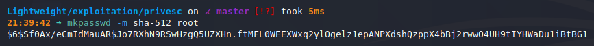

This makes `root:root` valid credentials, if I can replace the `/etc/shadow` file on the target.

I can do so using `openssl`.

I move the modified `shadow` file onto the target at `/tmp/shadow`. (The `root` line is changed to: `root:$6$UjM2.1t6NYzSFQm4$iZmZqG5eigvCcWV.iX4sDTjcjBdwj22zeLKwNSxVeAt2scfIO.lwtYyRvrncdiOhfpOkQlSq3nDKAVKgH0v6r1:17711:0:99999:7:::`).

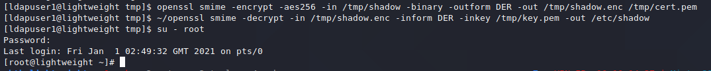

Note that `openssl` and `~/openssl` refer to different binaries. One has the required capabilities to overwrite `/etc/passwd`, and one does not.

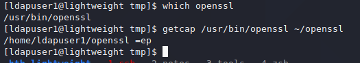