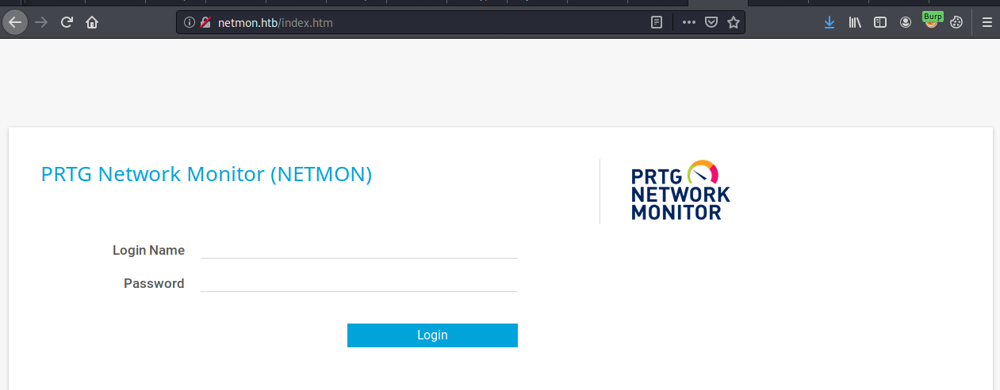
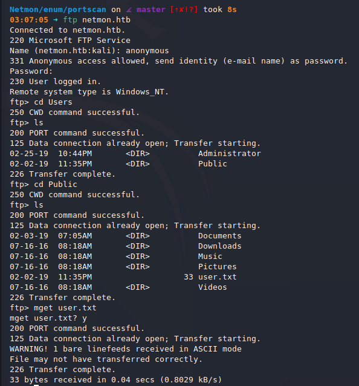
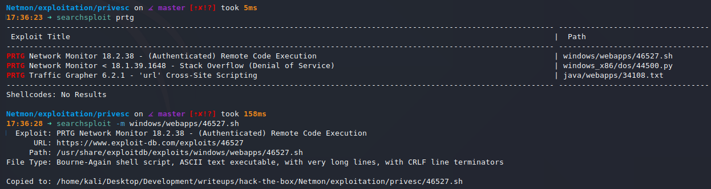
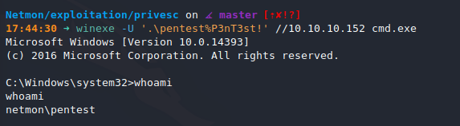
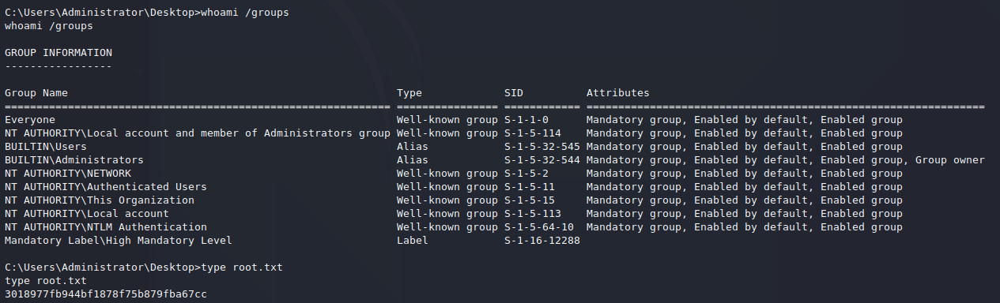

# Netmon (`10.10.10.152`)

## Summary

The whole `C:` drive was hosted on an FTP share with anonymous access allowed. The user flag was retrieved, and old `PRTG Network Monitor` credentials were found stored on the system. A slight variation of the password is the updated password. I used `CVE-2018-9276` to get Administrator access on the system.

## `/etc/hosts`

I begin by adding an entry in `/etc/hosts` to resolve `netmon.htb` to `10.10.10.152`. I use this later in my report.

## Enumeration

I start a portscan of all ports (`-p-`), running OS, service version, and vulnerability scripts (`-A`), skipping host discovery (`-Pn`), with verbose logging (`-v`) and output to a file (`-oN`).

```bash
$ nmap -A -v -p- -Pn -oN allports .htb
Nmap scan report for netmon.htb (10.10.10.152)
Host is up, received user-set (0.054s latency).
Scanned at 2020-11-30 03:05:07 CST for 162s
Not shown: 65522 closed ports
Reason: 65522 resets
PORT      STATE SERVICE      REASON          VERSION
21/tcp    open  ftp          syn-ack ttl 127 Microsoft ftpd
| ftp-anon: Anonymous FTP login allowed (FTP code 230)
| 02-02-19  11:18PM                 1024 .rnd
| 02-25-19  09:15PM       <DIR>          inetpub
| 07-16-16  08:18AM       <DIR>          PerfLogs
| 02-25-19  09:56PM       <DIR>          Program Files
| 02-02-19  11:28PM       <DIR>          Program Files (x86)
| 02-03-19  07:08AM       <DIR>          Users
|_02-25-19  10:49PM       <DIR>          Windows
| ftp-syst: 
|_  SYST: Windows_NT
80/tcp    open  http         syn-ack ttl 127 Indy httpd 18.1.37.13946 (Paessler PRTG bandwidth monitor)
|_http-favicon: Unknown favicon MD5: 36B3EF286FA4BEFBB797A0966B456479
| http-methods: 
|_  Supported Methods: GET HEAD POST OPTIONS
|_http-server-header: PRTG/18.1.37.13946
| http-title: Welcome | PRTG Network Monitor (NETMON)
|_Requested resource was /index.htm
|_http-trane-info: Problem with XML parsing of /evox/about
135/tcp   open  msrpc        syn-ack ttl 127 Microsoft Windows RPC
139/tcp   open  netbios-ssn  syn-ack ttl 127 Microsoft Windows netbios-ssn
445/tcp   open  microsoft-ds syn-ack ttl 127 Microsoft Windows Server 2008 R2 - 2012 microsoft-ds
5985/tcp  open  http         syn-ack ttl 127 Microsoft HTTPAPI httpd 2.0 (SSDP/UPnP)
|_http-server-header: Microsoft-HTTPAPI/2.0
|_http-title: Not Found
47001/tcp open  http         syn-ack ttl 127 Microsoft HTTPAPI httpd 2.0 (SSDP/UPnP)
|_http-server-header: Microsoft-HTTPAPI/2.0
|_http-title: Not Found
49664/tcp open  msrpc        syn-ack ttl 127 Microsoft Windows RPC
49665/tcp open  msrpc        syn-ack ttl 127 Microsoft Windows RPC
49666/tcp open  msrpc        syn-ack ttl 127 Microsoft Windows RPC
49667/tcp open  msrpc        syn-ack ttl 127 Microsoft Windows RPC
49668/tcp open  msrpc        syn-ack ttl 127 Microsoft Windows RPC
49669/tcp open  msrpc        syn-ack ttl 127 Microsoft Windows RPC
Aggressive OS guesses: Microsoft Windows Server 2016 build 10586 - 14393 (96%), Microsoft Windows Server 2016 (94%), Microsoft Windows 10 (93%), Microsoft Windows 10 1507 - 1607 (93%), Microsoft Windows Server 2012 (93%), Microsoft Windows Server 2012 R2 (93%), Microsoft Windows Server 2012 R2 Update 1 (93%), Microsoft Windows 7, Windows Server 2012, or Windows 8.1 Update 1 (93%), Microsoft Windows Vista SP1 - SP2, Windows Server 2008 SP2, or Windows 7 (93%), Microsoft Windows Vista SP1 (93%)
No exact OS matches for host (If you know what OS is running on it, see https://nmap.org/submit/ ).
TCP/IP fingerprint:
OS:SCAN(V=7.80%E=4%D=11/30%OT=21%CT=1%CU=32206%PV=Y%DS=2%DC=T%G=Y%TM=5FC4B6
OS:65%P=x86_64-pc-linux-gnu)SEQ(SP=FE%GCD=1%ISR=10F%TS=A)SEQ(SP=FE%GCD=1%IS
OS:R=10F%CI=I%TS=A)SEQ(SP=FE%GCD=1%ISR=10F%TI=I%CI=I%TS=A)OPS(O1=M54DNW8ST1
OS:1%O2=M54DNW8ST11%O3=M54DNW8NNT11%O4=M54DNW8ST11%O5=M54DNW8ST11%O6=M54DST
OS:11)WIN(W1=2000%W2=2000%W3=2000%W4=2000%W5=2000%W6=2000)ECN(R=Y%DF=Y%T=80
OS:%W=2000%O=M54DNW8NNS%CC=Y%Q=)T1(R=Y%DF=Y%T=80%S=O%A=S+%F=AS%RD=0%Q=)T2(R
OS:=Y%DF=Y%T=80%W=0%S=Z%A=S%F=AR%O=%RD=0%Q=)T3(R=Y%DF=Y%T=80%W=0%S=Z%A=O%F=
OS:AR%O=%RD=0%Q=)T4(R=Y%DF=Y%T=80%W=0%S=A%A=O%F=R%O=%RD=0%Q=)T5(R=Y%DF=Y%T=
OS:80%W=0%S=Z%A=S+%F=AR%O=%RD=0%Q=)T6(R=Y%DF=Y%T=80%W=0%S=A%A=O%F=R%O=%RD=0
OS:%Q=)T7(R=Y%DF=Y%T=80%W=0%S=Z%A=S+%F=AR%O=%RD=0%Q=)U1(R=Y%DF=N%T=80%IPL=1
OS:64%UN=0%RIPL=G%RID=G%RIPCK=G%RUCK=G%RUD=G)IE(R=Y%DFI=N%T=80%CD=Z)

Uptime guess: 0.004 days (since Mon Nov 30 03:02:20 2020)
Network Distance: 2 hops
TCP Sequence Prediction: Difficulty=254 (Good luck!)
IP ID Sequence Generation: Busy server or unknown class
Service Info: OSs: Windows, Windows Server 2008 R2 - 2012; CPE: cpe:/o:microsoft:windows

Host script results:
|_clock-skew: mean: 7m32s, deviation: 0s, median: 7m32s
| p2p-conficker: 
|   Checking for Conficker.C or higher...
|   Check 1 (port 33374/tcp): CLEAN (Couldn't connect)
|   Check 2 (port 52171/tcp): CLEAN (Couldn't connect)
|   Check 3 (port 15668/udp): CLEAN (Timeout)
|   Check 4 (port 18139/udp): CLEAN (Failed to receive data)
|_  0/4 checks are positive: Host is CLEAN or ports are blocked
|_smb-os-discovery: ERROR: Script execution failed (use -d to debug)
| smb-security-mode: 
|   authentication_level: user
|   challenge_response: supported
|_  message_signing: disabled (dangerous, but default)
| smb2-security-mode: 
|   2.02: 
|_    Message signing enabled but not required
| smb2-time: 
|   date: 2020-11-30T09:15:17
|_  start_date: 2020-11-30T09:10:03

TRACEROUTE (using port 1723/tcp)
HOP RTT       ADDRESS
1   152.37 ms 10.10.14.1
2   152.43 ms netmon.htb (10.10.10.152)

Read data files from: /usr/bin/../share/nmap
OS and Service detection performed. Please report any incorrect results at https://nmap.org/submit/ .
# Nmap done at Mon Nov 30 03:07:49 2020 -- 1 IP address (1 host up) scanned in 162.16 seconds
```

### Enumerating HTTP (Port 80)

I see a `PRTG Network Monitor` login page. The default credentials do not work. Moving on.



### Enumerating FTP (Port 21)




On the FTP server, I have access to `\ProgramData\Paessler\PRTG Network Monitor\PRTG Configuration.old.bak`, which contains a username and password.

```
<dbpassword>
<!-- User: prtgadmin -->
PrTg@dmin2018
</dbpassword>
```

I try those credentials on the login page, but they do not work. Incrementing the year to `2019` allows me to log in.

## Reverse Shell + Root






