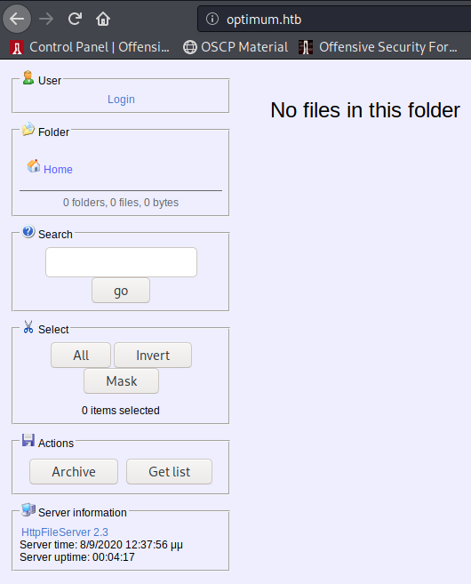
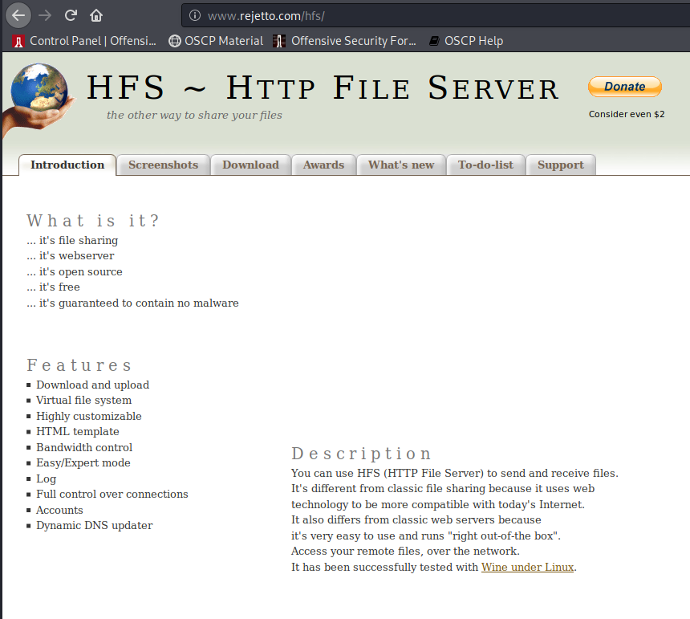
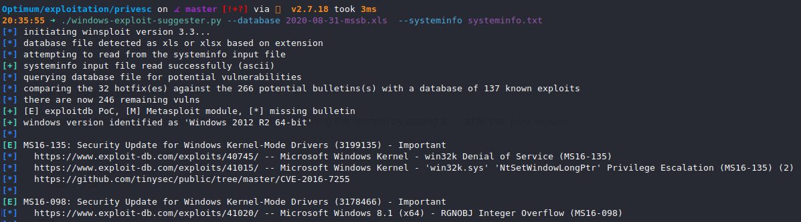
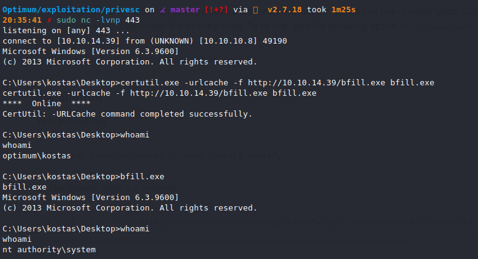

# Optimum (`10.10.10.8`)

## Summary

Rejetto HFS 2.3 RCE exploit + MS16-098 Kernel Exploit

## `/etc/hosts`

I begin by adding an entry in `/etc/hosts` to resolve `optimum.htb` to `10.10.10.8`. I use this later in my report.

## Enumeration

I start a portscan of all ports (`-p-`), running OS, service version, and vulnerability scripts (`-A`), skipping host discovery (`-Pn`), with verbose logging (`-v`) and output to a file (`-oN`).

```bash
$ nmap -A -v -p- -Pn -oN allports optimum.htb
# Nmap 7.80 scan initiated Tue Sep  1 19:30:33 2020 as: nmap -A -sVC -v -p- -Pn -oA allports 10.10.10.8
adjust_timeouts2: packet supposedly had rtt of -547881 microseconds.  Ignoring time.
adjust_timeouts2: packet supposedly had rtt of -547881 microseconds.  Ignoring time.
adjust_timeouts2: packet supposedly had rtt of -554971 microseconds.  Ignoring time.
adjust_timeouts2: packet supposedly had rtt of -554971 microseconds.  Ignoring time.
Nmap scan report for optimum.htb (10.10.10.8)
Host is up (0.061s latency).
Not shown: 65534 filtered ports
PORT   STATE SERVICE VERSION
80/tcp open  http    HttpFileServer httpd 2.3
|_http-favicon: Unknown favicon MD5: 759792EDD4EF8E6BC2D1877D27153CB1
| http-methods: 
|_  Supported Methods: GET HEAD
|_http-server-header: HFS 2.3
|_http-title: HFS /
Warning: OSScan results may be unreliable because we could not find at least 1 open and 1 closed port
Device type: general purpose
Running (JUST GUESSING): Microsoft Windows 2012|7 (90%)
OS CPE: cpe:/o:microsoft:windows_server_2012 cpe:/o:microsoft:windows_7::-:professional
Aggressive OS guesses: Microsoft Windows Server 2012 (90%), Microsoft Windows Server 2012 or Windows Server 2012 R2 (90%), Microsoft Windows Server 2012 R2 (90%), Microsoft Windows 7 Professional (85%)
No exact OS matches for host (test conditions non-ideal).
Uptime guess: 0.004 days (since Tue Sep  1 19:29:07 2020)
Network Distance: 2 hops
TCP Sequence Prediction: Difficulty=259 (Good luck!)
IP ID Sequence Generation: Busy server or unknown class
Service Info: OS: Windows; CPE: cpe:/o:microsoft:windows

TRACEROUTE (using port 80/tcp)
HOP RTT      ADDRESS
1   59.94 ms 10.10.14.1
2   59.94 ms optimum.htb (10.10.10.8)

Read data files from: /usr/bin/../share/nmap
OS and Service detection performed. Please report any incorrect results at https://nmap.org/submit/ .
# Nmap done at Tue Sep  1 19:34:14 2020 -- 1 IP address (1 host up) scanned in 221.34 seconds
```

## HTTP File Server (Port 80)





Vulnerable to https://www.exploit-db.com/raw/39161.

Put `nc.exe` in the same directory as you serve the python exploit from, update the IP address and port, and start a `nc` listener, then run the exploit. You'll get a shell.

## Privilege Escalation

I grab the `systeminfo` output and feed it to `windows-exploit-suggester`.



I use `MS16-098` to get root privileges.

https://github.com/SecWiki/windows-kernel-exploits/tree/master/MS16-098


