# Sunday (`10.10.10.76`)

## Summary

## `/etc/hosts`

I begin by adding an entry in `/etc/hosts` to resolve `sunday.htb` to `10.10.10.76`. I use this later in my report.

## Enumeration

I start a portscan of all ports (`-p-`), running OS, service version, and vulnerability scripts (`-A`), skipping host discovery (`-Pn`), with verbose logging (`-v`) and output to a file (`-oN`).

```bash
$ nmap -A -v -p- -Pn -oN allports sunday.htb
# Nmap 7.80 scan initiated Sun Sep  6 03:49:41 2020 as: nmap -A -sVC -v -p- -Pn -oA allports sunday.htb
Increasing send delay for 10.10.10.76 from 0 to 5 due to 11 out of 11 dropped probes since last increase.
Warning: 10.10.10.76 giving up on port because retransmission cap hit (10).
Nmap scan report for sunday.htb (10.10.10.76)
Host is up (0.045s latency).
Not shown: 64664 closed ports, 866 filtered ports
PORT      STATE SERVICE VERSION
79/tcp    open  finger  Sun Solaris fingerd
|_finger: No one logged on\x0D
111/tcp   open  rpcbind
22022/tcp open  ssh     SunSSH 1.3 (protocol 2.0)
| ssh-hostkey:
|   1024 d2:e5:cb:bd:33:c7:01:31:0b:3c:63:d9:82:d9:f1:4e (DSA)
|_  1024 e4:2c:80:62:cf:15:17:79:ff:72:9d:df:8b:a6:c9:ac (RSA)
43132/tcp open  rpcbind
44634/tcp open  unknown
No exact OS matches for host (If you know what OS is running on it, see https://nmap.org/submit/ ).
TCP/IP fingerprint:
OS:SCAN(V=7.80%E=4%D=9/6%OT=79%CT=1%CU=37957%PV=Y%DS=2%DC=T%G=Y%TM=5F557DC6
OS:%P=x86_64-pc-linux-gnu)SEQ(CI=I)SEQ(SP=92%GCD=1%ISR=A5%TI=I%CI=I%II=I%SS
OS:=S%TS=7)SEQ(CI=I%TS=7)SEQ(TI=I%TS=7)OPS(O1=NNT11M54DNW0NNS%O2=NNT11M54DN
OS:W0NNS%O3=NNT11M54DNW0%O4=NNT11M54DNW0NNS%O5=NNT11M54DNW0NNS%O6=NNT11M54D
OS:NNS)WIN(W1=C265%W2=C265%W3=C1CC%W4=C068%W5=C068%W6=C0B7)ECN(R=Y%DF=Y%T=3
OS:C%W=C421%O=M54DNW0NNS%CC=Y%Q=)T1(R=Y%DF=Y%T=3C%S=O%A=S+%F=AS%RD=0%Q=)T2(
OS:R=N)T3(R=N)T4(R=Y%DF=Y%T=40%W=0%S=A%A=Z%F=R%O=%RD=0%Q=)T5(R=Y%DF=Y%T=40%
OS:W=0%S=Z%A=S+%F=AR%O=%RD=0%Q=)T6(R=Y%DF=Y%T=40%W=0%S=A%A=Z%F=R%O=%RD=0%Q=
OS:)T7(R=N)U1(R=Y%DF=Y%T=FF%IPL=70%UN=0%RIPL=G%RID=G%RIPCK=G%RUCK=G%RUD=G)I
OS:E(R=Y%DFI=Y%T=FF%CD=S)

Uptime guess: 0.652 days (since Sun Sep  6 03:45:59 2020)
Network Distance: 2 hops
IP ID Sequence Generation: Incremental
Service Info: OS: Solaris; CPE: cpe:/o:sun:sunos

TRACEROUTE (using port 23/tcp)
HOP RTT      ADDRESS
1   45.04 ms 10.10.14.1
2   45.10 ms sunday.htb (10.10.10.76)

Read data files from: /usr/bin/../share/nmap
OS and Service detection performed. Please report any incorrect results at https://nmap.org/submit/ .
# Nmap done at Sun Sep  6 19:24:38 2020 -- 1 IP address (1 host up) scanned in 56097.48 seconds
```

### Finger

https://github.com/pentestmonkey/finger-user-enum

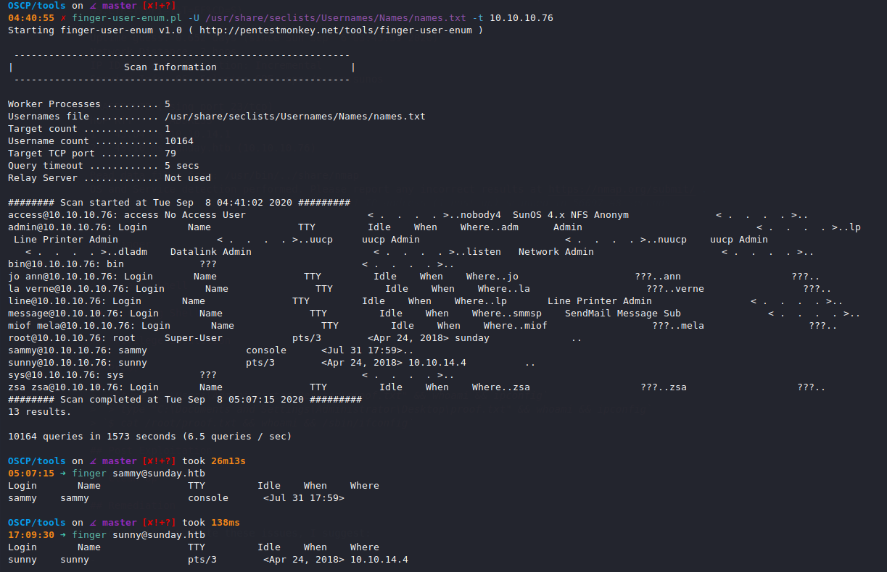

### SSH Brute Force

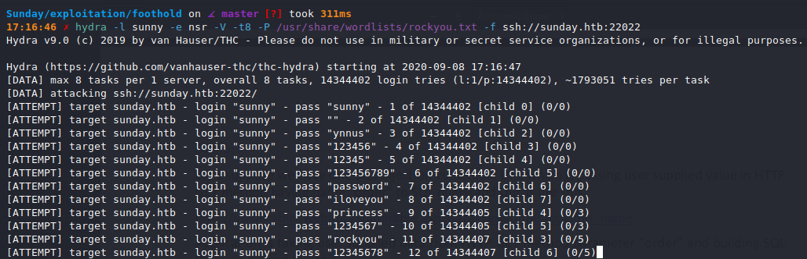

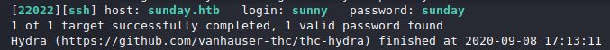

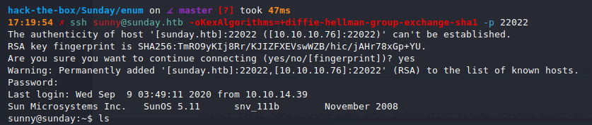

## Privilege Escalation (`sunny` to `sammy`)

I move `linpeas.sh` over. It flags two things.

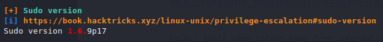

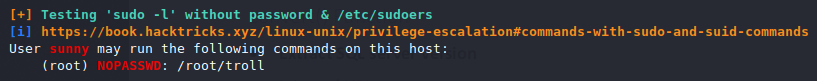

I then find the directory `/backup` and find a backup of the `/etc/shadow` file.

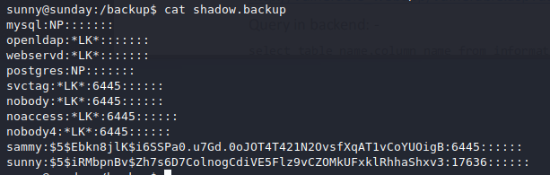

I use `john` to recover the credentials.

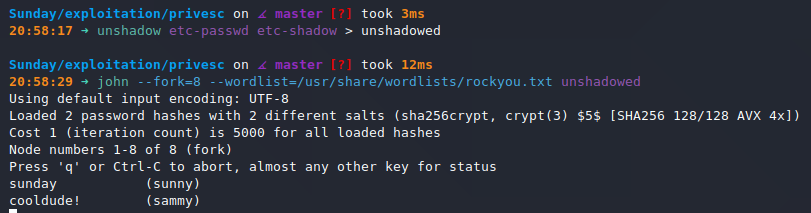

I can `ssh` in as `sammy` with the password `cooldude!`.

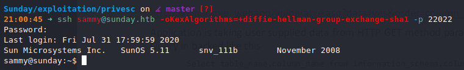

## Privilege Escalation (`sammy` to `root`)

`sammy` can execute `$ sudo wget` without a password, which is a SUID binary. 

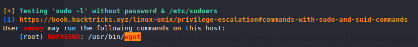

We know that `sunny` can execute `$ sudo /root/troll` without a password. To get a root shell, we'll write a script to `/root/troll` with `wget` as `sammy` and execute it as `sunny`.

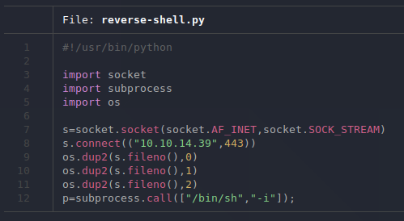

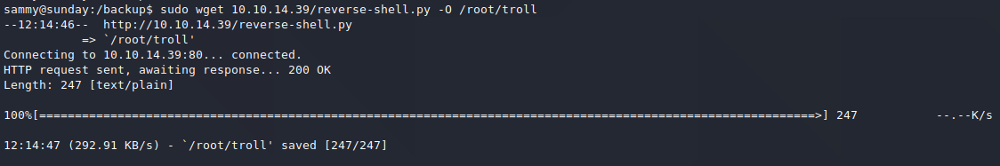

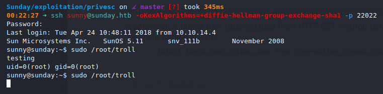

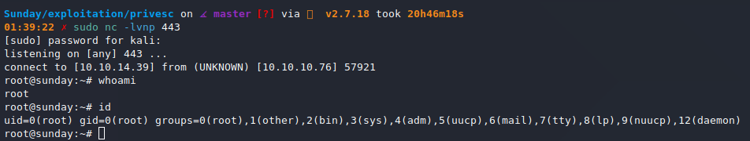