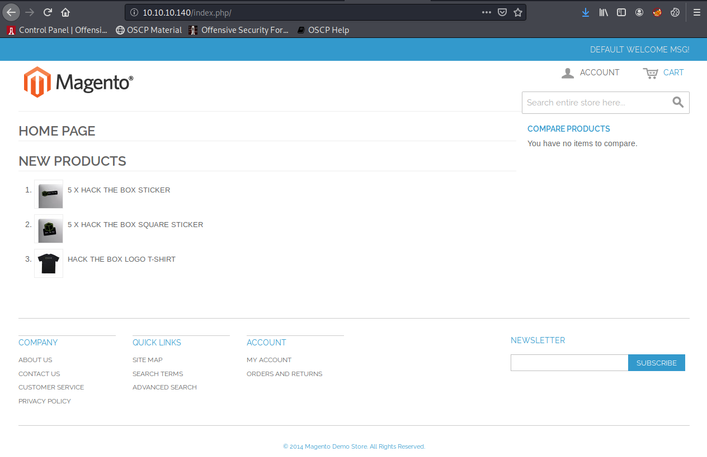
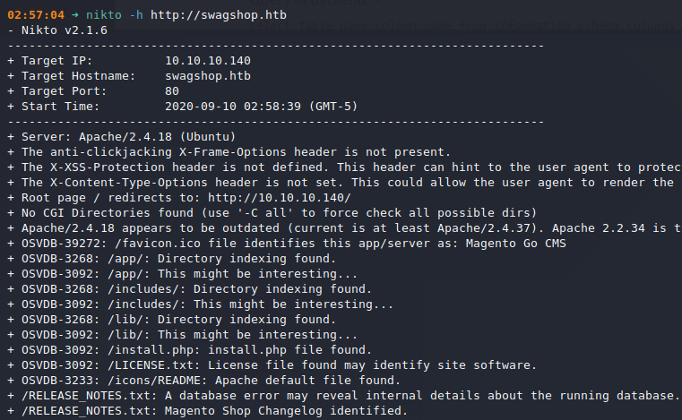
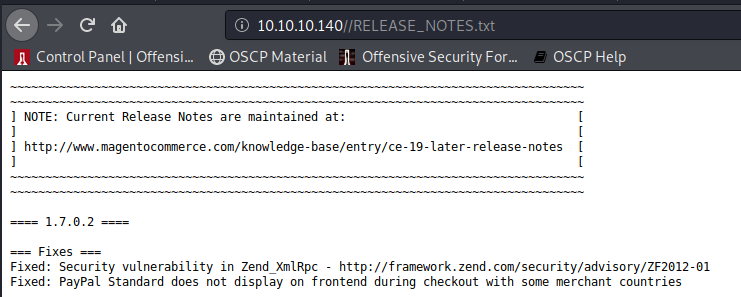
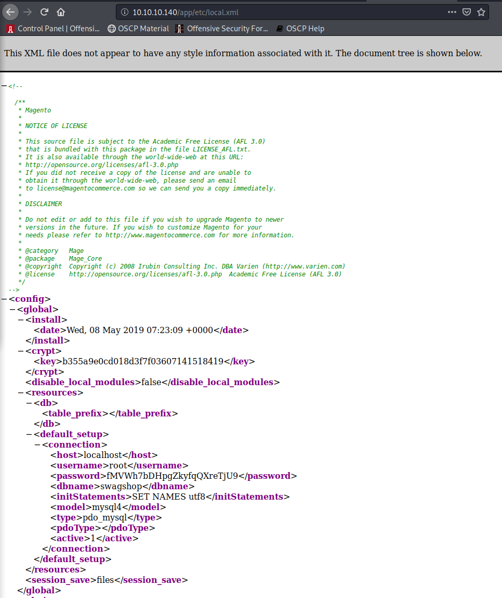
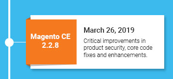
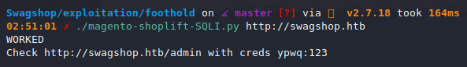
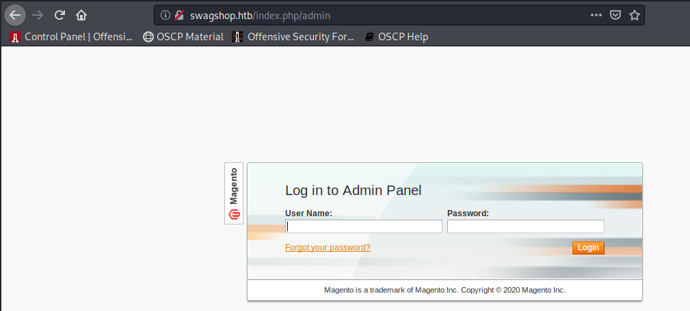
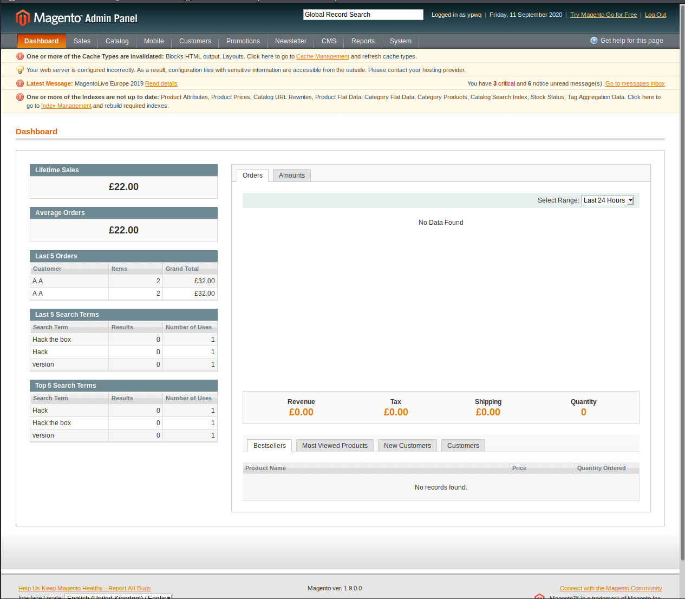

# Swagshop (`10.10.10.140`)

## Summary

## `/etc/hosts`

I begin by adding an entry in `/etc/hosts` to resolve `swagshop.htb` to `10.10.10.140`. I use this later in my report.

## Enumeration

I start a portscan of all ports (`-p-`), running OS, service version, and vulnerability scripts (`-A`), skipping host discovery (`-Pn`), with verbose logging (`-v`) and output to a file (`-oN`).

```bash
$ nmap -A -v -p- -Pn -oN allports 10.11.1.IP

```

### HTTP (Port 80)






I find a version above `v1.7.0.2` running, but I'm not sure which one.





Based on the install date, we can assume that it's running `2.2.8`.



I find an exploit for `CVE-2015-1397`: https://github.com/joren485/Magento-Shoplift-SQLI.





The credentials `ypwq:123` work.



We see it's running `Magento 1.9.0`.


## Reverse Shell

## Upgrading Shell

## Privilege Escalation

## Proof

> `> type "C:\Users\Administrator\Desktop\proof.txt" && whoami && ipconfig`
> `> type "C:\Documents and Settings\Administrator\Desktop\proof.txt" && whoami && ipconfig`
> `$ cat /root/proof.txt && whoami && /sbin/ifconfig`

## Post Exploitation

## Clean Up

## Remediation

In order to remediate these issues, I suggest:

-
