# Tabby (`10.10.10.IP`)

## Summary

## `/etc/hosts`

I begin by adding an entry in `/etc/hosts` to resolve `tabby.htb` to `10.10.10.194`. I use this later in my report.

## Enumeration

I start a portscan of all ports (`-p-`), running OS, service version, and vulnerability scripts (`-A`), skipping host discovery (`-Pn`), with verbose logging (`-v`) and output to a file (`-oN`).

```bash
$ nmap -A -v -p- -Pn -oN allports tabby.htb
# Nmap 7.91 scan initiated Sun Dec 27 00:33:27 2020 as: nmap -A -v -p- -Pn -oN allports tabby.htb
Nmap scan report for tabby.htb (10.10.10.194)
Host is up (0.051s latency).
Not shown: 65532 closed ports
PORT     STATE SERVICE VERSION
22/tcp   open  ssh     OpenSSH 8.2p1 Ubuntu 4 (Ubuntu Linux; protocol 2.0)
| ssh-hostkey: 
|   3072 45:3c:34:14:35:56:23:95:d6:83:4e:26:de:c6:5b:d9 (RSA)
|   256 89:79:3a:9c:88:b0:5c:ce:4b:79:b1:02:23:4b:44:a6 (ECDSA)
|_  256 1e:e7:b9:55:dd:25:8f:72:56:e8:8e:65:d5:19:b0:8d (ED25519)
80/tcp   open  http    Apache httpd 2.4.41 ((Ubuntu))
|_http-favicon: Unknown favicon MD5: 338ABBB5EA8D80B9869555ECA253D49D
| http-methods: 
|_  Supported Methods: GET HEAD POST OPTIONS
|_http-server-header: Apache/2.4.41 (Ubuntu)
|_http-title: Mega Hosting
8080/tcp open  http    Apache Tomcat
| http-methods: 
|_  Supported Methods: OPTIONS GET HEAD POST
|_http-title: Apache Tomcat
No exact OS matches for host (If you know what OS is running on it, see https://nmap.org/submit/ ).
TCP/IP fingerprint:
OS:SCAN(V=7.91%E=4%D=12/27%OT=22%CT=1%CU=36804%PV=Y%DS=2%DC=T%G=Y%TM=5FE81D
OS:12%P=x86_64-pc-linux-gnu)SEQ(SP=104%GCD=1%ISR=106%TI=Z%CI=Z%TS=A)OPS(O1=
OS:M54DST11NW7%O2=M54DST11NW7%O3=M54DNNT11NW7%O4=M54DST11NW7%O5=M54DST11NW7
OS:%O6=M54DST11)WIN(W1=FE88%W2=FE88%W3=FE88%W4=FE88%W5=FE88%W6=FE88)ECN(R=Y
OS:%DF=Y%T=40%W=FAF0%O=M54DNNSNW7%CC=Y%Q=)T1(R=Y%DF=Y%T=40%S=O%A=S+%F=AS%RD
OS:=0%Q=)T2(R=N)T3(R=N)T4(R=Y%DF=Y%T=40%W=0%S=A%A=Z%F=R%O=%RD=0%Q=)T5(R=Y%D
OS:F=Y%T=40%W=0%S=Z%A=S+%F=AR%O=%RD=0%Q=)T6(R=Y%DF=Y%T=40%W=0%S=A%A=Z%F=R%O
OS:=%RD=0%Q=)T7(R=Y%DF=Y%T=40%W=0%S=Z%A=S+%F=AR%O=%RD=0%Q=)U1(R=Y%DF=N%T=40
OS:%IPL=164%UN=0%RIPL=G%RID=G%RIPCK=G%RUCK=G%RUD=G)IE(R=Y%DFI=N%T=40%CD=S)

Uptime guess: 24.951 days (since Wed Dec  2 01:45:10 2020)
Network Distance: 2 hops
TCP Sequence Prediction: Difficulty=260 (Good luck!)
IP ID Sequence Generation: All zeros
Service Info: OS: Linux; CPE: cpe:/o:linux:linux_kernel

TRACEROUTE (using port 587/tcp)
HOP RTT      ADDRESS
1   73.47 ms 10.10.14.1
2   64.45 ms tabby.htb (10.10.10.194)

Read data files from: /usr/bin/../share/nmap
OS and Service detection performed. Please report any incorrect results at https://nmap.org/submit/ .
# Nmap done at Sun Dec 27 00:35:14 2020 -- 1 IP address (1 host up) scanned in 106.96 seconds

```

### Enumerating Port 80


I see a `vhost`: `megahosting.htb`. I add that to my `/etc/hosts` file.

```
...
10.10.10.194 tabby.htb megahosting.htb
...
```

`sales` is also likely a valid username.

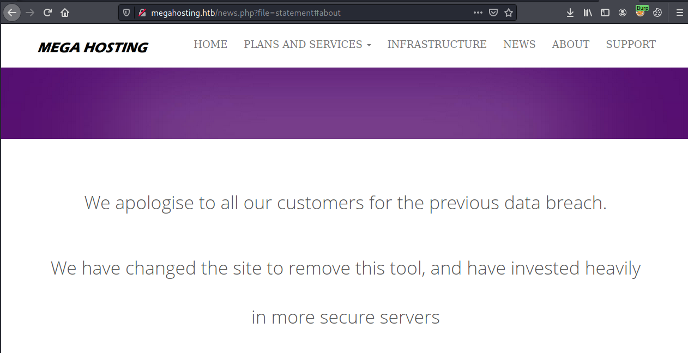

### Enumerating Port 8080


Tomcat 9 is running.

```bash
$ nikto -ask=no -h http://tabby.htb:8080
- Nikto v2.1.6
---------------------------------------------------------------------------
+ Target IP:          10.10.10.194
+ Target Hostname:    tabby.htb
+ Target Port:        8080
+ Start Time:         2020-12-27 00:32:58 (GMT-5)
---------------------------------------------------------------------------
+ Server: No banner retrieved
+ The anti-clickjacking X-Frame-Options header is not present.
+ The X-XSS-Protection header is not defined. This header can hint to the user agent to protect against some forms of XSS
+ The X-Content-Type-Options header is not set. This could allow the user agent to render the content of the site in a different fashion to the MIME type
+ No CGI Directories found (use '-C all' to force check all possible dirs)
+ Allowed HTTP Methods: GET, HEAD, POST, PUT, DELETE, OPTIONS 
+ OSVDB-397: HTTP method ('Allow' Header): 'PUT' method could allow clients to save files on the web server.
+ OSVDB-5646: HTTP method ('Allow' Header): 'DELETE' may allow clients to remove files on the web server.
+ /: Appears to be a default Apache Tomcat install.
+ /examples/servlets/index.html: Apache Tomcat default JSP pages present.
+ OSVDB-3720: /examples/jsp/snp/snoop.jsp: Displays information about page retrievals, including other users.
+ /manager/html: Default Tomcat Manager / Host Manager interface found
+ /host-manager/html: Default Tomcat Manager / Host Manager interface found
+ /manager/status: Default Tomcat Server Status interface found
+ 8091 requests: 0 error(s) and 12 item(s) reported on remote host
+ End Time:           2020-12-27 00:40:18 (GMT-5) (440 seconds)
---------------------------------------------------------------------------
+ 1 host(s) tested
```

This line sticks out to me: `+ OSVDB-3720: /examples/jsp/snp/snoop.jsp: Displays information about page retrievals, including other users.`

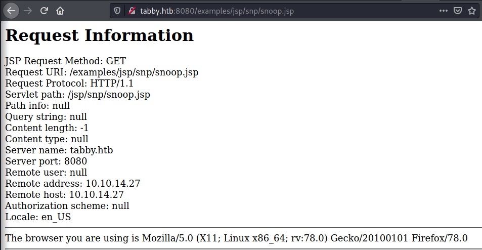

LFI in the website on port 80 lets me read `/etc/passwd`.

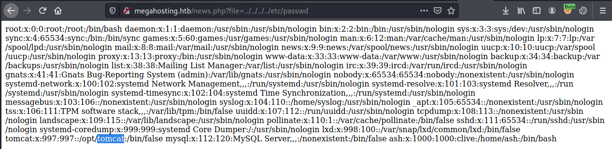

After some research, I find the default path of the `tomcat9` users file. I access it using the LFI vulnerability.

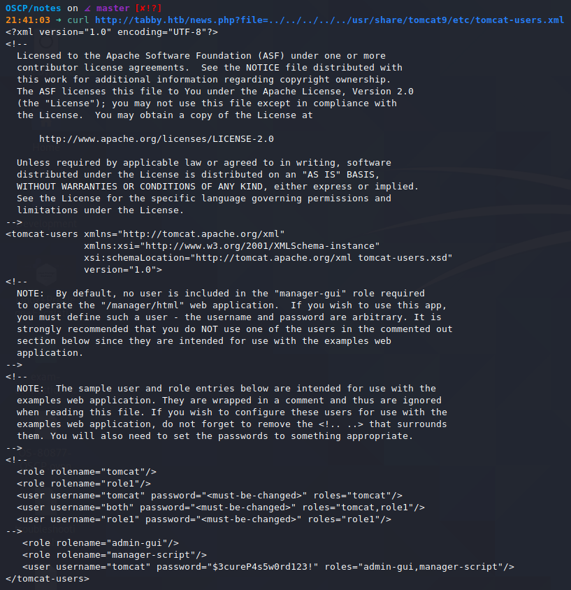

I find the credentials: `tomcat:$3cureP4s5w0rd123!` for an account with `admin-gui` and `manager-script` roles.

They allow access to the Tomcat Virtual Host Manager.

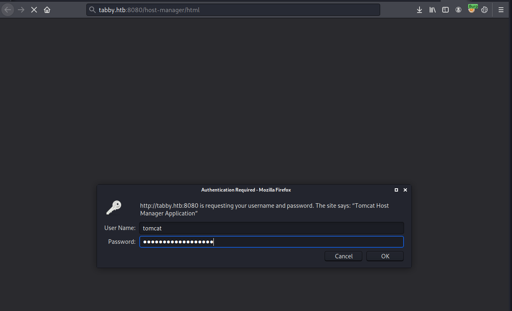

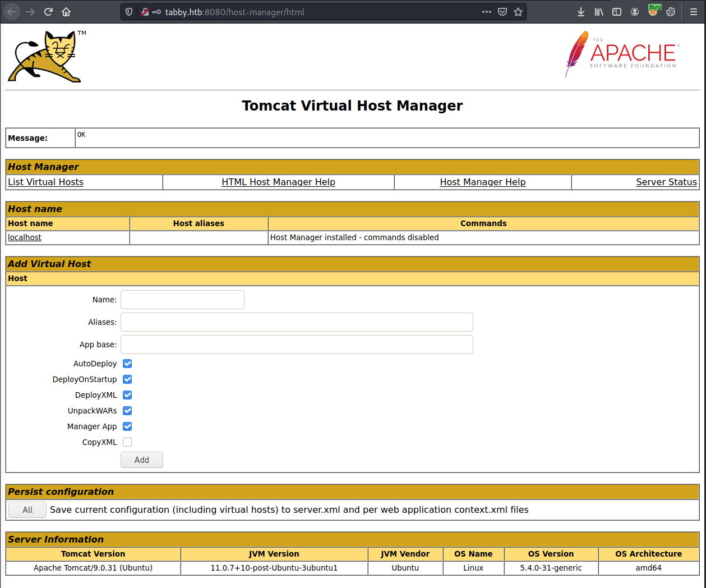


## Reverse Shell

I use a technique shown here: https://medium.com/@cyb0rgs/exploiting-apache-tomcat-manager-script-role-974e4307cd00

I generate a payload for Apache Tomcat.

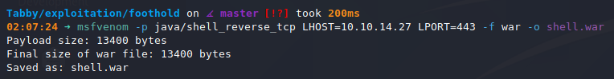

I upload the payload.


Start a listener, and run the exploit.


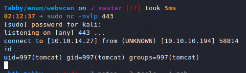

## Upgrading Shell

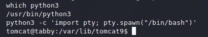

## Privilege Escalation to `ash`

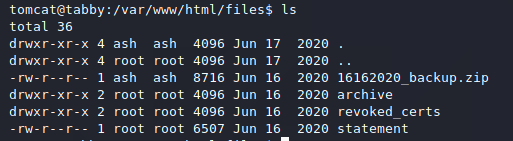

I copy the file over to my local machine with:

```bash
# Target
tomcat@tabby:/var/www/html/files$ cat 16162020_backup.zip | base64
UEsDBAoAAAAAAIUDf0gAAAAAAAAAAAAAAAAUABwAdmFyL3d3dy9odG1sL2Fzc2V0cy9VVAkAAxpv
...

# Kali
$ echo "UEsDBAoAAAAAAIUDf0g..." | base64 -d > backup.zip
```

I use `fcrackzip` to recover the zip file password.

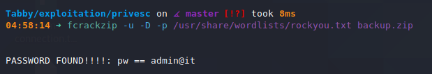

`admin@it` turns out to be `ash`'s user password.

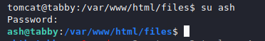

## `ash` to `root`

`ash` is part of the `lxd` group, which means we can get root using this technique: https://book.hacktricks.xyz/linux-unix/privilege-escalation/interesting-groups-linux-pe/lxd-privilege-escalation#method-1

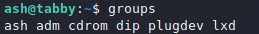

I prep the exploit on my Kali machine.

```bash
# Install requirements
sudo apt update
sudo apt install -y golang-go debootstrap rsync gpg squashfs-tools
# Clone repo
go get -d -v github.com/lxc/distrobuilder
# Make distrobuilder
cd $GOAPTH/src/github.com/lxc/distrobuilder
make
cd
# Prepare the creation of alpine
mkdir -p $HOME/ContainerImages/alpine/
cd $HOME/ContainerImages/alpine/
wget https://raw.githubusercontent.com/lxc/lxc-ci/master/images/alpine.yaml
#Create the container
sudo $GOPATH/bin/distrobuilder build-lxd alpine.yaml -o image.release=3.8

# Create a webserver
sudo python3 -m http.server 80
```

I download `lxd.tar.xz` and `rootfs.squashfs` on the target.

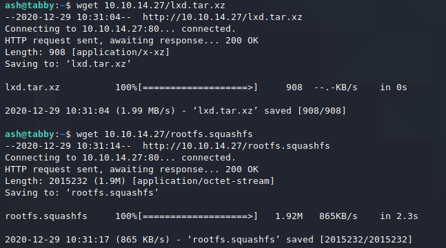

And run the rest of the exploit.

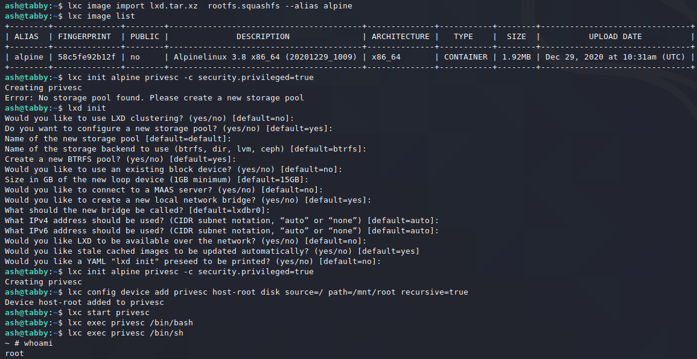

I go to `/mnt/root/`, where the `/root` directory is mounted and I see the flag.

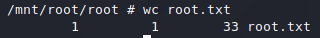

I drop into a full shell by setting the `SUID` bit on `/usr/bin/bash`

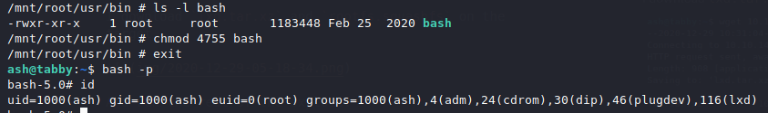